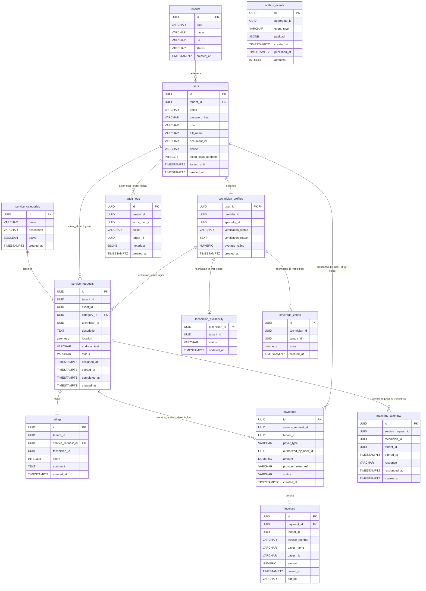

# DD — Documento de Diseño

## Modelos de Datos y Contratos — QUICKPATCH

Plataforma Digital Multi-tenant de Servicios Técnicos para el Hogar y las Empresas

|||
|---|---|
|**Tipo de documento**|Diccionario de Datos Evolutivo|
|**Arquitectura**|Microservicios + Event-Driven Architecture|
|**Backend principal**|ASP.NET Core|
|**Servicio Java**|Matching Service — Spring Boot|
|**Mensajería**|Apache Kafka|
|**Persistencia**|PostgreSQL + PostGIS|
|**Versión**|2.0|
|**Fecha**|Septiembre de 2026|
|**Curso**|Arquitectura de Software|
|**Proyecto**|QUICKPATCH|

---

## Índice

1. [Introducción](https://claude.ai/chat/79a9a126-9c5f-4641-bd84-002d21bcb12c#1-introducci%C3%B3n)
2. [Convenciones del modelo de datos](https://claude.ai/chat/79a9a126-9c5f-4641-bd84-002d21bcb12c#2-convenciones-del-modelo-de-datos)
3. [Distribución de datos por servicio](https://claude.ai/chat/79a9a126-9c5f-4641-bd84-002d21bcb12c#3-distribuci%C3%B3n-de-datos-por-servicio)
4. [Vista general del modelo](https://claude.ai/chat/79a9a126-9c5f-4641-bd84-002d21bcb12c#4-vista-general-del-modelo)
5. [Diccionario de Datos](https://claude.ai/chat/79a9a126-9c5f-4641-bd84-002d21bcb12c#5-diccionario-de-datos)
6. [Relaciones entre datos](https://claude.ai/chat/79a9a126-9c5f-4641-bd84-002d21bcb12c#6-relaciones-entre-datos)
7. [Contratos actuales](https://claude.ai/chat/79a9a126-9c5f-4641-bd84-002d21bcb12c#7-contratos-actuales)
8. [Multi-tenancy](https://claude.ai/chat/79a9a126-9c5f-4641-bd84-002d21bcb12c#8-multi-tenancy)
9. [Consideraciones de evolución del modelo](https://claude.ai/chat/79a9a126-9c5f-4641-bd84-002d21bcb12c#9-consideraciones-de-evoluci%C3%B3n-del-modelo)
10. [Control de evolución](https://claude.ai/chat/79a9a126-9c5f-4641-bd84-002d21bcb12c#10-control-de-evoluci%C3%B3n)
11. [Conclusión](https://claude.ai/chat/79a9a126-9c5f-4641-bd84-002d21bcb12c#11-conclusi%C3%B3n)

---

## 1. Introducción

### 1.1 Propósito

El presente Documento de Diseño tiene como propósito definir el modelo de datos inicial y los contratos conocidos de QUICKPATCH para las funcionalidades contempladas en el estado actual del backlog y del SRS.

El documento funciona principalmente como un diccionario de datos vivo, en el cual se documentan las entidades que actualmente pueden identificarse y justificarse a partir de los requisitos funcionales y no funcionales existentes.

### 1.2 Carácter evolutivo del modelo

El modelo presentado no pretende representar desde esta etapa la totalidad de las entidades que existirán en la solución final.

QUICKPATCH se desarrolla utilizando Scrum, por lo cual el modelo de datos evolucionará incrementalmente a medida que nuevos Sprint incorporen funcionalidades, reglas de negocio y necesidades de persistencia.

Cada nueva entidad, atributo, relación o restricción que surja durante el desarrollo deberá incorporarse en futuras versiones del presente documento.

Por esta razón, únicamente se modelan en esta versión las entidades que pueden sustentarse con el SRS vigente y con las decisiones arquitectónicas actualmente definidas.

### 1.3 Alcance actual

En esta versión se modelan las capacidades relacionadas con:

- Multi-tenancy.
- Registro y autenticación.
- Usuarios y técnicos.
- Categorías de servicios.
- Solicitudes de servicio.
- Disponibilidad y cobertura de técnicos.
- Matching.
- Calificaciones.
- Pagos.
- Facturación.
- Auditoría.
- Publicación confiable de eventos mediante Kafka.

Funcionalidades futuras como chat, evidencias fotográficas, reclamos, ranking avanzado, inteligencia artificial, payroll-lite o proveedores de materiales no se modelan todavía, debido a que el objetivo de este documento es representar los modelos que pueden justificarse actualmente a partir del SRS del MVP.

---

## 2. Convenciones del modelo de datos

|Convención|Descripción|
|---|---|
|PK|Primary Key. Identificador principal del registro.|
|FK|Foreign Key física entre entidades pertenecientes al mismo servicio.|
|Ref. lógica|Identificador perteneciente a una entidad administrada por otro microservicio. No existe una Foreign Key física entre las bases de datos independientes.|
|UUID|Identificador universal utilizado para las entidades principales.|
|NOT NULL|El campo es obligatorio.|
|NULL|El campo puede no contener un valor.|
|TIMESTAMPTZ|Fecha y hora con información de zona horaria.|
|snake_case|Convención utilizada para nombres de tablas y columnas.|
|tenant_id|Identificador utilizado para garantizar el aislamiento multi-tenant.|

_Cuadro 1: Convenciones utilizadas en el diccionario de datos_

---

## 3. Distribución de datos por servicio

QUICKPATCH utiliza una arquitectura distribuida basada en microservicios. Por esta razón, cada conjunto de datos es responsabilidad de un servicio determinado.

|Servicio|Entidades actuales|
|---|---|
|Identity & Tenant Service|`tenants`, `users`, `technician_profiles`|
|Service Request Service|`service_categories`, `service_requests`, `ratings`|
|Matching Service|`technician_availability`, `coverage_zones`, `matching_attempts`|
|Payment & Billing Service|`payments`, `invoices`|
|Transversal|`audit_logs`, `outbox_events`|

_Cuadro 2: Propiedad inicial de las entidades por microservicio_

Cada servicio será propietario de sus datos y no deberá modificar directamente las tablas pertenecientes a otro servicio.

Las relaciones entre servicios deberán realizarse mediante referencias lógicas, contratos REST o eventos publicados mediante Apache Kafka.

---

## 4. Vista general del modelo

La Figura 1 presenta la distribución lógica inicial de las entidades identificadas hasta el estado actual del proyecto.

El diagrama no representa necesariamente la totalidad de los modelos que existirán en QUICKPATCH. Nuevas entidades podrán incorporarse en Sprint posteriores conforme aparezcan nuevas historias de usuario y necesidades de persistencia.

> Las relaciones internas representan entidades administradas por un mismo microservicio. Las relaciones entre servicios corresponden a referencias lógicas y no necesariamente a Foreign Keys físicas entre bases de datos.

**Figura 1: Distribución lógica inicial del modelo de datos**



_Nota: Mermaid `erDiagram` no distingue visualmente entre línea continua y línea punteada como el UML original, así que ambos tipos de relación se dibujan igual. Para no perder la distinción, cada relación queda etiquetada: las relaciones físicas (FK real dentro de un mismo microservicio) llevan el nombre de la acción (`pertenece`, `extiende`, `clasifica`, `recibe`, `genera`), y las referencias lógicas entre microservicios (sin FK física) llevan la etiqueta `(ref logica)` junto con el campo que se referencia. El detalle completo de cada referencia lógica también se documenta en texto en la sección [6.2](https://claude.ai/chat/79a9a126-9c5f-4641-bd84-002d21bcb12c#62-referencias-l%C3%B3gicas-entre-microservicios)._

---

## 5. Diccionario de Datos

### 5.1 Tabla `tenants`

**Servicio propietario:** Identity & Tenant Service.

**Propósito:** Representa el contexto lógico de aislamiento de datos de QUICKPATCH. Puede corresponder a un contexto residencial o empresarial.

**Requisitos relacionados:** RF-04, RF-06, RF-21, RNF-09, RNF-10.

|Campo|Tipo|Nulo|Clave|Descripción|
|---|---|---|---|---|
|id|UUID|No|PK|Identificador único del tenant.|
|type|VARCHAR(20)|No|—|Tipo de tenant: hogar o empresa.|
|name|VARCHAR(150)|No|—|Nombre identificador del tenant.|
|nit|VARCHAR(30)|Sí|—|NIT de la organización cuando el tenant corresponde a una empresa.|
|status|VARCHAR(20)|No|—|Estado del tenant: activo o inactivo.|
|created_at|TIMESTAMPTZ|No|—|Fecha de creación del registro.|

**Reglas de negocio:**

- Un tenant inactivo no puede crear nuevas solicitudes.
- El NIT se utiliza principalmente para tenants empresariales.
- El tenant activo del usuario debe obtenerse desde el contexto autenticado.

**Índices iniciales sugeridos:**

- Índice único sobre `id`.
- Índice sobre `status`.
- Índice sobre `nit` cuando aplique.

### 5.2 Tabla `users`

**Servicio propietario:** Identity & Tenant Service.

**Propósito:** Almacena la identidad base de los usuarios que interactúan con la plataforma.

**Requisitos relacionados:** RF-01, RF-02, RF-03, RF-05, RF-06.

|Campo|Tipo|Nulo|Clave|Descripción|
|---|---|---|---|---|
|id|UUID|No|PK|Identificador único del usuario.|
|tenant_id|UUID|No|FK local|Tenant al que pertenece el usuario.|
|email|VARCHAR(150)|No|UNIQUE|Correo electrónico utilizado para autenticación.|
|password_hash|VARCHAR(255)|No|—|Hash seguro de la contraseña.|
|role|VARCHAR(30)|No|—|Rol principal del usuario.|
|full_name|VARCHAR(150)|No|—|Nombre completo.|
|document_id|VARCHAR(30)|Sí|UNIQUE|Documento de identidad. Requerido para técnicos y proveedores.|
|phone|VARCHAR(30)|Sí|—|Número de teléfono.|
|failed_login_attempts|INTEGER|No|—|Cantidad de intentos fallidos consecutivos.|
|locked_until|TIMESTAMPTZ|Sí|—|Fecha hasta la cual permanece bloqueada la cuenta.|
|created_at|TIMESTAMPTZ|No|—|Fecha de creación del usuario.|

**Valores iniciales de `role`:**

- `cliente`
- `tecnico`
- `proveedor`
- `admin`
- `empresa_contacto`

**Reglas de negocio:**

- El correo debe ser único.
- La contraseña nunca se almacena en texto plano.
- El tenant no se recibe libremente desde el frontend.
- Después de varios intentos fallidos se puede bloquear temporalmente la cuenta.

**Índices sugeridos:**

- UNIQUE sobre `email`.
- UNIQUE sobre `document_id` cuando exista.
- Índice sobre `tenant_id`.
- Índice compuesto sobre `tenant_id, role`.

### 5.3 Tabla `technician_profiles`

**Servicio propietario:** Identity & Tenant Service.

**Propósito:** Extiende la información de un usuario cuando su rol corresponde a técnico.

**Requisitos relacionados:** RF-02, RF-13, RF-19, RF-20.

|Campo|Tipo|Nulo|Clave|Descripción|
|---|---|---|---|---|
|user_id|UUID|No|PK / FK|Usuario correspondiente al técnico.|
|provider_id|UUID|Sí|Ref. lógica|Proveedor al que pertenece, si aplica.|
|specialty_id|UUID|No|Ref. lógica|Especialidad principal del técnico.|
|verification_status|VARCHAR(25)|No|—|Estado de verificación.|
|verification_reason|TEXT|Sí|—|Razón de rechazo o suspensión.|
|average_rating|NUMERIC(2,1)|Sí|—|Promedio de calificaciones del técnico.|
|created_at|TIMESTAMPTZ|No|—|Fecha de creación del perfil.|

**Estados de `verification_status`:**

- `pendiente`
- `aprobado`
- `rechazado`
- `suspendido`

**Reglas de negocio:**

- Solo técnicos aprobados pueden participar en matching.
- Un técnico suspendido no puede recibir nuevas solicitudes.

### 5.4 Tabla `service_categories`

**Servicio propietario:** Service Request Service.

**Propósito:** Define las categorías disponibles para clasificar solicitudes de servicio.

**Requisitos relacionados:** RF-07, RF-08, RF-09.

|Campo|Tipo|Nulo|Clave|Descripción|
|---|---|---|---|---|
|id|UUID|No|PK|Identificador único de la categoría.|
|name|VARCHAR(100)|No|UNIQUE|Nombre de la categoría.|
|description|VARCHAR(255)|Sí|—|Descripción opcional.|
|active|BOOLEAN|No|—|Indica si la categoría está disponible.|
|created_at|TIMESTAMPTZ|No|—|Fecha de creación.|

**Ejemplos iniciales:**

- Plomería.
- Electricidad.
- Cerrajería.
- Mantenimiento.

### 5.5 Tabla `service_requests`

**Servicio propietario:** Service Request Service.

**Propósito:** Almacena las solicitudes de servicio creadas por Clientes o Empresas y constituye la entidad principal del ciclo de negocio.

**Requisitos relacionados:** RF-07, RF-08, RF-09, RF-10, RF-11, RF-14, RF-15.

|Campo|Tipo|Nulo|Clave|Descripción|
|---|---|---|---|---|
|id|UUID|No|PK|Identificador único de la solicitud.|
|tenant_id|UUID|No|—|Tenant propietario de la solicitud.|
|client_id|UUID|No|Ref. lógica|Usuario que creó la solicitud.|
|category_id|UUID|No|FK local|Categoría del servicio.|
|technician_id|UUID|Sí|Ref. lógica|Técnico asignado a la solicitud.|
|description|TEXT|No|—|Descripción del problema.|
|location|geometry(POINT,4326)|No|—|Ubicación geográfica del servicio.|
|address_text|VARCHAR(255)|No|—|Dirección escrita.|
|status|VARCHAR(30)|No|—|Estado actual de la solicitud.|
|assigned_at|TIMESTAMPTZ|Sí|—|Momento de asignación.|
|started_at|TIMESTAMPTZ|Sí|—|Inicio del servicio.|
|completed_at|TIMESTAMPTZ|Sí|—|Finalización del servicio.|
|created_at|TIMESTAMPTZ|No|—|Fecha de creación.|

**Estados iniciales:**

- `buscando_tecnico`
- `en_espera`
- `asignado`
- `en_progreso`
- `completado`
- `pagado`

**Reglas de negocio:**

- Toda solicitud debe tener una ubicación válida.
- `technician_id` puede ser NULL mientras no exista asignación.
- Solo se puede pasar a `completado` desde `en_progreso`.
- Solo se puede pasar a `pagado` cuando Payment Service confirme el pago.

**Índices sugeridos:**

- Índice sobre `tenant_id`.
- Índice sobre `client_id`.
- Índice sobre `technician_id`.
- Índice sobre `status`.
- Índice geoespacial GIST sobre `location`.

### 5.6 Tabla `technician_availability`

**Servicio propietario:** Matching Service.

**Propósito:** Mantiene el estado operativo actual de cada técnico para determinar si puede participar en el proceso de matching.

**Requisitos relacionados:** RF-09, RF-10, RF-13.

|Campo|Tipo|Nulo|Clave|Descripción|
|---|---|---|---|---|
|technician_id|UUID|No|PK lógica|Identificador del técnico.|
|tenant_id|UUID|No|—|Tenant relacionado.|
|status|VARCHAR(25)|No|—|Disponibilidad actual.|
|updated_at|TIMESTAMPTZ|No|—|Última actualización.|

**Estados:**

- `disponible`
- `ocupado`
- `no_disponible`

### 5.7 Tabla `coverage_zones`

**Servicio propietario:** Matching Service.

**Propósito:** Define las zonas geográficas dentro de las cuales un técnico presta servicios.

**Requisitos relacionados:** RF-09, RF-13, RIE-02.

|Campo|Tipo|Nulo|Clave|Descripción|
|---|---|---|---|---|
|id|UUID|No|PK|Identificador de la zona.|
|technician_id|UUID|No|Ref. lógica|Técnico propietario.|
|tenant_id|UUID|No|—|Tenant relacionado.|
|area|geometry(POLYGON,4326)|No|—|Polígono de cobertura.|
|created_at|TIMESTAMPTZ|No|—|Fecha de creación.|

**Índices sugeridos:**

- Índice sobre `technician_id`.
- Índice GIST sobre `area`.

### 5.8 Tabla `matching_attempts`

**Servicio propietario:** Matching Service.

**Propósito:** Registra cada oferta realizada a un técnico durante el proceso de asignación de una solicitud.

**Requisitos relacionados:** RF-09, RF-10.

|Campo|Tipo|Nulo|Clave|Descripción|
|---|---|---|---|---|
|id|UUID|No|PK|Identificador del intento.|
|service_request_id|UUID|No|Ref. lógica|Solicitud relacionada.|
|technician_id|UUID|No|Ref. lógica|Técnico al que se realizó la oferta.|
|tenant_id|UUID|No|—|Tenant relacionado.|
|offered_at|TIMESTAMPTZ|No|—|Momento de la oferta.|
|response|VARCHAR(20)|No|—|Respuesta del técnico.|
|responded_at|TIMESTAMPTZ|Sí|—|Momento de respuesta.|
|expires_at|TIMESTAMPTZ|No|—|Fecha de expiración de la oferta.|

**Valores de `response`:**

- `pendiente`
- `aceptado`
- `rechazado`
- `expirado`

### 5.9 Tabla `ratings`

**Servicio propietario:** Service Request Service.

**Propósito:** Almacena la valoración realizada por un cliente al finalizar un servicio.

**Requisitos relacionados:** RF-12.

|Campo|Tipo|Nulo|Clave|Descripción|
|---|---|---|---|---|
|id|UUID|No|PK|Identificador de la calificación.|
|tenant_id|UUID|No|—|Tenant relacionado.|
|service_request_id|UUID|No|FK local|Solicitud calificada.|
|technician_id|UUID|No|Ref. lógica|Técnico calificado.|
|score|INTEGER|No|—|Valor entre 1 y 5.|
|comment|TEXT|Sí|—|Comentario opcional.|
|created_at|TIMESTAMPTZ|No|—|Fecha de creación.|

**Restricciones:**

- El `score` debe estar entre 1 y 5.
- Una solicitud solo puede calificarse una vez.
- Solo se permite calificar solicitudes completadas.

### 5.10 Tabla `payments`

**Servicio propietario:** Payment & Billing Service.

**Propósito:** Registra el resultado de los pagos realizados por Clientes o Empresas.

**Requisitos relacionados:** RF-22, RF-23, RF-25, RNF-01.

|Campo|Tipo|Nulo|Clave|Descripción|
|---|---|---|---|---|
|id|UUID|No|PK|Identificador del pago.|
|service_request_id|UUID|No|Ref. lógica|Solicitud asociada.|
|tenant_id|UUID|No|—|Tenant relacionado.|
|payer_type|VARCHAR(20)|No|—|Cliente o empresa.|
|authorized_by_user_id|UUID|Sí|Ref. lógica|Usuario que autorizó el pago.|
|amount|NUMERIC(12,2)|No|—|Monto del pago.|
|provider_token_ref|VARCHAR(255)|No|—|Token o referencia retornada por el PSP.|
|status|VARCHAR(20)|No|—|Estado del pago.|
|created_at|TIMESTAMPTZ|No|—|Fecha de creación.|

**Estados:**

- `pendiente`
- `aprobado`
- `rechazado`

**Restricción PCI-DSS:** la tabla no almacena:

- Número completo de tarjeta.
- CVV.
- Fecha de expiración.

### 5.11 Tabla `invoices`

**Servicio propietario:** Payment & Billing Service.

**Propósito:** Registra los comprobantes o facturas generados después de un pago aprobado.

**Requisitos relacionados:** RF-24.

|Campo|Tipo|Nulo|Clave|Descripción|
|---|---|---|---|---|
|id|UUID|No|PK|Identificador de la factura.|
|payment_id|UUID|No|FK local|Pago relacionado.|
|tenant_id|UUID|No|—|Tenant relacionado.|
|invoice_number|VARCHAR(50)|No|UNIQUE|Número único del comprobante.|
|payer_name|VARCHAR(150)|No|—|Nombre del pagador.|
|payer_nit|VARCHAR(30)|Sí|—|NIT cuando corresponde a empresa.|
|amount|NUMERIC(12,2)|No|—|Valor facturado.|
|issued_at|TIMESTAMPTZ|No|—|Fecha de emisión.|
|pdf_url|VARCHAR(500)|Sí|—|Ruta del comprobante generado.|

### 5.12 Tabla `audit_logs`

**Servicio propietario:** Transversal.

**Propósito:** Registrar operaciones administrativas y accesos no autorizados relevantes.

**Requisitos relacionados:** RF-19, RF-20, RNF-04.

|Campo|Tipo|Nulo|Clave|Descripción|
|---|---|---|---|---|
|id|UUID|No|PK|Identificador del registro.|
|tenant_id|UUID|Sí|—|Tenant relacionado cuando aplique.|
|actor_user_id|UUID|Sí|Ref. lógica|Usuario que ejecutó la acción.|
|action|VARCHAR(100)|No|—|Acción realizada.|
|target_id|UUID|Sí|—|Recurso afectado.|
|metadata|JSONB|Sí|—|Información adicional.|
|created_at|TIMESTAMPTZ|No|—|Fecha y hora.|

**Ejemplos de `action`:**

- `aprobar_tecnico`
- `rechazar_tecnico`
- `suspender_tecnico`
- `acceso_denegado`

### 5.13 Tabla `outbox_events`

**Servicio propietario:** Cada microservicio productor de eventos.

**Propósito:** Permitir que el registro de una operación de negocio y el evento que posteriormente será publicado en Apache Kafka se realicen dentro de una misma transacción local.

|Campo|Tipo|Nulo|Clave|Descripción|
|---|---|---|---|---|
|id|UUID|No|PK|Identificador único del evento.|
|aggregate_id|UUID|No|—|Identificador de la entidad que originó el evento.|
|event_type|VARCHAR(100)|No|—|Tipo de evento.|
|payload|JSONB|No|—|Información que será publicada en Kafka.|
|created_at|TIMESTAMPTZ|No|—|Fecha de creación.|
|published_at|TIMESTAMPTZ|Sí|—|Fecha en la que el evento fue publicado.|
|attempts|INTEGER|No|—|Cantidad de intentos de publicación.|

**Nota:** esta tabla corresponde a un modelo técnico y puede existir independientemente dentro de cada servicio productor de eventos.

---

## 6. Relaciones entre datos

### 6.1 Relaciones físicas dentro de un servicio

Cuando dos entidades son administradas por el mismo microservicio, pueden implementarse relaciones mediante Foreign Keys físicas.

**Ejemplos:**

```
users.tenant_id           -> tenants.id
service_requests.category_id -> service_categories.id
ratings.service_request_id   -> service_requests.id
invoices.payment_id          -> payments.id
```

### 6.2 Referencias lógicas entre microservicios

Cuando las entidades pertenecen a microservicios diferentes no se utilizarán Foreign Keys físicas entre sus respectivas bases de datos.

**Ejemplos:**

```
service_requests.client_id            --> users.id
service_requests.technician_id        --> users.id
matching_attempts.service_request_id  --> service_requests.id
payments.service_request_id           --> service_requests.id
```

Estas referencias podrán validarse mediante reglas de negocio, contratos REST o eventos.

---

## 7. Contratos actuales

El presente documento registra únicamente los contratos que actualmente pueden identificarse a partir del SRS y del modelo existente.

### 7.1 Contratos REST

|Método|Endpoint|Descripción|
|---|---|---|
|POST|`/v1/auth/register/client`|Registrar cliente.|
|POST|`/v1/auth/register/technician`|Registrar técnico o proveedor.|
|POST|`/v1/auth/register/company`|Registrar empresa.|
|POST|`/v1/auth/login`|Autenticar usuario.|
|GET|`/v1/users/me`|Consultar perfil actual.|
|POST|`/v1/service-requests`|Crear solicitud de servicio.|
|GET|`/v1/service-requests/{id}`|Consultar una solicitud.|
|POST|`/v1/service-requests/{id}/start`|Iniciar servicio.|
|POST|`/v1/service-requests/{id}/complete`|Completar servicio.|
|POST|`/v1/service-requests/{id}/rating`|Calificar servicio.|
|POST|`/v1/service-requests/{id}/payment`|Procesar pago.|
|GET|`/v1/payments/{id}/invoice`|Consultar factura o comprobante.|

### 7.2 Eventos Kafka actuales

Para el estado actual del diseño se identifican inicialmente los siguientes eventos:

|Evento|Productor|Finalidad|
|---|---|---|
|`service-request.created`|Service Request Service|Iniciar el proceso de matching.|
|`matching.technician-assigned`|Matching Service|Informar que existe un técnico asignado.|
|`matching.no-technician-available`|Matching Service|Informar que no se encontró un técnico disponible.|
|`service-request.completed`|Service Request Service|Notificar la finalización y habilitar el proceso de pago.|
|`payment.approved`|Payment Service|Confirmar un pago exitoso.|
|`payment.rejected`|Payment Service|Informar el rechazo de un pago.|

#### 7.2.1 Estructura base de evento

```json
{
  "eventId": "uuid",
  "eventType": "service-request.created",
  "eventVersion": 1,
  "occurredAt": "2026-09-02T10:00:00Z",
  "correlationId": "uuid",
  "tenantId": "uuid",
  "producer": "service-request-service",
  "data": {}
}
```

El contenido específico de `data` dependerá del tipo de evento.

---

## 8. Multi-tenancy

Todo registro de negocio que corresponda a un tenant deberá incluir `tenant_id` cuando sea necesario para garantizar el aislamiento de información.

El identificador del tenant se obtendrá del contexto autenticado y no deberá aceptarse como un valor libre proporcionado por el cliente.

Como mecanismo adicional de seguridad, PostgreSQL podrá implementar Row Level Security.

**Ejemplo:**

```sql
USING (
    tenant_id = current_setting('app.current_tenant')::uuid
)
```

RLS constituye una medida complementaria y no sustituye las validaciones de autorización realizadas por los servicios.

---

## 9. Consideraciones de evolución del modelo

El presente modelo corresponde exclusivamente al estado actual del proyecto.

Durante nuevos Sprint podrán incorporarse nuevas entidades cuando exista una Historia de Usuario, requisito funcional o necesidad de persistencia que justifique su incorporación.

Algunos modelos que podrían aparecer en versiones futuras son:

- Evidencias fotográficas.
- Chat.
- Reclamos.
- Ranking avanzado.
- Direcciones o sedes empresariales.
- Métodos de pago adicionales.
- Historial detallado de estados.
- Notificaciones persistentes.

La inclusión de estos modelos no se considera comprometida en esta versión del documento.

---

## 10. Control de evolución

|Versión|Sprint / Etapa|Cambio|
|---|---|---|
|1.0|Diseño inicial|Modelo inicial basado en usuarios, solicitudes, matching, pagos y multi-tenancy.|
|2.0|Revisión arquitectónica|Adaptación del modelo a una solución distribuida, definición de propiedad de datos por servicio y contratos mediante Kafka.|
|2.1|Futuros Sprint|Se agregarán nuevas entidades, campos y relaciones conforme las Historias de Usuario lo requieran.|

_Cuadro 17: Evolución del diccionario de datos_

---

## 11. Conclusión

El presente documento define el modelo de datos actualmente identificable para QUICKPATCH y debe entenderse como un artefacto evolutivo.

El objetivo no consiste en diseñar anticipadamente todas las tablas que podría requerir la plataforma, sino documentar de manera precisa los modelos que pueden justificarse con los requisitos existentes.

La separación por microservicios permite establecer claramente la propiedad de los datos y distinguir entre relaciones físicas dentro de un mismo servicio y referencias lógicas entre servicios diferentes.

En esta versión se dispone de un modelo inicial suficiente para soportar:

- usuarios;
- tenants;
- técnicos;
- categorías;
- solicitudes;
- matching;
- disponibilidad;
- zonas de cobertura;
- calificaciones;
- pagos;
- facturación;
- auditoría;
- eventos Kafka.

El diccionario deberá actualizarse progresivamente durante los Sprint siguientes conforme aparezcan nuevas necesidades de negocio y persistencia.