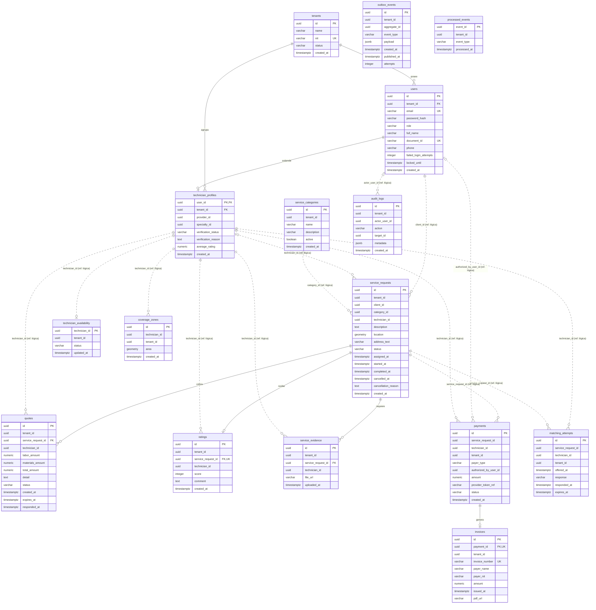
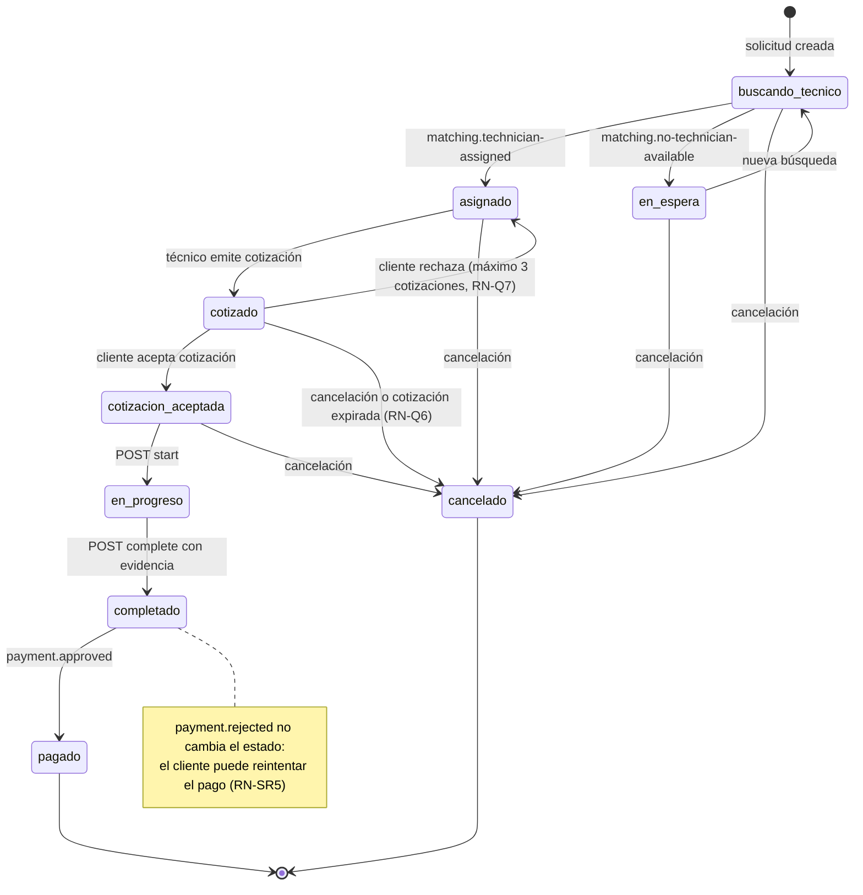
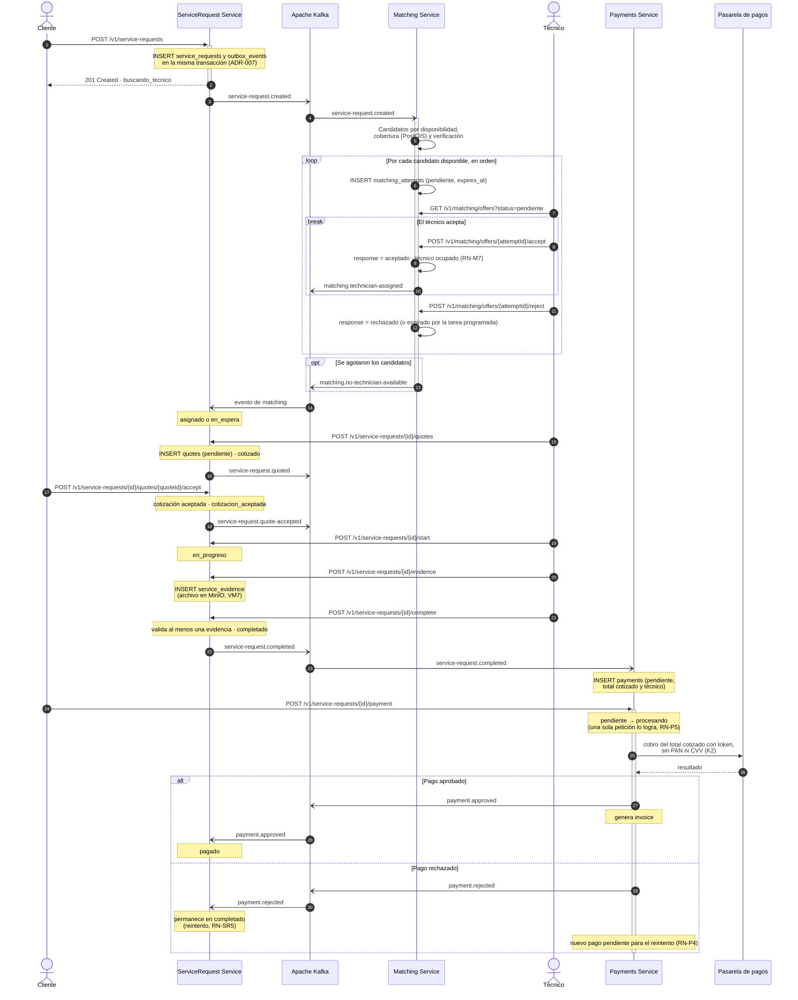
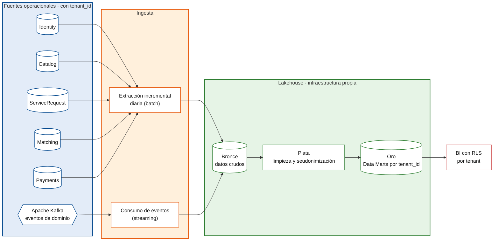

# DD — Documento de Diseño
## Modelos de Datos y Contratos — QUICKPATCH

Plataforma Digital Multi-tenant de Servicios Técnicos para el Hogar y las Empresas

|||
|---|---|
|**Tipo de documento**|Diccionario de Datos Evolutivo|
|**Arquitectura**|Microservicios + Event-Driven Architecture|
|**Backend principal**|Por definir (Matching Service: Java + Spring Boot)|
|**Mensajería**|Apache Kafka|
|**Persistencia**|PostgreSQL + PostGIS|
|**Versión**|2.2|
|**Fecha**|Septiembre de 2026|
|**Curso**|Arquitectura de Software|
|**Proyecto**|QUICKPATCH|

---

## Índice

1. [Introducción](#1-introducción)
2. [Convenciones del modelo de datos](#2-convenciones-del-modelo-de-datos)
3. [Distribución de datos por servicio](#3-distribución-de-datos-por-servicio)
4. [Vista general del modelo](#4-vista-general-del-modelo)
5. [Diccionario de Datos](#5-diccionario-de-datos)
6. [Relaciones entre datos](#6-relaciones-entre-datos)
7. [Reglas de negocio](#7-reglas-de-negocio)
8. [Contratos actuales](#8-contratos-actuales)
9. [Arquitectura de datos analítica (modelo objetivo)](#9-arquitectura-de-datos-analítica-modelo-objetivo)
10. [Multi-tenancy](#10-multi-tenancy)
11. [Consideraciones de evolución del modelo](#11-consideraciones-de-evolución-del-modelo)
12. [Control de evolución](#12-control-de-evolución)
13. [Conclusión](#13-conclusión)

---

## 1. Introducción

### 1.1 Propósito

El presente Documento de Diseño tiene como propósito definir el modelo de datos y los contratos conocidos de QUICKPATCH para las funcionalidades contempladas en el estado actual del backlog y del SRS.

El documento funciona principalmente como un diccionario de datos vivo, en el cual se documentan las entidades que actualmente pueden identificarse y justificarse a partir de los requisitos funcionales y no funcionales existentes.

Este documento desarrolla la Arquitectura de Datos del SAD (sección 8) y se mantiene alineado con la descomposición por microservicios del SAD (sección 4.2.2) y del SDD (sección 3.2). Las decisiones de arquitectura que lo sustentan son ADR-004 (PostgreSQL + PostGIS), ADR-005 (shared-schema con `tenant_id` + RLS), ADR-006 (Kafka como bus de eventos), ADR-007 (Transactional Outbox + idempotencia) y ADR-009 (tokenización de pagos).

### 1.2 Carácter evolutivo del modelo

El modelo presentado no pretende representar desde esta etapa la totalidad de las entidades que existirán en la solución final.

QUICKPATCH se desarrolla utilizando Scrum, por lo cual el modelo de datos evolucionará incrementalmente a medida que nuevos Sprint incorporen funcionalidades, reglas de negocio y necesidades de persistencia.

Cada nueva entidad, atributo, relación o restricción que surja durante el desarrollo deberá incorporarse en futuras versiones del presente documento.

Por esta razón, únicamente se modelan en esta versión las entidades que pueden sustentarse con el SRS vigente y con las decisiones arquitectónicas actualmente definidas. La única excepción es la sección 9, que describe un modelo analítico objetivo por solicitud de la revisión de arquitectura del curso y que se declara explícitamente fuera del alcance implementable del MVP.

### 1.3 Alcance actual

En esta versión se modelan las capacidades relacionadas con:

- Multi-tenancy.
- Registro y autenticación.
- Usuarios y técnicos.
- Categorías de servicios.
- Solicitudes de servicio, incluida su cancelación antes de iniciar el servicio.
- Cotización de mano de obra y materiales (SAD, sección 7.4).
- Disponibilidad y cobertura de técnicos.
- Matching, incluida la aceptación o rechazo de la oferta por parte del técnico (RF-10).
- Calificaciones.
- Evidencia fotográfica obligatoria al completar un servicio.
- Pagos.
- Facturación.
- Auditoría.
- Publicación confiable de eventos mediante Kafka.

Funcionalidades futuras como chat, reclamos, ranking avanzado, inteligencia artificial, payroll-lite o proveedores de materiales no se modelan todavía, debido a que el objetivo de este documento es representar los modelos que pueden justificarse actualmente a partir del SRS del MVP.

---

## 2. Convenciones del modelo de datos

|Convención|Descripción|
|---|---|
|PK|Primary Key. Identificador principal del registro.|
|FK|Foreign Key física entre entidades pertenecientes al mismo servicio.|
|UK|Restricción de unicidad.|
|Ref. lógica|Identificador perteneciente a una entidad administrada por otro microservicio. No existe una Foreign Key física entre las bases de datos independientes.|
|UUID|Identificador universal utilizado para las entidades principales.|
|NOT NULL|El campo es obligatorio.|
|NULL|El campo puede no contener un valor.|
|TIMESTAMPTZ|Fecha y hora con información de zona horaria.|
|snake_case|Convención utilizada para nombres de tablas y columnas.|
|tenant_id|Identificador utilizado para garantizar el aislamiento multi-tenant.|
|Línea continua|En los diagramas, relación física (FK) dentro de un mismo servicio.|
|Línea punteada|En los diagramas, referencia lógica entre servicios distintos.|

_Cuadro 1: Convenciones utilizadas en el diccionario de datos_

---

## 3. Distribución de datos por servicio

QUICKPATCH se descompone en 8 microservicios de dominio (SAD, sección 4.2.2), desplegados en VM3 sobre k3s (ADR-011). Cada servicio es propietario de sus datos en su propia base o esquema dentro de PostgreSQL (VM4). La asignación de tablas sigue la descomposición lógica del SDD (sección 3.2).

|Servicio|Entidades persistentes en esta versión|
|---|---|
|Identity Service|`tenants`, `users`, `technician_profiles`|
|Actors Service|Ninguna todavía. `Supplier`, `Ally` y `Client` son conceptos evolutivos (SDD, sección 4.4).|
|Catalog Service|`service_categories`|
|Matching Service|`technician_availability`, `coverage_zones`, `matching_attempts`|
|ServiceRequest Service|`service_requests`, `quotes`, `ratings`, `service_evidence`|
|Ranking Service|Ninguna todavía. Consume las calificaciones; su persistencia es evolutiva (SDD, sección 4.4).|
|Payments Service|`payments`, `invoices`|
|Communication Service|Ninguna todavía. Consume eventos para notificar; `Notification`, `Conversation` y `Complaint` son evolutivos.|
|Transversal (en cada servicio)|`audit_logs`, `outbox_events`, `processed_events`|

_Cuadro 2: Propiedad de las entidades por microservicio_

Cada servicio será propietario de sus datos y no deberá modificar directamente las tablas pertenecientes a otro servicio.

Las relaciones entre servicios deberán realizarse mediante referencias lógicas, contratos REST o eventos publicados mediante Apache Kafka.

---

## 4. Vista general del modelo

La Figura 1 presenta los dominios de datos: cada recuadro corresponde a un microservicio y encierra únicamente las entidades de las que es propietario. La Figura 2 presenta el mismo modelo como diagrama entidad-relación con atributos, claves y cardinalidades. Ambas figuras describen exactamente las mismas entidades y relaciones que el diccionario de la sección 5 y el listado de la sección 6.

El diagrama no representa necesariamente la totalidad de los modelos que existirán en QUICKPATCH. Nuevas entidades podrán incorporarse en Sprint posteriores conforme aparezcan nuevas historias de usuario y necesidades de persistencia.

**Figura 1: Dominios de datos por microservicio**

```mermaid
flowchart TB
    classDef entity fill:#FFFFFF,stroke:#00468C,stroke-width:1.5px,color:#111111
    classDef empty fill:#FFFFFF,stroke:#9E9E9E,stroke-width:1px,stroke-dasharray:4 3,color:#616161
    classDef store fill:#FFF8E1,stroke:#B8860B,stroke-width:1.5px,color:#111111

    subgraph IDN["Identity Service"]
        direction TB
        tenants["tenants"]:::entity
        users["users"]:::entity
        technician_profiles["technician_profiles"]:::entity
        tenants -->|"1 : N"| users
        tenants -->|"1 : N"| technician_profiles
        users -->|"1 : 0..1"| technician_profiles
    end

    subgraph CAT["Catalog Service"]
        direction TB
        service_categories["service_categories"]:::entity
    end

    subgraph SRQ["ServiceRequest Service"]
        direction TB
        service_requests["service_requests"]:::entity
        quotes["quotes"]:::entity
        ratings["ratings"]:::entity
        service_evidence["service_evidence"]:::entity
        service_requests -->|"1 : N"| quotes
        service_requests -->|"1 : 0..1"| ratings
        service_requests -->|"1 : N"| service_evidence
    end

    subgraph MAT["Matching Service · Java + Spring Boot"]
        direction TB
        technician_availability["technician_availability"]:::entity
        coverage_zones["coverage_zones"]:::entity
        matching_attempts["matching_attempts"]:::entity
    end

    subgraph PAY["Payments Service"]
        direction TB
        payments["payments"]:::entity
        invoices["invoices"]:::entity
        payments -->|"1 : 0..1"| invoices
    end

    subgraph ACT["Actors Service"]
        act_empty["Sin tablas en esta versión"]:::empty
    end

    subgraph RNK["Ranking Service"]
        rnk_empty["Sin tablas en esta versión"]:::empty
    end

    subgraph COM["Communication Service"]
        com_empty["Sin tablas en esta versión"]:::empty
    end

    subgraph TRV["Transversal · en cada servicio"]
        direction TB
        audit_logs["audit_logs"]:::entity
        outbox_events["outbox_events"]:::entity
        processed_events["processed_events"]:::entity
    end

    minio[("MinIO · VM7<br/>archivos de evidencia")]:::store

    users -.->|"client_id"| service_requests
    technician_profiles -.->|"technician_id"| service_requests
    service_categories -.->|"category_id"| service_requests
    technician_profiles -.->|"technician_id"| technician_availability
    technician_profiles -.->|"technician_id"| coverage_zones
    technician_profiles -.->|"technician_id"| matching_attempts
    service_requests -.->|"service_request_id"| matching_attempts
    technician_profiles -.->|"technician_id"| quotes
    technician_profiles -.->|"technician_id"| ratings
    technician_profiles -.->|"technician_id"| service_evidence
    service_requests -.->|"service_request_id · 1 : N"| payments
    technician_profiles -.->|"technician_id"| payments
    users -.->|"authorized_by_user_id"| payments
    users -.->|"actor_user_id"| audit_logs
    service_evidence -.->|"file_url"| minio

    style IDN fill:#E3ECF8,stroke:#00468C,stroke-width:2px
    style CAT fill:#FDF6DD,stroke:#9A7B00,stroke-width:2px
    style SRQ fill:#E6F4E6,stroke:#2E7D32,stroke-width:2px
    style MAT fill:#FFF0DC,stroke:#E65100,stroke-width:2px
    style PAY fill:#FBE4E4,stroke:#C62828,stroke-width:2px
    style ACT fill:#F3E8FA,stroke:#6A1B9A,stroke-width:2px
    style RNK fill:#F2E8DF,stroke:#6D4C41,stroke-width:2px
    style COM fill:#ECEFF1,stroke:#455A64,stroke-width:2px
    style TRV fill:#F5F5F5,stroke:#616161,stroke-width:2px
```



_Todas las tablas de la figura, excepto `tenants`, tienen la columna `tenant_id` (sección 10.1). Esas referencias se omiten del dibujo para no saturarlo: dentro de Identity Service son FK físicas (sección 6.1) y en los demás servicios son referencias lógicas (sección 6.2)._

**Figura 2: Diagrama entidad-relación**



_En la Figura 2, la línea continua es una FK física dentro del mismo servicio y la línea punteada una referencia lógica entre servicios; las referencias lógicas llevan la etiqueta `(ref. lógica)` y el nombre del campo. El servicio dueño de cada campo referenciado se indica en la sección 6.2. Las referencias lógicas se dibujan desde `technician_profiles` porque todo técnico referenciado debe tener perfil; el valor almacenado es `users.id`, que coincide con `technician_profiles.user_id`. Las referencias de `tenant_id` hacia `tenants` solo se dibujan dentro de Identity Service; en las demás entidades la columna aparece como atributo y se lista en la sección 10.1._

---

## 5. Diccionario de Datos

### 5.1 Tabla `tenants`

**Servicio propietario:** Identity Service.

**Propósito:** Representa a cada empresa oferente que opera sobre QUICKPATCH y constituye el límite de aislamiento de datos (SAD, sección 7.1). Los clientes hogar y las empresas cliente de un tenant son usuarios de ese tenant, no tenants propios; así el matching entre clientes y técnicos ocurre siempre dentro del mismo tenant.

**Requisitos relacionados:** RF-04, RF-21, RNF-09, RNF-10. RF-06 asocia cada empresa cliente a un tenant propio, lo que difiere del modelo del SAD que sigue este documento (DEP-13).

|Campo|Tipo|Nulo|Clave|Descripción|
|---|---|---|---|---|
|id|UUID|No|PK|Identificador único del tenant.|
|name|VARCHAR(150)|No|—|Nombre de la empresa oferente.|
|nit|VARCHAR(30)|No|UNIQUE|NIT de la empresa oferente.|
|status|VARCHAR(20)|No|—|Estado del tenant: activo o inactivo.|
|created_at|TIMESTAMPTZ|No|—|Fecha de creación del registro.|

**Reglas de negocio:** RN-T1 a RN-T3 (sección 7.1).

**Índices iniciales sugeridos:**

- Índice único sobre `id`.
- Índice único sobre `nit`.
- Índice sobre `status`.

### 5.2 Tabla `users`

**Servicio propietario:** Identity Service.

**Propósito:** Almacena la identidad base de los usuarios que interactúan con la plataforma.

**Requisitos relacionados:** RF-01, RF-02, RF-03, RF-05; RF-06 con la diferencia descrita en DEP-13.

|Campo|Tipo|Nulo|Clave|Descripción|
|---|---|---|---|---|
|id|UUID|No|PK|Identificador único del usuario.|
|tenant_id|UUID|No|FK local|Tenant al que pertenece el usuario.|
|email|VARCHAR(150)|No|UNIQUE por tenant|Correo electrónico utilizado para autenticación.|
|password_hash|VARCHAR(255)|No|—|Hash seguro de la contraseña.|
|role|VARCHAR(30)|No|—|Rol principal del usuario.|
|full_name|VARCHAR(150)|No|—|Nombre completo.|
|document_id|VARCHAR(30)|Sí|UNIQUE por tenant|Documento de identidad. Requerido para técnicos y proveedores.|
|phone|VARCHAR(30)|Sí|—|Número de teléfono.|
|failed_login_attempts|INTEGER|No|—|Cantidad de intentos fallidos consecutivos.|
|locked_until|TIMESTAMPTZ|Sí|—|Fecha hasta la cual permanece bloqueada la cuenta.|
|created_at|TIMESTAMPTZ|No|—|Fecha de creación del usuario.|

**Valores iniciales de `role`:**

- `cliente`
- `tecnico`
- `proveedor`
- `empresa_contacto`
- `admin_tenant`: administra su propio tenant; aprueba, rechaza y suspende técnicos (RF-19, RF-20).
- `admin_plataforma`: administra los tenants (RF-21). Solo existe en el tenant dueño de la plataforma (SAD, sección 7.1).

**Reglas de negocio:** RN-U1 a RN-U4 (sección 7.2).

**Índices sugeridos:**

- UNIQUE compuesto sobre `tenant_id, email`.
- UNIQUE compuesto sobre `tenant_id, document_id` cuando exista.
- Índice sobre `tenant_id`.
- Índice compuesto sobre `tenant_id, role`.

### 5.3 Tabla `technician_profiles`

**Servicio propietario:** Identity Service.

**Propósito:** Extiende la información de un usuario cuando su rol corresponde a técnico.

**Requisitos relacionados:** RF-02, RF-13, RF-19, RF-20.

|Campo|Tipo|Nulo|Clave|Descripción|
|---|---|---|---|---|
|user_id|UUID|No|PK / FK|Usuario correspondiente al técnico (`users.id`, mismo servicio).|
|tenant_id|UUID|No|FK local|Tenant del técnico; coincide con `users.tenant_id`.|
|provider_id|UUID|Sí|Ref. lógica|Proveedor o aliado al que pertenece, si aplica (Actors Service).|
|specialty_id|UUID|No|Ref. lógica|Especialidad principal del técnico (Catalog Service).|
|verification_status|VARCHAR(25)|No|—|Estado de verificación.|
|verification_reason|TEXT|Sí|—|Razón de rechazo o suspensión.|
|average_rating|NUMERIC(2,1)|Sí|—|Promedio de calificaciones del técnico. Proyección local; su cálculo corresponde a Ranking Service (SAD, D3).|
|created_at|TIMESTAMPTZ|No|—|Fecha de creación del perfil.|

**Estados de `verification_status`:**

- `pendiente`
- `aprobado`
- `rechazado`
- `suspendido`

**Reglas de negocio:** RN-TP1 y RN-TP2 (sección 7.3).

**Índices sugeridos:**

- Índice sobre `tenant_id`.
- Índice compuesto sobre `tenant_id, verification_status`.

### 5.4 Tabla `service_categories`

**Servicio propietario:** Catalog Service.

**Propósito:** Define las categorías disponibles para clasificar solicitudes de servicio. Cada tenant mantiene su propio catálogo (SAD, sección 7.1).

**Requisitos relacionados:** RF-07, RF-08, RF-09.

|Campo|Tipo|Nulo|Clave|Descripción|
|---|---|---|---|---|
|id|UUID|No|PK|Identificador único de la categoría.|
|tenant_id|UUID|No|Ref. lógica|Tenant dueño del catálogo.|
|name|VARCHAR(100)|No|UNIQUE por tenant|Nombre de la categoría, único dentro del tenant.|
|description|VARCHAR(255)|Sí|—|Descripción opcional.|
|active|BOOLEAN|No|—|Indica si la categoría está disponible.|
|created_at|TIMESTAMPTZ|No|—|Fecha de creación.|

**Ejemplos iniciales:**

- Plomería.
- Electricidad.
- Cerrajería.
- Mantenimiento.

**Índices sugeridos:**

- UNIQUE compuesto sobre `tenant_id, name`.

### 5.5 Tabla `service_requests`

**Servicio propietario:** ServiceRequest Service.

**Propósito:** Almacena las solicitudes de servicio creadas por Clientes o Empresas y constituye la entidad principal del ciclo de negocio.

**Requisitos relacionados:** RF-07, RF-08, RF-09, RF-10, RF-11, RF-14, RF-15.

|Campo|Tipo|Nulo|Clave|Descripción|
|---|---|---|---|---|
|id|UUID|No|PK|Identificador único de la solicitud.|
|tenant_id|UUID|No|Ref. lógica|Tenant propietario de la solicitud.|
|client_id|UUID|No|Ref. lógica|Usuario que creó la solicitud.|
|category_id|UUID|No|Ref. lógica|Categoría del servicio (Catalog Service).|
|technician_id|UUID|Sí|Ref. lógica|Técnico asignado a la solicitud.|
|description|TEXT|No|—|Descripción del problema.|
|location|geometry(POINT,4326)|No|—|Ubicación geográfica del servicio.|
|address_text|VARCHAR(255)|No|—|Dirección escrita.|
|status|VARCHAR(30)|No|—|Estado actual de la solicitud.|
|assigned_at|TIMESTAMPTZ|Sí|—|Momento de asignación.|
|started_at|TIMESTAMPTZ|Sí|—|Inicio del servicio.|
|completed_at|TIMESTAMPTZ|Sí|—|Finalización del servicio.|
|cancelled_at|TIMESTAMPTZ|Sí|—|Momento de la cancelación, si la hubo.|
|cancellation_reason|TEXT|Sí|—|Motivo de la cancelación.|
|created_at|TIMESTAMPTZ|No|—|Fecha de creación.|

**Estados:**

- `buscando_tecnico`
- `en_espera`
- `asignado`
- `cotizado`
- `cotizacion_aceptada`
- `en_progreso`
- `completado`
- `pagado`
- `cancelado`

**Reglas de negocio:** RN-SR1 a RN-SR7 y máquina de estados (sección 7.4).

**Índices sugeridos:**

- Índice sobre `tenant_id`.
- Índice sobre `client_id`.
- Índice sobre `technician_id`.
- Índice sobre `status`.
- Índice geoespacial GIST sobre `location`.

### 5.6 Tabla `technician_availability`

**Servicio propietario:** Matching Service.

**Propósito:** Mantiene el estado operativo actual de cada técnico para determinar si puede participar en el proceso de matching.

**Requisitos relacionados:** RF-09, RF-10, RF-13.

|Campo|Tipo|Nulo|Clave|Descripción|
|---|---|---|---|---|
|technician_id|UUID|No|PK (ref. lógica)|Identificador del técnico (`users.id` en Identity Service).|
|tenant_id|UUID|No|Ref. lógica|Tenant relacionado.|
|status|VARCHAR(25)|No|—|Disponibilidad actual.|
|updated_at|TIMESTAMPTZ|No|—|Última actualización.|

**Estados:**

- `disponible`
- `ocupado`
- `no_disponible`

### 5.7 Tabla `coverage_zones`

**Servicio propietario:** Matching Service.

**Propósito:** Define las zonas geográficas dentro de las cuales un técnico presta servicios.

**Requisitos relacionados:** RF-09, RF-13, RIE-02.

|Campo|Tipo|Nulo|Clave|Descripción|
|---|---|---|---|---|
|id|UUID|No|PK|Identificador de la zona.|
|technician_id|UUID|No|Ref. lógica|Técnico propietario.|
|tenant_id|UUID|No|Ref. lógica|Tenant relacionado.|
|area|geometry(POLYGON,4326)|No|—|Polígono de cobertura.|
|created_at|TIMESTAMPTZ|No|—|Fecha de creación.|

**Índices sugeridos:**

- Índice sobre `technician_id`.
- Índice GIST sobre `area`.

### 5.8 Tabla `matching_attempts`

**Servicio propietario:** Matching Service.

**Propósito:** Registra cada oferta realizada a un técnico durante el proceso de asignación de una solicitud, y la respuesta del técnico a esa oferta (RF-10).

**Requisitos relacionados:** RF-09, RF-10.

|Campo|Tipo|Nulo|Clave|Descripción|
|---|---|---|---|---|
|id|UUID|No|PK|Identificador del intento (oferta).|
|service_request_id|UUID|No|Ref. lógica|Solicitud relacionada.|
|technician_id|UUID|No|Ref. lógica|Técnico al que se realizó la oferta.|
|tenant_id|UUID|No|Ref. lógica|Tenant relacionado.|
|offered_at|TIMESTAMPTZ|No|—|Momento de la oferta.|
|response|VARCHAR(20)|No|—|Respuesta del técnico.|
|responded_at|TIMESTAMPTZ|Sí|—|Momento de respuesta.|
|expires_at|TIMESTAMPTZ|No|—|Fecha de expiración de la oferta.|

**Valores de `response`:**

- `pendiente`
- `aceptado`
- `rechazado`
- `expirado`
- `cancelado` (la solicitud se canceló mientras la oferta estaba pendiente)

**Reglas de negocio:** RN-M1 a RN-M7 (sección 7.5).

**Índices sugeridos:**

- Índice sobre `service_request_id`.
- Índice compuesto sobre `technician_id, response` para consultar las ofertas pendientes de un técnico.
- Índice único parcial sobre `service_request_id` donde `response = 'pendiente'`, que garantiza RN-M1.
- Índice único parcial sobre `technician_id` donde `response = 'pendiente'`, que garantiza RN-M7.

### 5.9 Tabla `ratings`

**Servicio propietario:** ServiceRequest Service.

**Propósito:** Almacena la valoración realizada por un cliente al finalizar un servicio.

**Requisitos relacionados:** RF-12.

|Campo|Tipo|Nulo|Clave|Descripción|
|---|---|---|---|---|
|id|UUID|No|PK|Identificador de la calificación.|
|tenant_id|UUID|No|Ref. lógica|Tenant relacionado.|
|service_request_id|UUID|No|FK local / UNIQUE|Solicitud calificada.|
|technician_id|UUID|No|Ref. lógica|Técnico calificado.|
|score|INTEGER|No|CHECK|Valor entre 1 y 5 (`CHECK (score BETWEEN 1 AND 5)`).|
|comment|TEXT|Sí|—|Comentario opcional.|
|created_at|TIMESTAMPTZ|No|—|Fecha de creación.|

**Reglas de negocio:** RN-R1 a RN-R3 (sección 7.6).

### 5.10 Tabla `service_evidence`

**Servicio propietario:** ServiceRequest Service.

**Propósito:** Registra la evidencia fotográfica que el Técnico adjunta obligatoriamente al completar una solicitud de servicio. El archivo en sí se almacena en MinIO (VM7); esta tabla guarda la referencia.

**Requisitos relacionados:** RF-15; driver D7 del SAD.

|Campo|Tipo|Nulo|Clave|Descripción|
|---|---|---|---|---|
|id|UUID|No|PK|Identificador único de la evidencia.|
|tenant_id|UUID|No|Ref. lógica|Tenant relacionado.|
|service_request_id|UUID|No|FK local|Solicitud a la que pertenece la evidencia.|
|technician_id|UUID|No|Ref. lógica|Técnico que adjuntó la evidencia.|
|file_url|VARCHAR(500)|No|—|Referencia al objeto almacenado en MinIO.|
|uploaded_at|TIMESTAMPTZ|No|—|Fecha y hora en que se subió la evidencia.|

**Reglas de negocio:** RN-E1 a RN-E3 (sección 7.7).

**Índices sugeridos:**

- Índice sobre `service_request_id`.

### 5.11 Tabla `quotes`

**Servicio propietario:** ServiceRequest Service.

**Propósito:** Registra la cotización de mano de obra y materiales que el técnico asignado presenta al cliente antes de iniciar el servicio (etapa `QUOTED` del SAD, sección 7.4). El total de la cotización aceptada es el monto que se cobra en el pago.

**Requisitos relacionados:** SAD, sección 7.4 (ciclo de vida) y sección 8.1 (entidad `Quote`). Su requisito en el SRS depende de DEP-10.

|Campo|Tipo|Nulo|Clave|Descripción|
|---|---|---|---|---|
|id|UUID|No|PK|Identificador de la cotización.|
|tenant_id|UUID|No|Ref. lógica|Tenant relacionado.|
|service_request_id|UUID|No|FK local|Solicitud cotizada.|
|technician_id|UUID|No|Ref. lógica|Técnico que emite la cotización.|
|labor_amount|NUMERIC(12,2)|No|—|Valor de la mano de obra, en pesos colombianos (K6).|
|materials_amount|NUMERIC(12,2)|No|—|Valor de los materiales; 0 si no se requieren.|
|total_amount|NUMERIC(12,2)|No|—|Total cotizado. Columna generada: `labor_amount + materials_amount`.|
|detail|TEXT|Sí|—|Descripción del trabajo y de los materiales incluidos.|
|status|VARCHAR(20)|No|—|Estado de la cotización.|
|created_at|TIMESTAMPTZ|No|—|Fecha de emisión.|
|expires_at|TIMESTAMPTZ|No|—|Fecha límite para que el cliente responda.|
|responded_at|TIMESTAMPTZ|Sí|—|Momento en que el cliente la aceptó o rechazó.|

**Estados:**

- `pendiente`
- `aceptada`
- `rechazada`
- `anulada` (la solicitud se canceló con la cotización pendiente)
- `expirada` (el cliente no respondió antes de `expires_at`)

**Reglas de negocio:** RN-Q1 a RN-Q7 (sección 7.9).

**Índices sugeridos:**

- Índice sobre `service_request_id`.
- Índice único parcial sobre `service_request_id` donde `status = 'pendiente'` (RN-Q2).
- Índice único parcial sobre `service_request_id` donde `status = 'aceptada'` (RN-Q4).

### 5.12 Tabla `payments`

**Servicio propietario:** Payments Service.

**Propósito:** Registra el resultado de los pagos realizados por Clientes o Empresas y permite al técnico consultar los pagos recibidos por sus servicios (RF-25). Una solicitud puede tener varios pagos porque un pago rechazado permite reintentar (SDD, escenario 6), pero solo uno aprobado. La liquidación al técnico (`PayoutRecord` en la sección 8.1 del SAD) no se modela porque K1 la excluye (DEP-14).

**Requisitos relacionados:** RF-22, RF-23, RF-25, RNF-01.

|Campo|Tipo|Nulo|Clave|Descripción|
|---|---|---|---|---|
|id|UUID|No|PK|Identificador del pago.|
|service_request_id|UUID|No|Ref. lógica|Solicitud asociada.|
|technician_id|UUID|No|Ref. lógica|Técnico que prestó el servicio; llega en el evento `service-request.completed`.|
|tenant_id|UUID|No|Ref. lógica|Tenant relacionado.|
|payer_type|VARCHAR(20)|No|—|Cliente o empresa.|
|authorized_by_user_id|UUID|Sí|Ref. lógica|Usuario que autorizó el pago.|
|amount|NUMERIC(12,2)|No|—|Monto del pago; igual al total de la cotización aceptada (RN-P3).|
|provider_token_ref|VARCHAR(255)|Sí|—|Token o referencia retornada por el PSP. Es nulo hasta que el PSP responde.|
|status|VARCHAR(20)|No|—|Estado del pago.|
|created_at|TIMESTAMPTZ|No|—|Fecha de creación.|

**Estados:**

- `pendiente`: creado al consumir `service-request.completed`, a la espera de que el cliente pague.
- `procesando`: enviado a la pasarela, a la espera de su respuesta.
- `aprobado`
- `rechazado`

**Restricción PCI-DSS (K2, ADR-009):** la tabla no almacena:

- Número completo de tarjeta.
- CVV.
- Fecha de expiración.

**Reglas de negocio:** RN-P1 a RN-P5 (sección 7.8).

**Índices sugeridos:**

- Índice sobre `service_request_id`.
- Índice único parcial sobre `service_request_id` donde `status = 'aprobado'`, que garantiza RN-P2.
- Índice único parcial sobre `service_request_id` donde `status IN ('pendiente', 'procesando')`, que garantiza RN-P5.
- Índice compuesto sobre `technician_id, status` para la consulta de RF-25.

### 5.13 Tabla `invoices`

**Servicio propietario:** Payments Service.

**Propósito:** Registra los comprobantes o facturas generados después de un pago aprobado.

**Requisitos relacionados:** RF-24.

|Campo|Tipo|Nulo|Clave|Descripción|
|---|---|---|---|---|
|id|UUID|No|PK|Identificador de la factura.|
|payment_id|UUID|No|FK local / UNIQUE|Pago relacionado.|
|tenant_id|UUID|No|Ref. lógica|Tenant relacionado.|
|invoice_number|VARCHAR(50)|No|UNIQUE|Número único del comprobante.|
|payer_name|VARCHAR(150)|No|—|Nombre del pagador.|
|payer_nit|VARCHAR(30)|Sí|—|NIT cuando corresponde a empresa.|
|amount|NUMERIC(12,2)|No|—|Valor facturado.|
|issued_at|TIMESTAMPTZ|No|—|Fecha de emisión.|
|pdf_url|VARCHAR(500)|Sí|—|Ruta del comprobante generado.|

### 5.14 Tabla `audit_logs`

**Servicio propietario:** Transversal.

**Propósito:** Registrar operaciones administrativas y accesos no autorizados relevantes.

**Requisitos relacionados:** RF-19, RF-20, RNF-04.

|Campo|Tipo|Nulo|Clave|Descripción|
|---|---|---|---|---|
|id|UUID|No|PK|Identificador del registro.|
|tenant_id|UUID|Sí|Ref. lógica|Tenant relacionado cuando aplique.|
|actor_user_id|UUID|Sí|Ref. lógica|Usuario que ejecutó la acción.|
|action|VARCHAR(100)|No|—|Acción realizada.|
|target_id|UUID|Sí|—|Recurso afectado.|
|metadata|JSONB|Sí|—|Información adicional.|
|created_at|TIMESTAMPTZ|No|—|Fecha y hora.|

**Reglas de negocio:** RN-A1 (sección 7.10).

**Ejemplos de `action`:**

- `aprobar_tecnico`
- `rechazar_tecnico`
- `suspender_tecnico`
- `acceso_denegado`

### 5.15 Tabla `outbox_events`

**Servicio propietario:** Cada microservicio productor de eventos.

**Propósito:** Permitir que el registro de una operación de negocio y el evento que posteriormente será publicado en Apache Kafka se realicen dentro de una misma transacción local (ADR-007).

|Campo|Tipo|Nulo|Clave|Descripción|
|---|---|---|---|---|
|id|UUID|No|PK|Identificador único del evento. Se publica como `eventId`.|
|tenant_id|UUID|No|—|Tenant de la operación que originó el evento. Su valor por defecto es el tenant de la sesión, y la política RLS de inserción impide cualquier otro (sección 10.2). El publicador lo copia en `tenantId` del evento.|
|aggregate_id|UUID|No|—|Identificador de la entidad que originó el evento.|
|event_type|VARCHAR(100)|No|—|Tipo de evento.|
|payload|JSONB|No|—|Información que será publicada en Kafka.|
|created_at|TIMESTAMPTZ|No|—|Fecha de creación.|
|published_at|TIMESTAMPTZ|Sí|—|Fecha en la que el evento fue publicado.|
|attempts|INTEGER|No|—|Cantidad de intentos de publicación.|

**Nota:** esta tabla corresponde a un modelo técnico y puede existir independientemente dentro de cada servicio productor de eventos.

### 5.16 Tabla `processed_events`

**Servicio propietario:** Cada microservicio consumidor de eventos.

**Propósito:** Registrar los eventos que un consumidor ya aplicó, para que un evento repetido por un reintento no produzca un segundo efecto (ADR-007, AC5-E5).

|Campo|Tipo|Nulo|Clave|Descripción|
|---|---|---|---|---|
|event_id|UUID|No|PK|`eventId` del evento aplicado.|
|tenant_id|UUID|No|Ref. lógica|`tenantId` del evento.|
|event_type|VARCHAR(100)|No|—|Tipo de evento.|
|processed_at|TIMESTAMPTZ|No|—|Momento en que se aplicó.|

**Reglas de negocio:** RN-EV1 (sección 7.11).

**Nota:** el consumidor inserta la fila en la misma transacción que aplica el efecto. Si el `event_id` ya existe, la clave primaria rechaza la inserción, la transacción se revierte y el evento se descarta sin efecto.

---

## 6. Relaciones entre datos

### 6.1 Relaciones físicas dentro de un servicio

Cuando dos entidades son administradas por el mismo microservicio, se implementan mediante Foreign Keys físicas.

```text
users.tenant_id                      -> tenants.id              (Identity)
technician_profiles.user_id          -> users.id                (Identity)
technician_profiles.tenant_id        -> tenants.id              (Identity)
quotes.service_request_id            -> service_requests.id     (ServiceRequest)
ratings.service_request_id           -> service_requests.id     (ServiceRequest)
service_evidence.service_request_id  -> service_requests.id     (ServiceRequest)
invoices.payment_id                  -> payments.id             (Payments)
```

### 6.2 Referencias lógicas entre microservicios

Cuando las entidades pertenecen a microservicios diferentes no se utilizan Foreign Keys físicas entre sus respectivas bases de datos. Este es el listado completo para el modelo de esta versión.

```text
Hacia Identity Service
  service_requests.client_id           --> users.id
  service_requests.technician_id       --> technician_profiles.user_id
  quotes.technician_id                 --> technician_profiles.user_id
  ratings.technician_id                --> technician_profiles.user_id
  service_evidence.technician_id       --> technician_profiles.user_id
  technician_availability.technician_id--> technician_profiles.user_id
  coverage_zones.technician_id         --> technician_profiles.user_id
  matching_attempts.technician_id      --> technician_profiles.user_id
  payments.authorized_by_user_id       --> users.id
  payments.technician_id               --> technician_profiles.user_id
  audit_logs.actor_user_id             --> users.id
  <tabla>.tenant_id                    --> tenants.id   (toda tabla fuera de Identity Service que tenga tenant_id, sección 10.1)

Hacia Catalog Service
  service_requests.category_id         --> service_categories.id
  technician_profiles.specialty_id     --> especialidad (fuera de esta versión, DEP-02)

Hacia Actors Service
  technician_profiles.provider_id      --> proveedor o aliado (fuera de esta versión, DEP-02)

Hacia ServiceRequest Service
  matching_attempts.service_request_id --> service_requests.id
  payments.service_request_id          --> service_requests.id
```

Estas referencias se validan mediante reglas de negocio, contratos REST o eventos. Ningún servicio escribe en tablas de otro dominio.

---

## 7. Reglas de negocio

Las reglas de negocio se documentan aparte del diccionario de datos: el diccionario describe la estructura de cada tabla y esta sección describe las condiciones que gobiernan el comportamiento del sistema sobre esos datos. Cada tabla de la sección 5 referencia las reglas que le aplican.

### 7.1 Reglas de `tenants`

- **RN-T1:** un tenant inactivo no puede crear nuevas solicitudes.
- **RN-T2:** todo tenant corresponde a una empresa oferente identificada por su NIT; clientes hogar y empresas cliente se registran como usuarios del tenant.
- **RN-T3:** el tenant activo del usuario debe obtenerse desde el contexto autenticado.

### 7.2 Reglas de `users`

- **RN-U1:** el correo es único dentro de cada tenant.
- **RN-U2:** la contraseña nunca se almacena en texto plano.
- **RN-U3:** el tenant no se recibe libremente desde el frontend.
- **RN-U4:** después de varios intentos fallidos se puede bloquear temporalmente la cuenta.
- **RN-U5:** en el registro y en el login, el tenant se resuelve a partir del canal por el que llega la solicitud, no de un campo del formulario (sección 10.3).
- **RN-U6:** solo `admin_plataforma` administra tenants; `admin_tenant` administra únicamente su propio tenant.

### 7.3 Reglas de `technician_profiles`

- **RN-TP1:** solo técnicos aprobados pueden participar en matching.
- **RN-TP2:** un técnico suspendido no puede recibir nuevas solicitudes.

Matching Service aplica estas reglas con el estado de verificación que mantiene Identity Service; el mecanismo de propagación depende de DEP-01.

### 7.4 Reglas de `service_requests` y máquina de estados

- **RN-SR1:** toda solicitud debe tener una ubicación válida.
- **RN-SR2:** `technician_id` puede ser NULL mientras no exista asignación.
- **RN-SR3:** solo se puede pasar a `completado` desde `en_progreso`, y únicamente si existe al menos un registro asociado en `service_evidence`.
- **RN-SR4:** solo se puede pasar a `pagado` cuando Payments Service confirme el pago (`payment.approved`).
- **RN-SR5:** si Payments Service informa `payment.rejected`, la solicitud permanece en `completado` y el cliente puede reintentar el pago.
- **RN-SR6:** solo se puede pasar a `en_progreso` desde `cotizacion_aceptada`; el servicio no inicia sin una cotización aceptada.
- **RN-SR7:** la solicitud puede pasar a `cancelado` desde cualquier estado anterior a `en_progreso`, igual que `CANCELLED` en el SAD (sección 7.4). La cancelación registra `cancelled_at` y `cancellation_reason`, anula la cotización pendiente y publica `service-request.cancelled`.
- **RN-SR8:** pueden cancelar una solicitud el cliente que la creó (`client_id`) y el `admin_tenant` de su tenant. ServiceRequest Service la cancela por sí mismo en los casos de RN-Q6 y RN-Q7.

**Figura 3: Máquina de estados de `service_requests`**



_La transición `en_espera → buscando_tecnico` se ejecuta cuando cambia la disponibilidad de algún técnico; su automatización depende de la implementación del reintento en Matching Service (SDD, escenario 3)._

**Correspondencia con el ciclo de vida del SAD (sección 7.4):**

|SAD|DD|
|---|---|
|`REQUESTED`|`buscando_tecnico`, `en_espera`, `asignado`|
|`QUOTED`|`cotizado`|
|`ACCEPTED`|`cotizacion_aceptada`|
|`IN_PROGRESS`|`en_progreso`|
|`DELIVERED`|`completado`|
|`EVALUATED`|Registro en `ratings` (la evaluación no cambia el estado de la solicitud)|
|`CANCELLED`|`cancelado`|
|—|`pagado` (confirmación de Payments Service, SDD escenario 6)|

### 7.5 Reglas del matching (`matching_attempts`)

Derivadas de RF-10 y del driver D1 del SAD.

- **RN-M1:** una solicitud tiene como máximo una oferta en estado `pendiente` a la vez.
- **RN-M2:** solo el técnico al que se dirigió la oferta puede aceptarla o rechazarla, y solo antes de `expires_at`.
- **RN-M3:** si el técnico rechaza la oferta o esta expira sin respuesta, Matching Service ofrece la solicitud al siguiente candidato elegible.
- **RN-M4:** Matching Service publica `matching.technician-assigned` solo cuando un técnico acepta la oferta, y publica `matching.no-technician-available` cuando se agotan los candidatos.
- **RN-M5:** al consumir `service-request.cancelled`, Matching Service marca como `cancelado` la oferta pendiente y no ofrece la solicitud a más candidatos.
- **RN-M6:** solo los técnicos con `technician_availability.status = 'disponible'` son candidatos. Cuando un técnico acepta una oferta, Matching Service cambia su `technician_availability.status` a `ocupado`. Lo devuelve a `disponible` al consumir `service-request.completed` o `service-request.cancelled` de esa solicitud. El estado `no_disponible` solo lo fija el propio técnico (RF-13).
- **RN-M7:** un técnico tiene como máximo una oferta `pendiente` a la vez, y solo puede aceptarla si sigue `disponible` en ese momento.

### 7.6 Reglas de `ratings`

- **RN-R1:** el `score` debe estar entre 1 y 5.
- **RN-R2:** una solicitud solo puede calificarse una vez.
- **RN-R3:** solo se permite calificar solicitudes en estado `pagado` (DEP-11).

### 7.7 Reglas de `service_evidence`

- **RN-E1:** una solicitud requiere al menos un registro en esta tabla antes de poder pasar al estado `completado`.
- **RN-E2:** solo el técnico asignado a la solicitud puede subir evidencia para esa solicitud.
- **RN-E3:** el archivo referenciado se almacena en MinIO (VM7), no en la base de datos.

### 7.8 Reglas de `payments`

- **RN-P1:** los datos de tarjeta nunca pasan por el backend ni se almacenan; se cumple la restricción PCI-DSS descrita en la sección 5.12.
- **RN-P2:** una solicitud puede tener como máximo un pago en estado `aprobado`.
- **RN-P3:** el monto de cada pago es el total de la cotización aceptada. ServiceRequest Service lo incluye en `data` del evento `service-request.completed`.
- **RN-P4:** al consumir `service-request.completed`, Payments Service crea un registro en `payments` con estado `pendiente`, el monto y el técnico que llegan en el evento. `POST /v1/service-requests/{id}/payment` procesa ese pago; si todavía no existe porque el evento no ha llegado, el endpoint responde que el pago aún no está disponible. Tras un rechazo, el mismo endpoint crea un nuevo pago `pendiente` copiando el monto y el técnico del pago rechazado de esa solicitud, y lo procesa.
- **RN-P5:** una solicitud tiene como máximo un pago abierto (`pendiente` o `procesando`). Solo una petición puede pasar un pago de `pendiente` a `procesando`; las peticiones repetidas, como un doble clic en "pagar", reciben un conflicto y no generan un segundo cobro.

### 7.9 Reglas de `quotes`

Derivadas de la etapa de cotización del SAD (sección 7.4).

- **RN-Q1:** solo el técnico asignado a la solicitud puede emitir una cotización, y solo cuando la solicitud está en `asignado`.
- **RN-Q2:** una solicitud tiene como máximo una cotización `pendiente` a la vez.
- **RN-Q3:** solo el cliente que creó la solicitud (`client_id`) puede aceptar o rechazar la cotización.
- **RN-Q4:** una solicitud tiene como máximo una cotización `aceptada`, y una cotización aceptada no se modifica.
- **RN-Q5:** si la solicitud se cancela con una cotización `pendiente`, esa cotización pasa a `anulada`.
- **RN-Q6:** si el cliente no responde antes de `expires_at`, la cotización pasa a `expirada` y la solicitud se cancela con el motivo "cotización sin respuesta", lo que libera al técnico (RN-M6).
- **RN-Q7:** una solicitud admite como máximo 3 cotizaciones. Si el cliente rechaza la tercera, la solicitud se cancela con el motivo "cotizaciones rechazadas".

### 7.10 Reglas de `audit_logs`

- **RN-A1:** los registros de auditoría no se modifican ni se borran con las credenciales de la aplicación; solo se insertan y se consultan (SAD, AC6-E7).

### 7.11 Reglas de consumo de eventos

- **RN-EV1:** cada evento produce su efecto una sola vez por consumidor, aunque Kafka lo entregue varias veces.

### 7.12 Mecanismo de cumplimiento de cada regla

Cada regla se hace cumplir con un mecanismo concreto. Cuando la regla depende de una decisión externa, se indica la dependencia.

|Regla|Mecanismo|
|---|---|
|RN-T1|Identity Service rechaza el login de usuarios de un tenant inactivo. Los tokens emitidos antes de la desactivación siguen siendo válidos hasta que expiran.|
|RN-T2, RN-T3, RN-U3, RN-U5|El tenant sale del token o del canal (sección 10.3) y RLS lo aplica en cada transacción (sección 10.2).|
|RN-U1|Índice único sobre `tenant_id, email`.|
|RN-U2|Identity Service guarda solo el hash (RNF-03).|
|RN-U4|Identity Service actualiza `failed_login_attempts` y `locked_until` en cada intento.|
|RN-U6|Autorización por rol en Identity Service. El rol `_app` no tiene permiso de escritura sobre `tenants` (sección 10.2).|
|RN-TP1, RN-TP2|Depende de DEP-01.|
|RN-SR1, RN-SR2|`location` es NOT NULL; `technician_id` admite nulos.|
|RN-SR3 a RN-SR7, RN-R3|Validación de transiciones en ServiceRequest Service (módulo *State Validation* del SDD). RN-SR3 cuenta las evidencias dentro de la misma transacción que cambia el estado.|
|RN-SR8, RN-E2, RN-Q1, RN-Q3|Autorización en ServiceRequest Service comparando el usuario del token con `client_id`, `technician_id` o el rol.|
|RN-M1, RN-M7|Índices únicos parciales sobre `matching_attempts` (sección 5.8). La aceptación ejecuta `UPDATE technician_availability SET status = 'ocupado' WHERE technician_id = $1 AND status = 'disponible'` y la rechaza si no actualiza ninguna fila.|
|RN-M2|La aceptación actualiza la oferta con la condición `response = 'pendiente' AND expires_at > now()` y el técnico del token.|
|RN-M3|Tarea programada de Matching Service que marca como `expirado` cada oferta vencida y ofrece la solicitud al siguiente candidato.|
|RN-M4, RN-SR7|Eventos publicados con Transactional Outbox (ADR-007).|
|RN-M5, RN-M6, RN-SR4, RN-SR5, RN-P4|Consumidores de eventos que aplican el efecto con el tenant del evento (sección 10.3) y cumplen RN-EV1.|
|RN-EV1|Inserción en `processed_events` dentro de la misma transacción del efecto; la clave primaria sobre `event_id` rechaza los duplicados (sección 5.16).|
|RN-R1|`CHECK (score BETWEEN 1 AND 5)`.|
|RN-R2|Índice único sobre `ratings.service_request_id`.|
|RN-E1|Igual que RN-SR3.|
|RN-E3|`file_url` guarda solo la referencia al objeto en MinIO.|
|RN-P1|Tokenización en el cliente contra la pasarela (ADR-009).|
|RN-P2|Índice único parcial sobre `service_request_id` con `status = 'aprobado'`.|
|RN-P3|ServiceRequest incluye en `data` del evento el total de la cotización aceptada y el técnico asignado.|
|RN-P5|Índice único parcial sobre los pagos abiertos, y paso a `procesando` con `UPDATE ... WHERE status = 'pendiente' RETURNING id`, que solo una petición concurrente puede completar. El `id` del pago viaja como clave de idempotencia hacia la pasarela cuando esta la soporte.|
|RN-Q2, RN-Q4|Índices únicos parciales sobre `quotes` (sección 5.11). ServiceRequest Service no expone ninguna operación que modifique una cotización aceptada.|
|RN-Q5, RN-Q7|Lógica de cancelación y de rechazo en ServiceRequest Service. RN-Q7 cuenta las cotizaciones con la fila de la solicitud bloqueada (`SELECT ... FOR UPDATE`) para evitar carreras.|
|RN-Q6|Tarea programada de ServiceRequest Service sobre Redis (BullMQ en VM5, SAD sección 5.1).|
|RN-A1|Permisos: los roles de aplicación solo tienen `INSERT` y `SELECT` sobre `audit_logs` (sección 10.2).|

---

## 8. Contratos actuales

El presente documento registra únicamente los contratos que actualmente pueden identificarse a partir del SRS y del modelo existente. Siguen el principio del SAD (sección 4.3): REST solo cuando el usuario necesita una respuesta inmediata a través del API Gateway, y eventos Kafka para toda coordinación entre dominios (ADR-006), publicados con Transactional Outbox y consumidos de forma idempotente por `eventId` (ADR-007). Esta sección concreta esos ADRs en contratos.

### 8.1 Contratos REST

|Método|Endpoint|Servicio|Descripción|
|---|---|---|---|
|POST|`/v1/auth/register/client`|Identity|Registrar cliente.|
|POST|`/v1/auth/register/technician`|Identity|Registrar técnico o proveedor.|
|POST|`/v1/auth/register/company`|Identity|Registrar empresa.|
|POST|`/v1/auth/login`|Identity|Autenticar usuario.|
|GET|`/v1/users/me`|Identity|Consultar perfil actual.|
|POST|`/v1/service-requests`|ServiceRequest|Crear solicitud de servicio.|
|GET|`/v1/service-requests/{id}`|ServiceRequest|Consultar una solicitud.|
|POST|`/v1/service-requests/{id}/cancel`|ServiceRequest|Cancelar la solicitud antes de iniciar el servicio (RN-SR7, RN-SR8).|
|GET|`/v1/matching/offers?status=pendiente`|Matching|Consultar las ofertas pendientes del técnico autenticado (RF-10).|
|POST|`/v1/matching/offers/{attemptId}/accept`|Matching|Aceptar una oferta de asignación (RF-10).|
|POST|`/v1/matching/offers/{attemptId}/reject`|Matching|Rechazar una oferta de asignación (RF-10).|
|POST|`/v1/service-requests/{id}/quotes`|ServiceRequest|Emitir la cotización de mano de obra y materiales (técnico asignado).|
|POST|`/v1/service-requests/{id}/quotes/{quoteId}/accept`|ServiceRequest|Aceptar la cotización (cliente).|
|POST|`/v1/service-requests/{id}/quotes/{quoteId}/reject`|ServiceRequest|Rechazar la cotización (cliente).|
|POST|`/v1/service-requests/{id}/start`|ServiceRequest|Iniciar servicio (requiere cotización aceptada).|
|POST|`/v1/service-requests/{id}/evidence`|ServiceRequest|Adjuntar evidencia fotográfica del servicio (requerida antes de completar).|
|POST|`/v1/service-requests/{id}/complete`|ServiceRequest|Completar servicio.|
|POST|`/v1/service-requests/{id}/rating`|ServiceRequest|Calificar servicio.|
|POST|`/v1/service-requests/{id}/payment`|Payments|Procesar el pago pendiente de la solicitud, o reintentar tras un rechazo (RN-P4, RN-P5).|
|GET|`/v1/payments/{id}/invoice`|Payments|Consultar factura o comprobante.|
|GET|`/v1/payments/received`|Payments|Consultar los pagos aprobados de los servicios del técnico autenticado (RF-25).|

### 8.2 Eventos Kafka actuales

|Evento|Productor|Consumidores|Finalidad|
|---|---|---|---|
|`service-request.created`|ServiceRequest|Matching, Communication|Iniciar el proceso de matching y notificar.|
|`matching.technician-assigned`|Matching|ServiceRequest, Communication|Informar que un técnico aceptó la oferta; la solicitud pasa a `asignado`.|
|`matching.no-technician-available`|Matching|ServiceRequest, Communication|Informar que se agotaron los candidatos; la solicitud pasa a `en_espera`.|
|`service-request.quoted`|ServiceRequest|Communication|Notificar al cliente que tiene una cotización por revisar.|
|`service-request.quote-accepted`|ServiceRequest|Communication|Notificar al técnico que puede iniciar el servicio. Corresponde a `QUOTE_ACCEPTED` del SAD.|
|`service-request.cancelled`|ServiceRequest|Matching, Communication|Informar la cancelación; Matching anula la oferta pendiente y libera al técnico (RN-M5, RN-M6).|
|`service-request.completed`|ServiceRequest|Payments, Matching, Communication|Notificar la finalización. `data` incluye el total de la cotización aceptada y el técnico asignado. Payments crea el pago pendiente (RN-P3, RN-P4) y Matching libera al técnico (RN-M6).|
|`payment.approved`|Payments|ServiceRequest, Communication|Confirmar un pago exitoso; la solicitud pasa a `pagado` y Payments emite la factura.|
|`payment.rejected`|Payments|ServiceRequest, Communication|Informar el rechazo; la solicitud permanece en `completado` y el cliente puede reintentar (RN-SR5).|

#### 8.2.1 Estructura base de evento

```json
{
  "eventId": "uuid",
  "eventType": "service-request.created",
  "eventVersion": 1,
  "occurredAt": "2026-09-02T10:00:00Z",
  "correlationId": "uuid",
  "tenantId": "uuid",
  "producer": "service-request-service",
  "data": {}
}
```

El contenido específico de `data` dependerá del tipo de evento. `eventId` corresponde al `id` de `outbox_events` y es la clave de idempotencia de los consumidores (ADR-007). `tenantId` corresponde a `outbox_events.tenant_id` y es el tenant con el que el consumidor procesa el evento (sección 10.3).

### 8.3 Flujo de extremo a extremo

La Figura 4 muestra cómo los contratos anteriores recorren el ciclo completo: creación, oferta y aceptación del técnico, cotización, ejecución con evidencia, y pago aprobado o rechazado. La cancelación, posible antes de `en_progreso`, se describe en la Figura 3.

**Figura 4: Secuencia de solicitud, matching con aceptación, cotización, evidencia y pago**



---

## 9. Arquitectura de datos analítica (modelo objetivo)

### 9.1 Alcance de esta sección

Esta sección describe el modelo analítico objetivo de QUICKPATCH. **No forma parte del alcance implementable del MVP:** ningún RF o RNF del SRS vigente lo exige, K3 limita el tiempo disponible y K10 fija el hardware en 7 VMs sin capacidad asignada para una capa analítica. Se documenta para que las decisiones del modelo operacional no impidan construirla después. Su adopción requerirá un ADR propio que evalúe la capacidad disponible contra K5 y K10.

### 9.2 Enfoque: Data Lakehouse en infraestructura propia

Se propone un **Data Lakehouse** por las siguientes razones:

- El modelo operacional combina datos estructurados (PostgreSQL + PostGIS) con datos semiestructurados (eventos en JSON, `audit_logs.metadata` en JSONB y archivos de evidencia).
- Un Data Warehouse puro exigiría un esquema relacional rígido desde el inicio, prematuro dado el carácter evolutivo del modelo (sección 1.2).
- Un Data Lake puro no ofrece las garantías de calidad y gobierno que requieren los reportes de pagos y facturación.

Por K5, toda la capa debe correr dentro de la infraestructura propia del proyecto; no se admiten bases de datos, almacenamiento ni herramientas de BI administradas en la nube. No se ubica en VM7, que ya aloja las evidencias y el respaldo diario de PostgreSQL (Documento de Infraestructura, sección 9).

No se adopta **Data Mesh**: requiere equipos de datos independientes por dominio, y el proyecto tiene un solo equipo Scrum.

### 9.3 Aislamiento multi-tenant en la capa analítica

La capa analítica mantiene las mismas garantías que el modelo operacional (ADR-005, RNF-10, escenario AC6-E2 del SAD):

- Toda tabla analítica, en todas sus capas, conserva la columna `tenant_id`.
- Los Data Marts se particionan por `tenant_id` y aplican el mismo esquema de roles y políticas RLS de la sección 10.
- Cada usuario de BI consulta solo los datos del tenant de su sesión. Los indicadores agregados entre tenants se limitan al administrador de la plataforma, solo muestran agregados sin datos personales y requerirán su propio rol de lectura, que se definirá en el ADR de adopción de esta capa (DEP-07).

### 9.4 Flujo de datos

**Figura 5: Flujo del modelo analítico objetivo**



### 9.5 Fuentes de datos

|Fuente|Tipo de ingesta|Contenido relevante|
|---|---|---|
|PostgreSQL — Identity|Batch incremental|tenants, users, technician_profiles|
|PostgreSQL — Catalog|Batch incremental|service_categories|
|PostgreSQL — ServiceRequest|Batch incremental|service_requests, quotes, ratings, service_evidence (solo metadatos, no archivos)|
|PostgreSQL — Matching|Batch incremental|technician_availability, coverage_zones, matching_attempts|
|PostgreSQL — Payments|Batch incremental|payments, invoices (sin datos de tarjeta, K2)|
|Apache Kafka|Streaming|Eventos de dominio de la sección 8.2|
|`audit_logs`|Batch incremental|Acciones administrativas y accesos denegados|

### 9.6 Data Marts

|Data Mart|Propósito|
|---|---|
|Operacional — Matching|Tiempo de asignación, tasa de aceptación, rechazo y expiración de ofertas, disponibilidad por zona.|
|Financiero — Pagos y Facturación|Ingresos por categoría de servicio, relación entre mano de obra y materiales cotizados, tasa de aprobación y rechazo de pagos, facturación por tenant.|
|Calidad de servicio|Calificaciones promedio por técnico, por categoría y por zona geográfica.|
|Auditoría y cumplimiento|Consolidado de `audit_logs` para reportes de seguridad.|

### 9.7 Herramientas

La selección de herramientas se hará en el ADR de adopción de esta capa. Todas deben ser de código abierto y auto-hospedadas, en cumplimiento de K5.

---

## 10. Multi-tenancy

El aislamiento entre tenants sigue ADR-005 (shared-schema con `tenant_id` + Row Level Security), el driver D5 y RNF-10, y sustenta el escenario AC6-E2 (aislamiento multi-tenant, prioridad Alta). El tenant de cada operación sale del contexto de esa operación, según la sección 10.3, y nunca de un valor libre enviado por el cliente (RN-U3). RLS es una defensa complementaria: no sustituye las validaciones de autorización que hace cada servicio.

### 10.1 Tablas con `tenant_id`

|Tabla|`tenant_id`|Tratamiento RLS|
|---|---|---|
|`tenants`|No aplica: es la tabla raíz|Política sobre `id`; el rol `_app` solo puede consultarla.|
|`users`, `technician_profiles`|NOT NULL, FK física|Política de aislamiento por tenant.|
|`service_categories`, `service_requests`, `quotes`, `ratings`, `service_evidence`, `technician_availability`, `coverage_zones`, `matching_attempts`, `payments`, `invoices`|NOT NULL, referencia lógica|Política de aislamiento por tenant.|
|`processed_events`|NOT NULL, con el `tenantId` del evento|Política de aislamiento por tenant.|
|`outbox_events`|NOT NULL, con el tenant de la sesión por defecto|Política de inserción por tenant; la lectura para publicar la hace el rol del publicador (sección 10.2).|
|`audit_logs`|Admite nulos: los eventos de plataforma no pertenecen a un tenant|Política de aislamiento para filas con tenant; las filas sin tenant solo las escribe `identity_platform`. Ningún rol de aplicación puede modificar ni borrar filas (RN-A1).|

### 10.2 Roles de base de datos y permisos

|Rol|Atributo|Quién lo usa y con qué permisos|
|---|---|---|
|`<servicio>_app`|`NOBYPASSRLS`|Los 8 microservicios, para toda operación de negocio, tanto de peticiones REST como de consumidores de eventos. Sobre `audit_logs` solo tiene `INSERT` y `SELECT`; sobre `tenants`, solo `SELECT`; sobre `outbox_events`, solo `INSERT`.|
|`<servicio>_outbox`|`BYPASSRLS`|El publicador de eventos de cada servicio. Solo tiene `SELECT` y `UPDATE` sobre `outbox_events` y ningún permiso sobre las demás tablas. El publicador lo adopta con `SET LOCAL ROLE` dentro de su transacción, en el mismo pool de conexiones; el rol `_app` tiene membresía en él con el atributo `NOINHERIT`, así que no hereda sus permisos.|
|`identity_platform`|`BYPASSRLS`|Solo Identity Service, para las operaciones de la sección 10.4. Sobre `audit_logs` solo tiene `INSERT` y `SELECT`.|
|`<servicio>_migrator`|`BYPASSRLS`|Solo el paso de migraciones del pipeline de despliegue. Es el dueño de las tablas; `BYPASSRLS` evita que `FORCE ROW LEVEL SECURITY` filtre las filas durante las migraciones *expand-contract* (Documento de Infraestructura, sección 5.8).|

Solo Identity Service abre un segundo pool, limitado a 2 conexiones, para `identity_platform`. El rol del publicador y el de migraciones no abren pools permanentes, así que el uso base de conexiones a PostgreSQL pasa de 45 a 47 de las 100 disponibles y se conserva el margen para escalar Matching (Documento de Infraestructura, sección 5.7).

Al inicio de cada transacción con el rol `_app`, el servicio fija el tenant con `SET LOCAL app.current_tenant = '<uuid>'`. Como `SET LOCAL` solo dura lo que dura la transacción, toda consulta de negocio debe ejecutarse dentro de una transacción que primero fije el tenant. Con Prisma, que es el ORM que asume el Documento de Infraestructura (sección 5.7), eso implica usar transacciones interactivas o una extensión del cliente que haga ese paso en cada operación (DEP-12). Cada tabla de negocio define una política equivalente a la siguiente:

```sql
ALTER TABLE service_requests ENABLE ROW LEVEL SECURITY;
ALTER TABLE service_requests FORCE ROW LEVEL SECURITY;

CREATE POLICY tenant_isolation ON service_requests
    TO service_request_app
    USING      (tenant_id = NULLIF(current_setting('app.current_tenant', true), '')::uuid)
    WITH CHECK (tenant_id = NULLIF(current_setting('app.current_tenant', true), '')::uuid);
```

En `outbox_events` la columna toma el tenant de la sesión por defecto y la política restringe la inserción:

```sql
ALTER TABLE outbox_events
    ALTER COLUMN tenant_id SET DEFAULT NULLIF(current_setting('app.current_tenant', true), '')::uuid;

CREATE POLICY outbox_insert ON outbox_events FOR INSERT
    TO service_request_app
    WITH CHECK (tenant_id = NULLIF(current_setting('app.current_tenant', true), '')::uuid);
```

En `audit_logs`, los permisos cumplen RN-A1:

```sql
REVOKE UPDATE, DELETE, TRUNCATE ON audit_logs FROM service_request_app;
GRANT  INSERT, SELECT            ON audit_logs TO   service_request_app;
```

Cómo se comporta:

- `USING` limita las filas que se pueden leer, actualizar o borrar, y `WITH CHECK` impide insertar o actualizar filas de otro tenant.
- `current_setting(..., true)` devuelve nulo en lugar de un error cuando el tenant no se fijó, y `NULLIF` cubre el caso en que la variable quedó vacía al terminar una transacción anterior. Así, una conexión sin tenant no ve ninguna fila y no puede escribir: el sistema falla cerrado.
- Una fila de `audit_logs` con `tenant_id` nulo no puede insertarse con el rol `_app`. Esas filas corresponden a operaciones de plataforma y solo las escribe `identity_platform`.
- En `tenants`, la política compara `id` con el tenant de la sesión, y el rol `_app` no tiene `INSERT`, `UPDATE` ni `DELETE`: ningún tenant puede reactivarse ni modificarse a sí mismo. Esas operaciones son de plataforma (RF-21).

### 10.3 Origen del tenant en cada tipo de operación

|Operación|De dónde sale el tenant|
|---|---|
|Petición REST autenticada|Del token emitido en el login, propagado por el API Gateway (SDD, sección 3.2.1).|
|Login y registro|Del canal por el que llega la petición (RN-U5).|
|Consumo de un evento|De `tenantId` en el sobre del evento.|
|Publicación de un evento|De `outbox_events.tenant_id`, que fijó la base de datos con el tenant de la sesión que escribió el evento.|

**Canal.** Cada aplicación y panel de un tenant se identifica ante el API Gateway, que traduce ese canal al `tenant_id` correspondiente. El cuerpo de la petición nunca trae `tenant_id`. En el MVP opera un solo tenant (SAD, sección 7.1), por lo que todos los canales apuntan a él; la identificación del canal cuando opere más de un tenant depende de DEP-09.

**Login.** `POST /v1/auth/login` recibe el correo y la contraseña. Identity Service fija el tenant del canal con `SET LOCAL` y busca al usuario con el rol `_app`, por lo que la búsqueda queda sujeta a RLS y solo puede encontrar usuarios de ese tenant. Verifica la contraseña, comprueba que el tenant esté activo, actualiza el contador de intentos (RN-U4) y emite el token con `userId`, `tenantId` y `role`. Como el correo es único por tenant (RN-U1), un intento de login o de registro no revela si el mismo correo existe en otro tenant.

**Registro.** `POST /v1/auth/register/client`, `/technician` y `/company` usan el tenant del canal e insertan con el rol `_app`. `register/company` registra una empresa cliente (`empresa_contacto`) dentro de ese tenant (DEP-13).

**Consumidores de eventos.** Kafka corre en VM6, dentro de la red privada del laboratorio (K9), y solo los microservicios publican en él. Cada consumidor abre una transacción con el rol `_app`, fija `SET LOCAL app.current_tenant` con el `tenantId` del evento y aplica el efecto bajo RLS. Si el evento se refiere a una fila que no existe en ese tenant, por ejemplo una solicitud de otro tenant, la actualización no afecta ninguna fila: el consumidor descarta el evento y registra el caso en `audit_logs`.

### 10.4 Operaciones de plataforma

Son las únicas operaciones autorizadas a usar `identity_platform`. Cada uso queda registrado en `audit_logs`.

|Operación|Servicio|Por qué no puede usar el rol `_app`|
|---|---|---|
|Creación, activación y desactivación de tenants (RF-21), por un usuario `admin_plataforma`|Identity|Opera sobre tenants distintos al propio.|
|Registro de los eventos de auditoría de la operación anterior|Identity|Son filas sin tenant.|

---

## 11. Consideraciones de evolución del modelo

El presente modelo corresponde exclusivamente al estado actual del proyecto.

Durante nuevos Sprint podrán incorporarse nuevas entidades cuando exista una Historia de Usuario, requisito funcional o necesidad de persistencia que justifique su incorporación.

El modelo de esta versión depende de las siguientes decisiones de diseño, que se toman fuera de este documento y se registran en el Registro de Cambios del Proyecto:

|ID|Elemento del modelo|Decisión de la que depende|Referencia|
|---|---|---|---|
|DEP-01|RN-TP1 y RN-TP2 en Matching Service|Mecanismo por el cual Matching Service conoce `technician_profiles.verification_status`.|SAD, sección 3.9|
|DEP-02|`technician_profiles.specialty_id` y `provider_id`|Persistencia de las especialidades en Catalog Service y de proveedores y aliados en Actors Service.|SAD, sección 8.1; SDD, sección 4.4|
|DEP-03|`service_categories`|Atributo de riesgo físico por categoría de servicio, requerido por los escenarios de Safety.|SAD, sección 3.9 (AC9)|
|DEP-04|`technician_profiles.average_rating`|Persistencia de Ranking Service y evento que publica ServiceRequest al registrar una calificación (`SERVICE_EVALUATED` en el SAD).|SAD, D3; SDD, sección 4.4|
|DEP-05|`users.role`|Correspondencia entre los valores de `role` y los roles del SAD. `admin_plataforma` y `admin_tenant` corresponden a `PLATFORM_ADMIN` y `TENANT_ADMIN`; falta definir cómo se reflejan `EMPLOYEE`, `ALLY`, `SUPPLIER` y `BUSINESS_CLIENT`.|SAD, sección 7.2|
|DEP-06|Contratos de la sección 8|Incorporación en el SDD de los endpoints de ofertas, cotización y cancelación, de los eventos nuevos y de la propiedad de `service_categories` por Catalog Service.|SDD, secciones 3.2.5 y 3.4|
|DEP-07|Sección 9|ADR de adopción de la capa analítica, con evaluación de capacidad frente a K5 y K10.|SAD, sección 6|
|DEP-08|`payments`|Mecanismo de recepción de la respuesta del PSP dentro de la red del laboratorio.|K9; SAD, sección 1.2|
|DEP-09|Sección 10.3|Identificación del canal de registro de cada tenant cuando opere más de uno.|RNF-09|
|DEP-10|`quotes`, estado `cancelado`, `service_evidence`|Requisitos en el SRS para la cotización, la cancelación y la evidencia fotográfica obligatoria, que el SAD define y el SRS v3.1 no incluye.|SAD, sección 7.4 y D7|
|DEP-11|RN-R3|Orden entre evaluación y pago. El SRS (RF-12) permite calificar desde `completado` y el SAD (sección 7.4) libera el pago después de la evaluación, mientras que el SDD (escenario 7) y RF-27 ponen el pago antes de la calificación. Este documento sigue al SDD y a RF-27.|RF-12, RF-27; SDD, escenario 7|
|DEP-12|Sección 10.2|Tecnología del backend: el Documento de Infraestructura (secciones 5.6 y 5.7) asume NestJS con Prisma y el SDD (sección 6) menciona .NET.|Infraestructura 5.6 y 5.7|
|DEP-13|`tenants`, `register/company`|RF-06 asocia cada empresa cliente a un tenant propio; el SAD (sección 7.1) define el tenant como la empresa oferente y a las empresas cliente como usuarios de ese tenant. Este documento sigue al SAD, así que RF-06 no queda cubierto tal como está redactado.|RF-06; SAD, sección 7.1|
|DEP-14|`payments`|El SAD (sección 8.1) lista la entidad `PayoutRecord`, pero K1 excluye la liquidación a técnicos. Este documento no la modela.|K1; SAD, sección 8.1|

**Modelos que podrían aparecer en versiones futuras:**

- Chat.
- Reclamos.
- Ranking avanzado.
- Direcciones o sedes empresariales.
- Métodos de pago adicionales.
- Historial detallado de estados.
- Notificaciones persistentes.

La inclusión de estos modelos no se considera comprometida en esta versión del documento.

---

## 12. Control de evolución

|Versión|Sprint / Etapa|Cambio|
|---|---|---|
|1.0|Diseño inicial|Modelo inicial basado en usuarios, solicitudes, matching, pagos y multi-tenancy.|
|2.0|Revisión arquitectónica|Adaptación del modelo a una solución distribuida, definición de propiedad de datos por servicio y contratos mediante Kafka.|
|2.1|Confirmación de alcance (evidencias)|Se confirma con el equipo que la evidencia fotográfica está en el alcance del MVP; se agrega la tabla `service_evidence`, el endpoint `POST /v1/service-requests/{id}/evidence`, y la regla de negocio que exige al menos una evidencia para completar una solicitud.|
|2.2|Revisión de arquitectura de datos|Se alinea la propiedad de datos con los 8 microservicios del SAD y el SDD (`service_categories` pasa a Catalog Service y `service_requests.category_id` a referencia lógica). Se alinea el modelo de tenancy con el SAD: el tenant es la empresa oferente (se retira `tenants.type`; `nit` pasa a obligatorio y único) y la diferencia con RF-06 se registra en DEP-13. Se agrega `tenant_id` a `technician_profiles`, `service_categories` y `outbox_events`. El correo y el documento de identidad pasan a ser únicos por tenant (RN-U1 cambia de redacción) y el rol `admin` se divide en `admin_tenant` y `admin_plataforma`. Se modela la etapa de cotización del SAD con la tabla `quotes` y la cancelación con el estado `cancelado`. `payments` agrega `technician_id` para RF-25 y el estado `procesando`. Se agregan el diagrama de dominios de datos y el diagrama entidad-relación consistentes con el diccionario, y el listado completo de referencias lógicas. Las reglas de negocio pasan a una sección propia con la máquina de estados, la correspondencia con el ciclo de vida del SAD y el mecanismo de cumplimiento de cada regla; se ajustan RN-T2, RN-U1 y RN-R3 (esta última a `pagado`, según el SDD y RF-27) y se agregan RN-U5, RN-U6, RN-SR5 a RN-SR8, RN-M1 a RN-M7, RN-P2 a RN-P5, RN-Q1 a RN-Q7 y RN-A1. Se agregan los contratos de ofertas (RF-10), cotización, cancelación y pagos recibidos (RF-25), los consumidores de cada evento y el flujo de extremo a extremo. La sección de multi-tenancy aplica RLS según ADR-005 con roles separados para la aplicación, el publicador de eventos, la plataforma y las migraciones; define el origen del tenant en peticiones, login, registro y consumo de eventos; y deja `audit_logs` sin permisos de modificación para la aplicación (AC6-E7). Se agrega el modelo analítico objetivo, fuera del alcance del MVP. Se agrega `processed_events` para la idempotencia de los consumidores (RN-EV1). La sección 11 registra las decisiones externas de las que depende el modelo (DEP-01 a DEP-14).|
|2.3|Futuros Sprint|Se agregarán nuevas entidades, campos y relaciones conforme las Historias de Usuario lo requieran.|

_Cuadro 3: Evolución del diccionario de datos_

---

## 13. Conclusión

El presente documento define el modelo de datos actualmente identificable para QUICKPATCH y debe entenderse como un artefacto evolutivo.

El objetivo no consiste en diseñar anticipadamente todas las tablas que podría requerir la plataforma, sino documentar de manera precisa los modelos que pueden justificarse con los requisitos existentes.

La separación por microservicios permite establecer claramente la propiedad de los datos y distinguir entre relaciones físicas dentro de un mismo servicio y referencias lógicas entre servicios diferentes.

En esta versión se dispone de un modelo suficiente para soportar:

- usuarios;
- tenants;
- técnicos;
- categorías;
- solicitudes y su cancelación;
- cotización de mano de obra y materiales;
- matching con aceptación o rechazo de ofertas;
- disponibilidad;
- zonas de cobertura;
- calificaciones;
- evidencias fotográficas;
- pagos;
- facturación;
- auditoría;
- eventos Kafka con publicación confiable y consumo idempotente.

El diccionario deberá actualizarse progresivamente durante los Sprint siguientes conforme aparezcan nuevas necesidades de negocio y persistencia.
