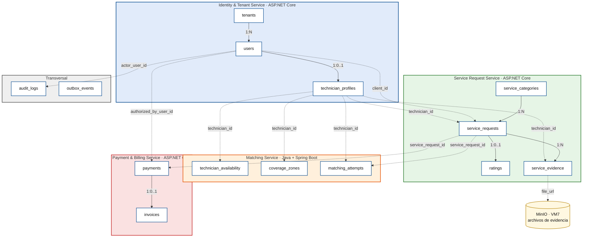
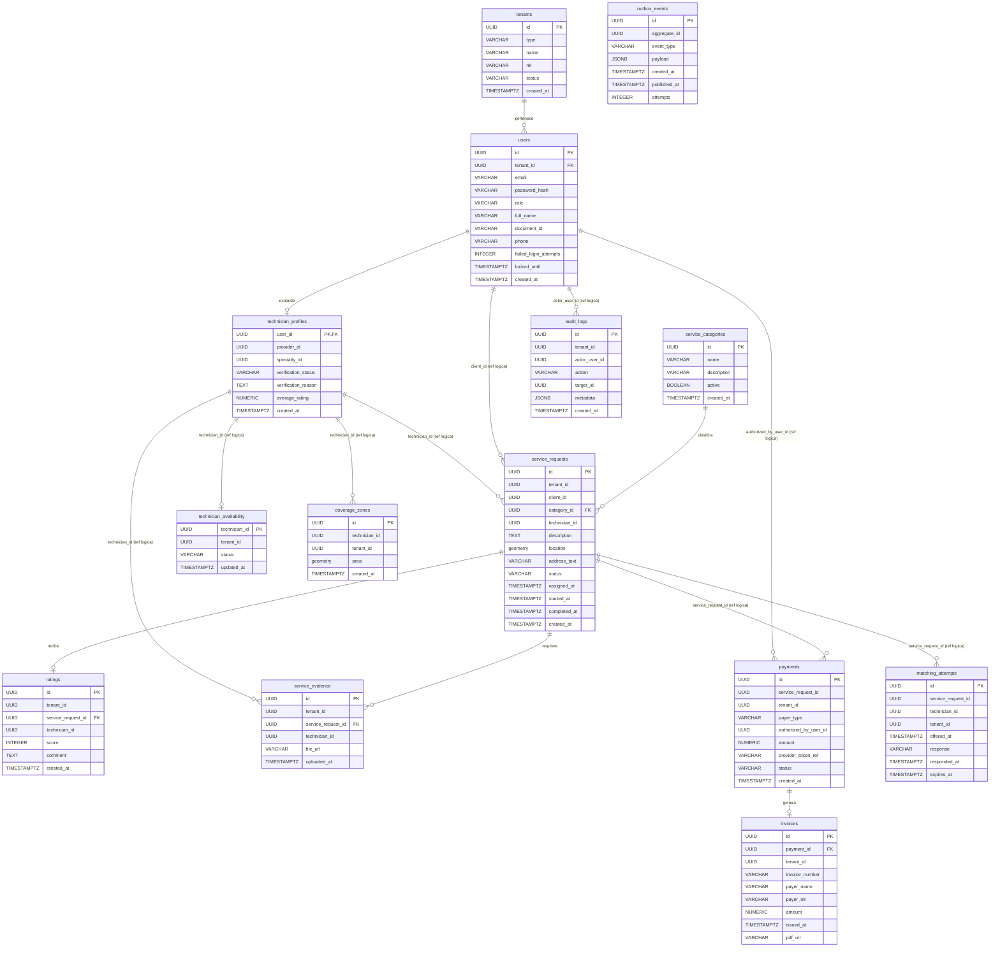
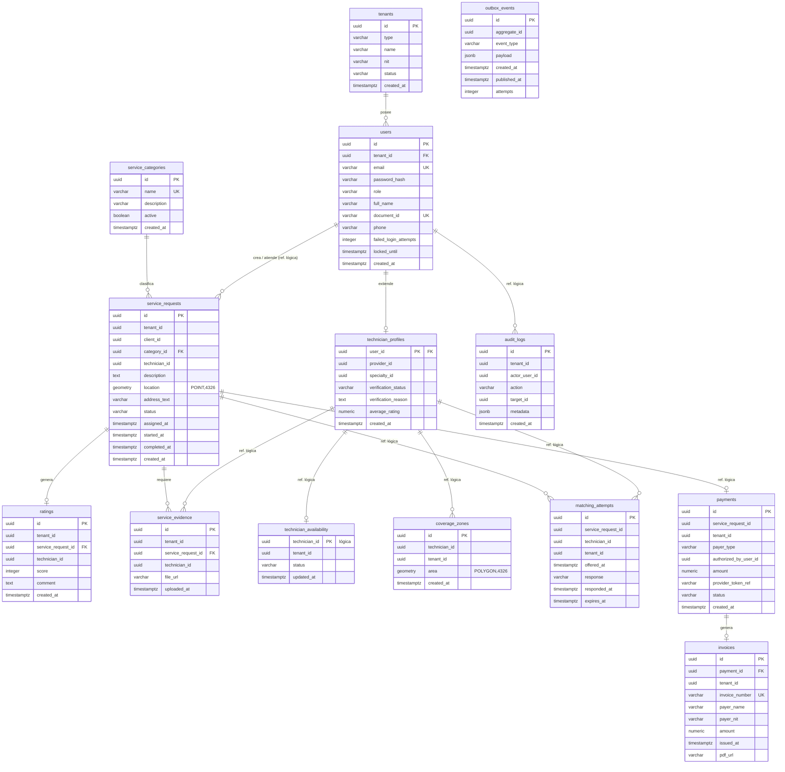
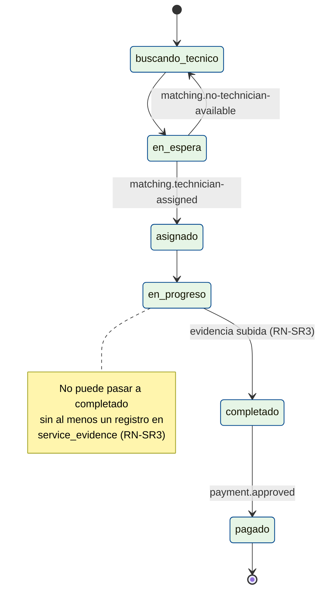
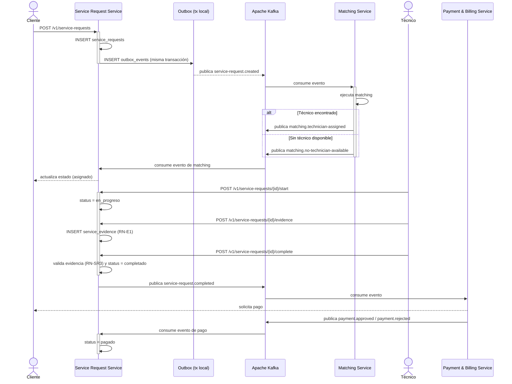
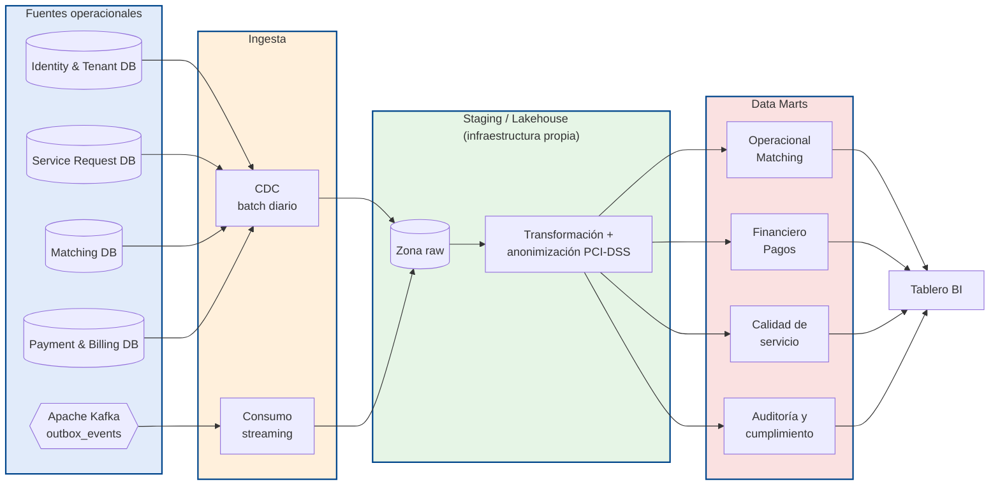

# DD — Documento de Diseño (v2)
## Modelos de Datos y Contratos — QUICKPATCH

Plataforma Digital Multi-tenant de Servicios Técnicos para el Hogar y las Empresas

|||
|---|---|
|**Tipo de documento**|Diccionario de Datos Evolutivo|
|**Arquitectura**|Microservicios + Event-Driven Architecture|
|**Backend principal**|ASP.NET Core|
|**Servicio Java**|Matching Service — Spring Boot|
|**Mensajería**|Apache Kafka|
|**Persistencia**|PostgreSQL + PostGIS|
|**Versión**|**2**|
|**Fecha**|Septiembre de 2026|
|**Curso**|Arquitectura de Software|
|**Proyecto**|QUICKPATCH|

> **Nota de esta versión:** este documento se reconstruyó tomando como base **el texto literal**
> de la versión 1 (`Documentos/DD.md`, la que pegaste), sin parafrasear ni reordenar el
> contenido ya aprobado. Las únicas modificaciones respecto al texto original son las 4
> correcciones acordadas: (1) diagrama de dominios de datos y diagrama entidad-relación detallado — nuevos, (2) reglas de negocio
> movidas del diccionario a una sección propia — el texto de cada regla se mantiene idéntico,
> solo cambia su ubicación, (3) arquitectura analítica corregida para infraestructura propia —
> nueva, (4) ADR de REST vs. Kafka corregido en estado y en el killer citado — nuevo. Todo lo
> demás —incluida `service_evidence`, sus reglas, y la tabla de servicios de la sección 3— es el
> texto original sin cambios.
>
> ⚠️ **Sigue pendiente:** la sección 3 del documento pegado lista 5 servicios
> (`Identity & Tenant Service`, `Service Request Service`, `Matching Service`,
> `Payment & Billing Service`, `Transversal`), pero la retroalimentación que me compartiste
> habla de **8 microservicios reales** (Identity, Actors, Catalog, Matching, ServiceRequest,
> Ranking, Payments, Communication) ya con CPU/RAM asignada en el Documento de Infraestructura.
> Como el texto que pegaste no trae esa tabla de 8, y yo no tengo el Documento de
> Infraestructura, **dejé la sección 3 tal cual está en el original** (5 servicios) en vez de
> volver a inventar la división en 8 por mi cuenta. Si me pasas la tabla real de 8 servicios (o
> el Documento de Infraestructura), la reemplazo en dos minutos sin tocar nada más.

---

## Índice

1. [Introducción](#1-introducción)
2. [Convenciones del modelo de datos](#2-convenciones-del-modelo-de-datos)
3. [Distribución de datos por servicio](#3-distribución-de-datos-por-servicio)
4. [Vista general del modelo](#4-vista-general-del-modelo)
5. [Diccionario de Datos](#5-diccionario-de-datos)
6. [Relaciones entre datos](#6-relaciones-entre-datos)
7. [Reglas de negocio](#7-reglas-de-negocio)
8. [Contratos actuales](#8-contratos-actuales)
9. [Arquitectura de datos analítica](#9-arquitectura-de-datos-analítica)
10. [Multi-tenancy](#10-multi-tenancy)
11. [Consideraciones de evolución del modelo](#11-consideraciones-de-evolución-del-modelo)
12. [Control de evolución](#12-control-de-evolución)
13. [Conclusión](#13-conclusión)

---

## 1. Introducción

### 1.1 Propósito

El presente Documento de Diseño tiene como propósito definir el modelo de datos inicial y los contratos conocidos de QUICKPATCH para las funcionalidades contempladas en el estado actual del backlog y del SRS.

El documento funciona principalmente como un diccionario de datos vivo, en el cual se documentan las entidades que actualmente pueden identificarse y justificarse a partir de los requisitos funcionales y no funcionales existentes.

### 1.2 Carácter evolutivo del modelo

El modelo presentado no pretende representar desde esta etapa la totalidad de las entidades que existirán en la solución final.

QUICKPATCH se desarrolla utilizando Scrum, por lo cual el modelo de datos evolucionará incrementalmente a medida que nuevos Sprint incorporen funcionalidades, reglas de negocio y necesidades de persistencia.

Cada nueva entidad, atributo, relación o restricción que surja durante el desarrollo deberá incorporarse en futuras versiones del presente documento.

Por esta razón, únicamente se modelan en esta versión las entidades que pueden sustentarse con el SRS vigente y con las decisiones arquitectónicas actualmente definidas.

### 1.3 Alcance actual

En esta versión se modelan las capacidades relacionadas con:

- Multi-tenancy.
- Registro y autenticación.
- Usuarios y técnicos.
- Categorías de servicios.
- Solicitudes de servicio.
- Disponibilidad y cobertura de técnicos.
- Matching.
- Calificaciones.
- Evidencia fotográfica obligatoria al completar un servicio.
- Pagos.
- Facturación.
- Auditoría.
- Publicación confiable de eventos mediante Kafka.

Funcionalidades futuras como chat, reclamos, ranking avanzado, inteligencia artificial, payroll-lite o proveedores de materiales no se modelan todavía, debido a que el objetivo de este documento es representar los modelos que pueden justificarse actualmente a partir del SRS del MVP.

---

## 2. Convenciones del modelo de datos

|Convención|Descripción|
|---|---|
|PK|Primary Key. Identificador principal del registro.|
|FK|Foreign Key física entre entidades pertenecientes al mismo servicio.|
|Ref. lógica|Identificador perteneciente a una entidad administrada por otro microservicio. No existe una Foreign Key física entre las bases de datos independientes.|
|UUID|Identificador universal utilizado para las entidades principales.|
|NOT NULL|El campo es obligatorio.|
|NULL|El campo puede no contener un valor.|
|TIMESTAMPTZ|Fecha y hora con información de zona horaria.|
|snake_case|Convención utilizada para nombres de tablas y columnas.|
|tenant_id|Identificador utilizado para garantizar el aislamiento multi-tenant.|

_Cuadro 1: Convenciones utilizadas en el diccionario de datos_

---

## 3. Distribución de datos por servicio

QUICKPATCH utiliza una arquitectura distribuida basada en microservicios. Por esta razón, cada conjunto de datos es responsabilidad de un servicio determinado.

|Servicio|Entidades actuales|
|---|---|
|Identity & Tenant Service|`tenants`, `users`, `technician_profiles`|
|Service Request Service|`service_categories`, `service_requests`, `ratings`, `service_evidence`|
|Matching Service|`technician_availability`, `coverage_zones`, `matching_attempts`|
|Payment & Billing Service|`payments`, `invoices`|
|Transversal|`audit_logs`, `outbox_events`|

_Cuadro 2: Propiedad inicial de las entidades por microservicio_

Cada servicio será propietario de sus datos y no deberá modificar directamente las tablas pertenecientes a otro servicio.

Las relaciones entre servicios deberán realizarse mediante referencias lógicas, contratos REST o eventos publicados mediante Apache Kafka.

---

## 4. Vista general del modelo

Las Figuras 1 y 2 presentan la distribución lógica inicial de las entidades identificadas hasta el estado actual del proyecto: la Figura 1 por dominios de datos y la Figura 2 como modelo entidad-relación.

El diagrama no representa necesariamente la totalidad de los modelos que existirán en QUICKPATCH. Nuevas entidades podrán incorporarse en Sprint posteriores conforme aparezcan nuevas historias de usuario y necesidades de persistencia.

> Las relaciones internas representan entidades administradas por un mismo microservicio. Las relaciones entre servicios corresponden a referencias lógicas y no necesariamente a Foreign Keys físicas entre bases de datos.

### 4.0 Dominios de datos por microservicio *(nuevo — pedido por el profesor)*

Cada agrupación representa un **dominio de datos** propiedad de un único microservicio.
Línea continua = relación física (FK real, misma base de datos). Línea punteada = referencia
lógica entre dominios (sin FK física; se valida por REST o eventos Kafka).



*Figura 1: Dominios de datos por microservicio.*

**Figura 2: Distribución lógica inicial del modelo de datos**



_Nota: Mermaid `erDiagram` no distingue visualmente entre línea continua y línea punteada como el UML original, así que ambos tipos de relación se dibujan igual. Para no perder la distinción, cada relación queda etiquetada: las relaciones físicas (FK real dentro de un mismo microservicio) llevan el nombre de la acción (`pertenece`, `extiende`, `clasifica`, `recibe`, `genera`), y las referencias lógicas entre microservicios (sin FK física) llevan la etiqueta `(ref logica)` junto con el campo que se referencia. El detalle completo de cada referencia lógica también se documenta en texto en la sección [6.2](#62-referencias-lógicas-entre-microservicios)._

### 4.1 Diagrama entidad-relación detallado *(nuevo)*

La Figura 2 muestra la vista general de cardinalidad, pero para consulta rápida de tipos y
claves durante el desarrollo, aquí va el mismo modelo con **atributos y notación pata de gallo
más legible por bloques**, agrupado en el mismo orden que el diccionario de la sección 5.



*Figura 3: Diagrama entidad-relación detallado con tipos, claves y cardinalidad.*

---

## 5. Diccionario de Datos

### 5.1 Tabla `tenants`

**Servicio propietario:** Identity & Tenant Service.

**Propósito:** Representa el contexto lógico de aislamiento de datos de QUICKPATCH. Puede corresponder a un contexto residencial o empresarial.

**Requisitos relacionados:** RF-04, RF-06, RF-21, RNF-09, RNF-10.

|Campo|Tipo|Nulo|Clave|Descripción|
|---|---|---|---|---|
|id|UUID|No|PK|Identificador único del tenant.|
|type|VARCHAR(20)|No|—|Tipo de tenant: hogar o empresa.|
|name|VARCHAR(150)|No|—|Nombre identificador del tenant.|
|nit|VARCHAR(30)|Sí|—|NIT de la organización cuando el tenant corresponde a una empresa.|
|status|VARCHAR(20)|No|—|Estado del tenant: activo o inactivo.|
|created_at|TIMESTAMPTZ|No|—|Fecha de creación del registro.|

**Reglas de negocio:** ver RN-T1 a RN-T3, sección 7.1.

**Índices iniciales sugeridos:**

- Índice único sobre `id`.
- Índice sobre `status`.
- Índice sobre `nit` cuando aplique.

### 5.2 Tabla `users`

**Servicio propietario:** Identity & Tenant Service.

**Propósito:** Almacena la identidad base de los usuarios que interactúan con la plataforma.

**Requisitos relacionados:** RF-01, RF-02, RF-03, RF-05, RF-06.

|Campo|Tipo|Nulo|Clave|Descripción|
|---|---|---|---|---|
|id|UUID|No|PK|Identificador único del usuario.|
|tenant_id|UUID|No|FK local|Tenant al que pertenece el usuario.|
|email|VARCHAR(150)|No|UNIQUE|Correo electrónico utilizado para autenticación.|
|password_hash|VARCHAR(255)|No|—|Hash seguro de la contraseña.|
|role|VARCHAR(30)|No|—|Rol principal del usuario.|
|full_name|VARCHAR(150)|No|—|Nombre completo.|
|document_id|VARCHAR(30)|Sí|UNIQUE|Documento de identidad. Requerido para técnicos y proveedores.|
|phone|VARCHAR(30)|Sí|—|Número de teléfono.|
|failed_login_attempts|INTEGER|No|—|Cantidad de intentos fallidos consecutivos.|
|locked_until|TIMESTAMPTZ|Sí|—|Fecha hasta la cual permanece bloqueada la cuenta.|
|created_at|TIMESTAMPTZ|No|—|Fecha de creación del usuario.|

**Valores iniciales de `role`:**

- `cliente`
- `tecnico`
- `proveedor`
- `admin`
- `empresa_contacto`

**Reglas de negocio:** ver RN-U1 a RN-U4, sección 7.2.

**Índices sugeridos:**

- UNIQUE sobre `email`.
- UNIQUE sobre `document_id` cuando exista.
- Índice sobre `tenant_id`.
- Índice compuesto sobre `tenant_id, role`.

### 5.3 Tabla `technician_profiles`

**Servicio propietario:** Identity & Tenant Service.

**Propósito:** Extiende la información de un usuario cuando su rol corresponde a técnico.

**Requisitos relacionados:** RF-02, RF-13, RF-19, RF-20.

|Campo|Tipo|Nulo|Clave|Descripción|
|---|---|---|---|---|
|user_id|UUID|No|PK / FK|Usuario correspondiente al técnico.|
|provider_id|UUID|Sí|Ref. lógica|Proveedor al que pertenece, si aplica.|
|specialty_id|UUID|No|Ref. lógica|Especialidad principal del técnico.|
|verification_status|VARCHAR(25)|No|—|Estado de verificación.|
|verification_reason|TEXT|Sí|—|Razón de rechazo o suspensión.|
|average_rating|NUMERIC(2,1)|Sí|—|Promedio de calificaciones del técnico.|
|created_at|TIMESTAMPTZ|No|—|Fecha de creación del perfil.|

**Estados de `verification_status`:**

- `pendiente`
- `aprobado`
- `rechazado`
- `suspendido`

**Reglas de negocio:** ver RN-TP1, RN-TP2, sección 7.3.

### 5.4 Tabla `service_categories`

**Servicio propietario:** Service Request Service.

**Propósito:** Define las categorías disponibles para clasificar solicitudes de servicio.

**Requisitos relacionados:** RF-07, RF-08, RF-09.

|Campo|Tipo|Nulo|Clave|Descripción|
|---|---|---|---|---|
|id|UUID|No|PK|Identificador único de la categoría.|
|name|VARCHAR(100)|No|UNIQUE|Nombre de la categoría.|
|description|VARCHAR(255)|Sí|—|Descripción opcional.|
|active|BOOLEAN|No|—|Indica si la categoría está disponible.|
|created_at|TIMESTAMPTZ|No|—|Fecha de creación.|

**Ejemplos iniciales:**

- Plomería.
- Electricidad.
- Cerrajería.
- Mantenimiento.

### 5.5 Tabla `service_requests`

**Servicio propietario:** Service Request Service.

**Propósito:** Almacena las solicitudes de servicio creadas por Clientes o Empresas y constituye la entidad principal del ciclo de negocio.

**Requisitos relacionados:** RF-07, RF-08, RF-09, RF-10, RF-11, RF-14, RF-15.

|Campo|Tipo|Nulo|Clave|Descripción|
|---|---|---|---|---|
|id|UUID|No|PK|Identificador único de la solicitud.|
|tenant_id|UUID|No|—|Tenant propietario de la solicitud.|
|client_id|UUID|No|Ref. lógica|Usuario que creó la solicitud.|
|category_id|UUID|No|FK local|Categoría del servicio.|
|technician_id|UUID|Sí|Ref. lógica|Técnico asignado a la solicitud.|
|description|TEXT|No|—|Descripción del problema.|
|location|geometry(POINT,4326)|No|—|Ubicación geográfica del servicio.|
|address_text|VARCHAR(255)|No|—|Dirección escrita.|
|status|VARCHAR(30)|No|—|Estado actual de la solicitud.|
|assigned_at|TIMESTAMPTZ|Sí|—|Momento de asignación.|
|started_at|TIMESTAMPTZ|Sí|—|Inicio del servicio.|
|completed_at|TIMESTAMPTZ|Sí|—|Finalización del servicio.|
|created_at|TIMESTAMPTZ|No|—|Fecha de creación.|

**Estados iniciales:**

- `buscando_tecnico`
- `en_espera`
- `asignado`
- `en_progreso`
- `completado`
- `pagado`

**Reglas de negocio:** ver RN-SR1 a RN-SR4, sección 7.4 — incluye la máquina de estados
completa con diagrama.

**Índices sugeridos:**

- Índice sobre `tenant_id`.
- Índice sobre `client_id`.
- Índice sobre `technician_id`.
- Índice sobre `status`.
- Índice geoespacial GIST sobre `location`.

### 5.6 Tabla `technician_availability`

**Servicio propietario:** Matching Service.

**Propósito:** Mantiene el estado operativo actual de cada técnico para determinar si puede participar en el proceso de matching.

**Requisitos relacionados:** RF-09, RF-10, RF-13.

|Campo|Tipo|Nulo|Clave|Descripción|
|---|---|---|---|---|
|technician_id|UUID|No|PK lógica|Identificador del técnico.|
|tenant_id|UUID|No|—|Tenant relacionado.|
|status|VARCHAR(25)|No|—|Disponibilidad actual.|
|updated_at|TIMESTAMPTZ|No|—|Última actualización.|

**Estados:**

- `disponible`
- `ocupado`
- `no_disponible`

### 5.7 Tabla `coverage_zones`

**Servicio propietario:** Matching Service.

**Propósito:** Define las zonas geográficas dentro de las cuales un técnico presta servicios.

**Requisitos relacionados:** RF-09, RF-13, RIE-02.

|Campo|Tipo|Nulo|Clave|Descripción|
|---|---|---|---|---|
|id|UUID|No|PK|Identificador de la zona.|
|technician_id|UUID|No|Ref. lógica|Técnico propietario.|
|tenant_id|UUID|No|—|Tenant relacionado.|
|area|geometry(POLYGON,4326)|No|—|Polígono de cobertura.|
|created_at|TIMESTAMPTZ|No|—|Fecha de creación.|

**Índices sugeridos:**

- Índice sobre `technician_id`.
- Índice GIST sobre `area`.

### 5.8 Tabla `matching_attempts`

**Servicio propietario:** Matching Service.

**Propósito:** Registra cada oferta realizada a un técnico durante el proceso de asignación de una solicitud.

**Requisitos relacionados:** RF-09, RF-10.

|Campo|Tipo|Nulo|Clave|Descripción|
|---|---|---|---|---|
|id|UUID|No|PK|Identificador del intento.|
|service_request_id|UUID|No|Ref. lógica|Solicitud relacionada.|
|technician_id|UUID|No|Ref. lógica|Técnico al que se realizó la oferta.|
|tenant_id|UUID|No|—|Tenant relacionado.|
|offered_at|TIMESTAMPTZ|No|—|Momento de la oferta.|
|response|VARCHAR(20)|No|—|Respuesta del técnico.|
|responded_at|TIMESTAMPTZ|Sí|—|Momento de respuesta.|
|expires_at|TIMESTAMPTZ|No|—|Fecha de expiración de la oferta.|

**Valores de `response`:**

- `pendiente`
- `aceptado`
- `rechazado`
- `expirado`

### 5.9 Tabla `ratings`

**Servicio propietario:** Service Request Service.

**Propósito:** Almacena la valoración realizada por un cliente al finalizar un servicio.

**Requisitos relacionados:** RF-12.

|Campo|Tipo|Nulo|Clave|Descripción|
|---|---|---|---|---|
|id|UUID|No|PK|Identificador de la calificación.|
|tenant_id|UUID|No|—|Tenant relacionado.|
|service_request_id|UUID|No|FK local|Solicitud calificada.|
|technician_id|UUID|No|Ref. lógica|Técnico calificado.|
|score|INTEGER|No|—|Valor entre 1 y 5.|
|comment|TEXT|Sí|—|Comentario opcional.|
|created_at|TIMESTAMPTZ|No|—|Fecha de creación.|

**Restricciones:** ver RN-R1 a RN-R3, sección 7.5.

### 5.10 Tabla `service_evidence`

**Servicio propietario:** Service Request Service.

**Propósito:** Registra la evidencia fotográfica que el Técnico adjunta obligatoriamente al completar una solicitud de servicio. El archivo en sí se almacena en MinIO (VM7); esta tabla guarda la referencia.

**Requisitos relacionados:** RF-15.

|Campo|Tipo|Nulo|Clave|Descripción|
|---|---|---|---|---|
|id|UUID|No|PK|Identificador único de la evidencia.|
|tenant_id|UUID|No|—|Tenant relacionado.|
|service_request_id|UUID|No|FK local|Solicitud a la que pertenece la evidencia.|
|technician_id|UUID|No|Ref. lógica|Técnico que adjuntó la evidencia.|
|file_url|VARCHAR(500)|No|—|Referencia al objeto almacenado en MinIO.|
|uploaded_at|TIMESTAMPTZ|No|—|Fecha y hora en que se subió la evidencia.|

**Reglas de negocio:** ver RN-E1 a RN-E3, sección 7.6.

**Índices sugeridos:**

- Índice sobre `service_request_id`.

### 5.11 Tabla `payments`

**Servicio propietario:** Payment & Billing Service.

**Propósito:** Registra el resultado de los pagos realizados por Clientes o Empresas.

**Requisitos relacionados:** RF-22, RF-23, RF-25, RNF-01.

|Campo|Tipo|Nulo|Clave|Descripción|
|---|---|---|---|---|
|id|UUID|No|PK|Identificador del pago.|
|service_request_id|UUID|No|Ref. lógica|Solicitud asociada.|
|tenant_id|UUID|No|—|Tenant relacionado.|
|payer_type|VARCHAR(20)|No|—|Cliente o empresa.|
|authorized_by_user_id|UUID|Sí|Ref. lógica|Usuario que autorizó el pago.|
|amount|NUMERIC(12,2)|No|—|Monto del pago.|
|provider_token_ref|VARCHAR(255)|No|—|Token o referencia retornada por el PSP.|
|status|VARCHAR(20)|No|—|Estado del pago.|
|created_at|TIMESTAMPTZ|No|—|Fecha de creación.|

**Estados:**

- `pendiente`
- `aprobado`
- `rechazado`

**Restricción PCI-DSS:** la tabla no almacena:

- Número completo de tarjeta.
- CVV.
- Fecha de expiración.

**Reglas de negocio:** ver RN-P1, RN-P2, sección 7.7.

### 5.12 Tabla `invoices`

**Servicio propietario:** Payment & Billing Service.

**Propósito:** Registra los comprobantes o facturas generados después de un pago aprobado.

**Requisitos relacionados:** RF-24.

|Campo|Tipo|Nulo|Clave|Descripción|
|---|---|---|---|---|
|id|UUID|No|PK|Identificador de la factura.|
|payment_id|UUID|No|FK local|Pago relacionado.|
|tenant_id|UUID|No|—|Tenant relacionado.|
|invoice_number|VARCHAR(50)|No|UNIQUE|Número único del comprobante.|
|payer_name|VARCHAR(150)|No|—|Nombre del pagador.|
|payer_nit|VARCHAR(30)|Sí|—|NIT cuando corresponde a empresa.|
|amount|NUMERIC(12,2)|No|—|Valor facturado.|
|issued_at|TIMESTAMPTZ|No|—|Fecha de emisión.|
|pdf_url|VARCHAR(500)|Sí|—|Ruta del comprobante generado.|

### 5.13 Tabla `audit_logs`

**Servicio propietario:** Transversal.

**Propósito:** Registrar operaciones administrativas y accesos no autorizados relevantes.

**Requisitos relacionados:** RF-19, RF-20, RNF-04.

|Campo|Tipo|Nulo|Clave|Descripción|
|---|---|---|---|---|
|id|UUID|No|PK|Identificador del registro.|
|tenant_id|UUID|Sí|—|Tenant relacionado cuando aplique.|
|actor_user_id|UUID|Sí|Ref. lógica|Usuario que ejecutó la acción.|
|action|VARCHAR(100)|No|—|Acción realizada.|
|target_id|UUID|Sí|—|Recurso afectado.|
|metadata|JSONB|Sí|—|Información adicional.|
|created_at|TIMESTAMPTZ|No|—|Fecha y hora.|

**Ejemplos de `action`:**

- `aprobar_tecnico`
- `rechazar_tecnico`
- `suspender_tecnico`
- `acceso_denegado`

### 5.14 Tabla `outbox_events`

**Servicio propietario:** Cada microservicio productor de eventos.

**Propósito:** Permitir que el registro de una operación de negocio y el evento que posteriormente será publicado en Apache Kafka se realicen dentro de una misma transacción local.

|Campo|Tipo|Nulo|Clave|Descripción|
|---|---|---|---|---|
|id|UUID|No|PK|Identificador único del evento.|
|aggregate_id|UUID|No|—|Identificador de la entidad que originó el evento.|
|event_type|VARCHAR(100)|No|—|Tipo de evento.|
|payload|JSONB|No|—|Información que será publicada en Kafka.|
|created_at|TIMESTAMPTZ|No|—|Fecha de creación.|
|published_at|TIMESTAMPTZ|Sí|—|Fecha en la que el evento fue publicado.|
|attempts|INTEGER|No|—|Cantidad de intentos de publicación.|

**Nota:** esta tabla corresponde a un modelo técnico y puede existir independientemente dentro de cada servicio productor de eventos.

---

## 6. Relaciones entre datos

### 6.1 Relaciones físicas dentro de un servicio

Cuando dos entidades son administradas por el mismo microservicio, pueden implementarse relaciones mediante Foreign Keys físicas.

**Ejemplos:**

```
users.tenant_id           -> tenants.id
service_requests.category_id -> service_categories.id
ratings.service_request_id   -> service_requests.id
service_evidence.service_request_id -> service_requests.id
invoices.payment_id          -> payments.id
```

### 6.2 Referencias lógicas entre microservicios

Cuando las entidades pertenecen a microservicios diferentes no se utilizarán Foreign Keys físicas entre sus respectivas bases de datos.

**Ejemplos:**

```
service_requests.client_id            --> users.id
service_requests.technician_id        --> users.id
matching_attempts.service_request_id  --> service_requests.id
payments.service_request_id           --> service_requests.id
service_evidence.technician_id        --> users.id
```

Estas referencias podrán validarse mediante reglas de negocio, contratos REST o eventos.

---

## 7. Reglas de negocio *(sección nueva — el texto de cada regla es el mismo que estaba en el diccionario de la 5, solo cambió de ubicación)*

### 7.1 Reglas de `tenants`

- **RN-T1:** un tenant inactivo no puede crear nuevas solicitudes.
- **RN-T2:** el NIT se utiliza principalmente para tenants empresariales.
- **RN-T3:** el tenant activo del usuario debe obtenerse desde el contexto autenticado.

### 7.2 Reglas de `users`

- **RN-U1:** el correo debe ser único.
- **RN-U2:** la contraseña nunca se almacena en texto plano.
- **RN-U3:** el tenant no se recibe libremente desde el frontend.
- **RN-U4:** después de varios intentos fallidos se puede bloquear temporalmente la cuenta.

### 7.3 Reglas de `technician_profiles`

- **RN-TP1:** solo técnicos aprobados pueden participar en matching.
- **RN-TP2:** un técnico suspendido no puede recibir nuevas solicitudes.

### 7.4 Reglas de `service_requests`: máquina de estados

- **RN-SR1:** toda solicitud debe tener una ubicación válida.
- **RN-SR2:** `technician_id` puede ser NULL mientras no exista asignación.
- **RN-SR3:** solo se puede pasar a `completado` desde `en_progreso`, y únicamente si existe
  al menos un registro asociado en `service_evidence`.
- **RN-SR4:** solo se puede pasar a `pagado` cuando Payment Service confirme el pago.



*Figura 4: Máquina de estados de `service_requests` (RN-SR1 a RN-SR4).*

### 7.5 Reglas de `ratings`

- **RN-R1:** el `score` debe estar entre 1 y 5.
- **RN-R2:** una solicitud solo puede calificarse una vez.
- **RN-R3:** solo se permite calificar solicitudes completadas.

### 7.6 Reglas de `service_evidence` *(confirmadas el 12 de septiembre)*

- **RN-E1:** una solicitud requiere al menos un registro en esta tabla antes de poder pasar
  al estado `completado`.
- **RN-E2:** solo el técnico asignado a la solicitud puede subir evidencia para esa
  solicitud.
- **RN-E3:** el archivo referenciado se almacena en MinIO (VM7), no en la base de datos.

### 7.7 Reglas de `payments`

- **RN-P1:** la tabla no almacena número completo de tarjeta, CVV, ni fecha de expiración
  (PCI-DSS).
- **RN-P2:** *(pendiente de implementar, ver sección 11)* un `service_request_id` no debería
  poder tener más de un pago en estado `aprobado`; hoy no hay constraint que lo garantice.

---

## 8. Contratos actuales

El presente documento registra únicamente los contratos que actualmente pueden identificarse a partir del SRS y del modelo existente.

### 8.1 Contratos REST

|Método|Endpoint|Descripción|
|---|---|---|
|POST|`/v1/auth/register/client`|Registrar cliente.|
|POST|`/v1/auth/register/technician`|Registrar técnico o proveedor.|
|POST|`/v1/auth/register/company`|Registrar empresa.|
|POST|`/v1/auth/login`|Autenticar usuario.|
|GET|`/v1/users/me`|Consultar perfil actual.|
|POST|`/v1/service-requests`|Crear solicitud de servicio.|
|GET|`/v1/service-requests/{id}`|Consultar una solicitud.|
|POST|`/v1/service-requests/{id}/start`|Iniciar servicio.|
|POST|`/v1/service-requests/{id}/evidence`|Adjuntar evidencia fotográfica del servicio (requerida antes de completar).|
|POST|`/v1/service-requests/{id}/complete`|Completar servicio.|
|POST|`/v1/service-requests/{id}/rating`|Calificar servicio.|
|POST|`/v1/service-requests/{id}/payment`|Procesar pago.|
|GET|`/v1/payments/{id}/invoice`|Consultar factura o comprobante.|

### 8.2 Eventos Kafka actuales

Para el estado actual del diseño se identifican inicialmente los siguientes eventos:

|Evento|Productor|Finalidad|
|---|---|---|
|`service-request.created`|Service Request Service|Iniciar el proceso de matching.|
|`matching.technician-assigned`|Matching Service|Informar que existe un técnico asignado.|
|`matching.no-technician-available`|Matching Service|Informar que no se encontró un técnico disponible.|
|`service-request.completed`|Service Request Service|Notificar la finalización y habilitar el proceso de pago.|
|`payment.approved`|Payment Service|Confirmar un pago exitoso.|
|`payment.rejected`|Payment Service|Informar el rechazo de un pago.|

#### 8.2.1 Estructura base de evento

```json
{
  "eventId": "uuid",
  "eventType": "service-request.created",
  "eventVersion": 1,
  "occurredAt": "2026-09-02T10:00:00Z",
  "correlationId": "uuid",
  "tenantId": "uuid",
  "producer": "service-request-service",
  "data": {}
}
```

El contenido específico de `data` dependerá del tipo de evento.

### 8.3 Flujo end-to-end: creación de solicitud, matching, evidencia y pago *(nuevo)*



*Figura 5: Flujo de creación de solicitud, matching, evidencia obligatoria y pago.*

### 8.4 ADR — Uso combinado de REST síncrono y eventos Kafka asíncronos *(nuevo, corregido)*

|Campo|Contenido|
|---|---|
|**Estado**|**Aceptado** *(no "Propuesto": esta decisión ya estaba tomada por el equipo)*|
|**Contexto**|QUICKPATCH requiere tanto operaciones interactivas de baja latencia (registro, login, consulta de perfil, creación de solicitud) como flujos de negocio desacoplados y tolerantes a fallos entre microservicios.|
|**Decisión**|Se usa REST para operaciones *cliente → sistema* que requieren respuesta inmediata (sección 8.1). Se usa Apache Kafka con patrón Outbox para comunicación *servicio → servicio* donde el desacople temporal y la resiliencia ante caídas son más importantes que la latencia (sección 8.2).|
|**Drivers relacionados**|Disponibilidad del sistema de matching; experiencia de usuario en operaciones interactivas.|
|**Killers relacionados**|⚠️ *La versión anterior de este ADR citaba un killer que no está en el listado oficial del proyecto. Se retira esa cita hasta que el equipo confirme cuál killer (K1–K5) del listado real aplica aquí — candidato razonable: protección e integridad de los datos de clientes y técnicos, mencionado en la sesión de revisión, pero sin número de killer asignado en este documento.*|
|**Alternativas consideradas**|(1) REST puro entre todos los servicios — descartada por acoplamiento temporal y menor resiliencia ante caídas del Matching Service. (2) Kafka puro incluso para operaciones cliente-sistema — descartada por la latencia percibida inaceptable en registro/login.|
|**Trade-offs**|Se gana desacople y resiliencia entre servicios a costa de consistencia eventual y mayor complejidad operativa (dos protocolos en vez de uno).|
|**Consecuencias**|Se requiere idempotencia en los consumidores Kafka (deduplicación por `eventId`) y versionado de evento (`eventVersion`) — *pendiente de formalizar, ver sección 11*.|

---

## 9. Arquitectura de datos analítica *(nueva, corregida)*

### 9.1 Enfoque seleccionado: Data Lakehouse **en infraestructura propia**

Se propone un modelo de tipo **Data Lakehouse**, por las siguientes razones:

- Los datos operacionales son mayoritariamente estructurados (PostgreSQL + PostGIS), pero ya
  hay fuentes semi-estructuradas reales: eventos Kafka en JSON, `audit_logs` en JSONB, y los
  archivos de `service_evidence` en MinIO.
- Un Data Warehouse puro exigiría transformar todo a esquema relacional desde el inicio, lo
  cual es prematuro dado el carácter evolutivo del modelo (sección 1.2).
- Un Data Lake puro carecería de las garantías de calidad y gobierno de datos que necesita el
  área financiera (Payment & Billing) para auditoría y reportes regulatorios.

> ⚠️ **Corrección respecto a la versión anterior:** esta capa **debe desplegarse en
> infraestructura propia del proyecto** (una VM dedicada, a asignar en el Documento de
> Infraestructura), **nunca en un servicio cloud administrado** (ej. AWS Redshift, BigQuery,
> Snowflake). Un servicio cloud administrado ya había sido descartado antes por el killer de
> soberanía/control de los datos; la redacción anterior de esta sección no lo dejaba explícito
> y volvía a abrir esa puerta. La VM específica queda pendiente de coordinar con
> infraestructura.

No se adopta **Data Mesh** en esta etapa: la organización del equipo (un solo equipo Scrum)
no justifica todavía la descentralización de la propiedad analítica por dominio de negocio.

### 9.2 Pipeline de datos propuesto



*Figura 6: Pipeline de ingesta, transformación y consumo analítico, alojado en
infraestructura propia.*

### 9.3 Fuentes de datos

|Fuente|Tipo|Contenido relevante|
|---|---|---|
|PostgreSQL — Identity & Tenant|Batch (CDC)|tenants, users, technician_profiles|
|PostgreSQL — Service Request|Batch (CDC)|service_requests, ratings, service_categories, service_evidence|
|PostgreSQL — Matching|Batch (CDC)|matching_attempts, coverage_zones, technician_availability|
|PostgreSQL — Payment & Billing|Batch (CDC), sensible|payments, invoices|
|Apache Kafka (`outbox_events`)|Streaming|Eventos de negocio en tiempo real|
|`audit_logs`|Batch|Trazabilidad de acciones administrativas|

### 9.4 Data Marts propuestos

|Data Mart|Propósito|
|---|---|
|Operacional — Matching|Tiempos de asignación, tasa de aceptación/rechazo de técnicos, disponibilidad por zona.|
|Financiero — Pagos y Facturación|Ingresos por categoría de servicio, tasa de aprobación/rechazo de pagos, facturación por tenant.|
|Calidad de servicio|Calificaciones promedio por técnico, por categoría y por zona geográfica.|
|Auditoría y cumplimiento|Consolidado de `audit_logs` para reportes regulatorios y de seguridad.|

### 9.5 Herramientas de análisis (propuesta inicial)

- **Almacenamiento Lakehouse:** solución open-source auto-hospedable (formatos tipo
  Iceberg/Delta sobre almacenamiento de objetos self-managed, ej. el mismo MinIO usado para
  evidencias), desplegada en la VM que asigne infraestructura.
- **Orquestación de ETL/ELT:** herramienta de orquestación a definir en un ADR específico,
  también auto-hospedada.
- **Visualización/BI:** tablero de BI auto-hospedado, consumido por roles `admin` y
  `empresa_contacto`.

*Nota: toda la capa mantiene la restricción de infraestructura propia; ningún componente de
esta sección puede ser un servicio cloud administrado.*

---

## 10. Multi-tenancy

Todo registro de negocio que corresponda a un tenant deberá incluir `tenant_id` cuando sea necesario para garantizar el aislamiento de información.

El identificador del tenant se obtendrá del contexto autenticado y no deberá aceptarse como un valor libre proporcionado por el cliente.

Como mecanismo adicional de seguridad, PostgreSQL podrá implementar Row Level Security.

**Ejemplo:**

```sql
USING (
    tenant_id = current_setting('app.current_tenant')::uuid
)
```

RLS constituye una medida complementaria y no sustituye las validaciones de autorización realizadas por los servicios.

---

## 11. Consideraciones de evolución del modelo

El presente modelo corresponde exclusivamente al estado actual del proyecto.

Durante nuevos Sprint podrán incorporarse nuevas entidades cuando exista una Historia de Usuario, requisito funcional o necesidad de persistencia que justifique su incorporación.

**Pendientes agregados en esta versión:**

- Confirmar contra el Documento de Infraestructura si la sección 3 debe pasar de 5 a 8
  microservicios reales (Identity, Actors, Catalog, Matching, ServiceRequest, Ranking,
  Payments, Communication) — ver nota al inicio del documento.
- Agregar índice único (o único parcial por estado `aprobado`) sobre
  `payments.service_request_id` (RN-P2).
- Documentar la estrategia de idempotencia del lado consumidor de eventos Kafka
  (deduplicación por `eventId`).
- Confirmar en el ADR de la sección 8.4 cuál killer (K1–K5) del listado oficial aplica.
- Asignar la VM específica del Lakehouse en el Documento de Infraestructura (sección 9.1).

Algunos modelos que podrían aparecer en versiones futuras son:

- Chat.
- Reclamos.
- Ranking avanzado.
- Direcciones o sedes empresariales.
- Métodos de pago adicionales.
- Historial detallado de estados.
- Notificaciones persistentes.

La inclusión de estos modelos no se considera comprometida en esta versión del documento.

---

## 12. Control de evolución

|Versión|Sprint / Etapa|Cambio|
|---|---|---|
|1|Diseño inicial → confirmación de evidencias|Modelo inicial basado en usuarios, solicitudes, matching, pagos y multi-tenancy; adaptación a solución distribuida con propiedad de datos por servicio y contratos mediante Kafka; incorporación de `service_evidence`, el endpoint `POST /v1/service-requests/{id}/evidence`, y la regla de negocio que exige al menos una evidencia para completar una solicitud. *(iterada internamente como 1.0 → 2.0 → 2.1 antes de esta renumeración)*|
|**2**|**Diagrama ER, reglas de negocio separadas, analítica y ADR corregidos**|Se agrega el diagrama de dominios de datos por microservicio (4.0) y el diagrama entidad-relación detallado (4.1), se separan las reglas de negocio del diccionario a una sección propia (7) sin cambiar su contenido, se corrige el modelo de analítica para operar en infraestructura propia sin servicio cloud administrado (9), y se corrige el ADR de REST vs. Kafka: estado "Aceptado" y killer citado retirado hasta confirmar contra el listado oficial (8.4).|

_Cuadro 17: Evolución del diccionario de datos_

---

## 13. Conclusión

El presente documento define el modelo de datos actualmente identificable para QUICKPATCH y debe entenderse como un artefacto evolutivo.

El objetivo no consiste en diseñar anticipadamente todas las tablas que podría requerir la plataforma, sino documentar de manera precisa los modelos que pueden justificarse con los requisitos existentes.

La separación por microservicios permite establecer claramente la propiedad de los datos y distinguir entre relaciones físicas dentro de un mismo servicio y referencias lógicas entre servicios diferentes.

En esta versión se dispone de un modelo suficiente para soportar:

- usuarios;
- tenants;
- técnicos;
- categorías;
- solicitudes;
- matching;
- disponibilidad;
- zonas de cobertura;
- calificaciones;
- evidencias fotográficas;
- pagos;
- facturación;
- auditoría;
- eventos Kafka;
- capa analítica de datos.

El diccionario deberá actualizarse progresivamente durante los Sprint siguientes conforme aparezcan nuevas necesidades de negocio y persistencia, y en particular una vez se confirmen los puntos marcados con ⚠️ en este documento.
