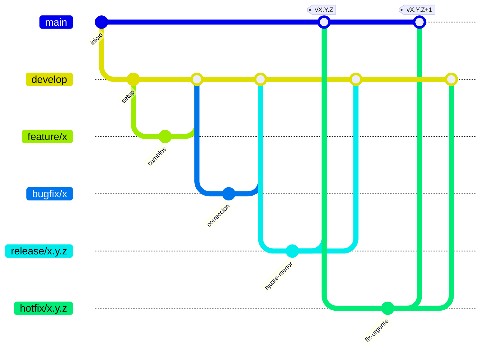
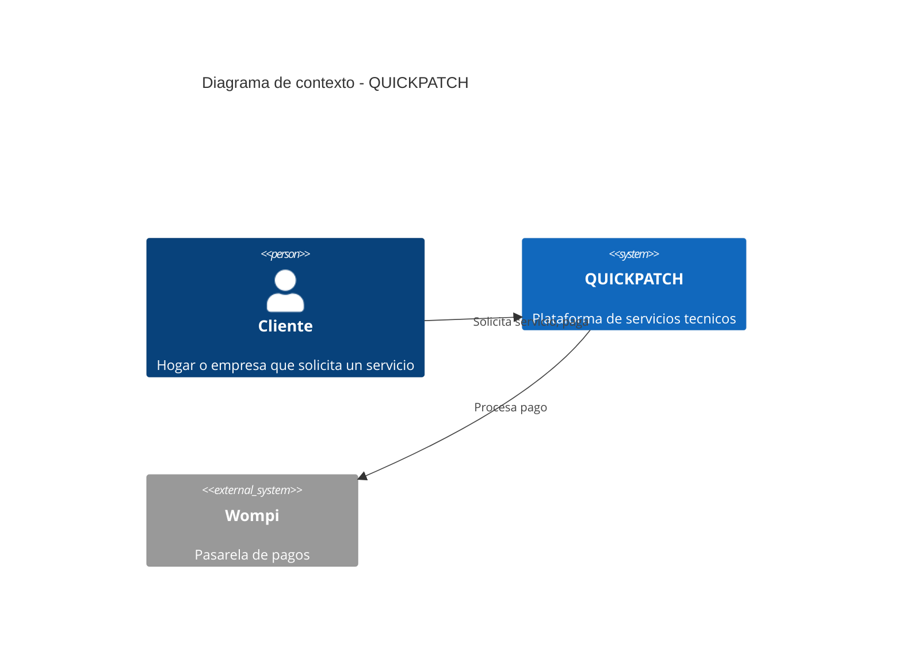

# Herramientas y Políticas de Trabajo

**GitFlow, Backlog, Estilo de Código y Documentación Técnica**

Plataforma Multi-tenant de Servicios Técnicos — _QUICKPATCH_ Marketplace de servicios técnicos para hogares y empresas

|||
|---|---|
|**Curso**|Arquitectura de Software|
|**Entregable**|Políticas y Herramientas del proyecto|
|**Rol**|Encargado de Infraestructura / DevOps|
|**Alcance**|Flujo de trabajo, políticas de equipo y herramientas|

Bogotá, Colombia — 14 de agosto de 2026

---

## Índice

1. [Introducción](https://claude.ai/chat/79a9a126-9c5f-4641-bd84-002d21bcb12c#introducci%C3%B3n)
2. [Infraestructura del proyecto (resumen)](https://claude.ai/chat/79a9a126-9c5f-4641-bd84-002d21bcb12c#infraestructura-del-proyecto-resumen)
3. [GitFlow: modelo de ramas](https://claude.ai/chat/79a9a126-9c5f-4641-bd84-002d21bcb12c#gitflow-modelo-de-ramas)
4. [Políticas de trabajo del equipo](https://claude.ai/chat/79a9a126-9c5f-4641-bd84-002d21bcb12c#pol%C3%ADticas-de-trabajo-del-equipo)
5. [Versionamiento semántico (SemVer)](https://claude.ai/chat/79a9a126-9c5f-4641-bd84-002d21bcb12c#versionamiento-sem%C3%A1ntico-semver)
6. [Gestión del backlog y herramientas de planeación](https://claude.ai/chat/79a9a126-9c5f-4641-bd84-002d21bcb12c#gesti%C3%B3n-del-backlog-y-herramientas-de-planeaci%C3%B3n)
7. [Estilo de código](https://claude.ai/chat/79a9a126-9c5f-4641-bd84-002d21bcb12c#estilo-de-c%C3%B3digo)
8. [Uso de Inteligencia Artificial en el desarrollo](https://claude.ai/chat/79a9a126-9c5f-4641-bd84-002d21bcb12c#uso-de-inteligencia-artificial-en-el-desarrollo)
9. [Documentación técnica: C4 Model y Obsidian](https://claude.ai/chat/79a9a126-9c5f-4641-bd84-002d21bcb12c#documentaci%C3%B3n-t%C3%A9cnica-c4-model-y-obsidian)

---

## Introducción

Este documento define los **estándares y políticas de trabajo del equipo** para el desarrollo de QUICKPATCH (Next.js, Flutter, NestJS, PostgreSQL/PostGIS, Redis, Apache Kafka y MinIO): el flujo de trabajo en Git (GitFlow), las políticas de colaboración, el versionamiento semántico, la gestión del backlog, el estilo de código, el uso responsable de IA, y las herramientas de documentación técnica. Su objetivo es que todo el equipo trabaje bajo las mismas reglas, independientemente de qué módulo o funcionalidad esté desarrollando cada persona.

La propuesta de infraestructura distribuida (despliegue sobre las 7 máquinas virtuales, contenedores, CI/CD, monitoreo y gestión de secretos) se documenta por separado en el anexo _"Propuesta de Infraestructura DevOps"_, ya que responde a decisiones de arquitectura técnica en lugar de a políticas de trabajo del equipo.

---

## Infraestructura del proyecto (resumen)

El proyecto opera sobre **7 máquinas virtuales**, administradas por el rol de DevOps del equipo. La siguiente tabla resume para qué sirve cada una; el detalle técnico completo (topología, justificación, contenedores, CI/CD) se documenta en el anexo _"Propuesta de Infraestructura DevOps"_.

|VM|Rol|Para qué sirve|
|---|---|---|
|VM1|Gateway|Recibe el tráfico entrante y lo dirige hacia el sitio web o la API|
|VM2|Frontend Web|Sirve el sitio público y el panel administrativo (Next.js)|
|VM3|Backend|Ejecuta la lógica de negocio de la plataforma (NestJS)|
|VM4|Base de datos|Almacena la información del sistema, incluida la geolocalización (PostgreSQL + PostGIS)|
|VM5|Cache|Acelera respuestas frecuentes y gestiona colas de trabajos programados (Redis)|
|VM6|Mensajería|Procesa eventos en segundo plano: matching, ranking, notificaciones, pagos (Kafka)|
|VM7|Storage y observabilidad|Guarda evidencias fotográficas y centraliza logs/métricas de las demás VMs|

---

## GitFlow: modelo de ramas

### Ramas principales

- **`main`** — código en producción, siempre estable. Nunca se hace push directo.
- **`develop`** — rama de integración; aquí se juntan las features antes de pasar a producción.

### Ramas de soporte

- **`feature/nombre-corto`** — sale de `develop`, vuelve a `develop`. Una por funcionalidad.
- **`release/x.y.z`** — sale de `develop` cuando hay un conjunto de features listo para entregar. Solo correcciones menores; se mergea a `main` y a `develop`.
- **`hotfix/x.y.z`** — sale de `main` para corregir algo urgente en producción. Se mergea a `main` y a `develop`.

### Convención de nombres

```
feature/nombre-corto-descriptivo
bugfix/descripcion-del-bug
hotfix/descripcion-urgente
release/1.2.0
```

La ruta de cada rama incluye el módulo de dominio afectado (Auth, Matching, Payments, Ranking, Billing, etc., según los módulos definidos en la arquitectura), de forma que el nombre de la rama indica a qué parte del sistema pertenece sin necesidad de abrir el PR:

```
feature/<modulo>/<descripcion-corta>
bugfix/<modulo>/<descripcion-corta>
hotfix/<modulo>/<descripcion-corta>
```

```
feature/auth/login-jwt
feature/matching/filtro-ventana-horaria
feature/payments/integracion-wompi
feature/ranking/calculo-reputacion

bugfix/matching/no-filtra-hora
bugfix/billing/factura-monto-incorrecto

hotfix/payments/webhook-caido
hotfix/auth/tenant-id-expuesto

release/1.0.0
release/1.1.0
```

Reglas generales de nomenclatura:

- Todo en minúsculas, sin tildes ni espacios.
- Palabras separadas por guiones (`-`), no guion bajo.
- Descripción corta pero clara — no `feature/fix`, sí `feature/matching/filtro-ventana-horaria`.
- `release/` siempre usa SemVer completo (`1.0.0`, nunca solo `1.0`).
- Si se usa un tablero de tareas (Jira/GitHub Projects), se puede anteponer el identificador de la tarjeta: `feature/TC-23-login-jwt`.

### Diagrama del flujo



### Origen y destino de cada rama

|Rama|Sale de|Vuelve a|Urgencia|
|---|---|---|---|
|`feature/*`|`develop`|`develop`|Normal|
|`bugfix/*`|`develop` **o** `release/x.y.z`|La misma rama de la que salió|Normal a media|
|`release/x.y.z`|`develop`|`main` **y** `develop`|Media (previo a entrega)|
|`hotfix/*`|`main`|`main` **y** `develop`|Alta|

### Qué es técnicamente "salir de" y "volver a" una rama

En Git una rama no es una copia de archivos: es un **puntero** a un commit. Cuando una rama "sale de" otra, únicamente se crea un puntero nuevo apuntando al mismo commit donde estaba la rama de origen en ese momento; a partir de ahí ambas avanzan de forma independiente. Cuando una rama "vuelve a" otra, se genera un _merge commit_ que une ambas historias y mueve el puntero de destino hacia adelante. Git no conserva una jerarquía permanente entre ramas — el "sale de / vuelve a" es una convención de trabajo del equipo, no una restricción técnica.

### Diferencia entre `bugfix` y `hotfix`

Ambas corrigen errores; la diferencia está en **dónde está el bug** y **qué tan urgente es**.

|Criterio|`bugfix/`|`hotfix/`|
|---|---|---|
|¿Dónde está el bug?|En desarrollo (`develop` o `release`), aún no llegó a producción|En producción (`main`)|
|¿De dónde sale?|`develop` o `release/x.y.z`|`main` directamente|
|¿A dónde vuelve?|La misma rama de origen|`main` **y** `develop`|
|Urgencia|Normal, sigue el flujo estándar de PR|Alta, se prioriza sobre cualquier otro trabajo|
|¿Usuarios afectados ahora mismo?|No|Sí|

**Regla práctica:** _¿esto ya le está fallando a alguien en producción ahora mismo?_ Si sí, es `hotfix`; si no, es `bugfix`.

#### `bugfix/` desde `develop` vs. desde `release`

- **Desde `develop`**: el bug se encuentra en código ya integrado, pero el equipo todavía no decidió preparar una entrega. Sigue el flujo normal de PR, sin urgencia especial, y convive con features nuevas que se desarrollan en paralelo.
- **Desde `release/x.y.z`**: el bug aparece durante las pruebas de la versión que ya se congeló para entrega (E2E, UAT, staging). El fix debe ser mínimo y quirúrgico — no se agregan features nuevas en esta rama — y bloquea la salida a producción hasta corregirse. Al cerrarse la `release`, este fix llega tanto a `main` como de vuelta a `develop`.

_Nota:_ si el bug es de código que la misma persona metió dentro de la `feature/` en la que está trabajando en ese momento, no se crea una rama `bugfix/` aparte — simplemente se agrega otro commit dentro de esa misma `feature/`.

### Qué pruebas se hacen en cada rama

|Rama|Pruebas|
|---|---|
|`feature/*`|Unitarias (Jest, flutter_test) mientras se desarrolla; lint + unitarias como gate obligatorio en el PR hacia `develop`|
|`develop`|Integración (Testcontainers: PostgreSQL/PostGIS y Kafka reales en Docker); tests de contrato (Pact) entre Flutter/Next.js y la API de NestJS|
|`release/x.y.z`|End-to-end (Playwright / Patrol) de los flujos completos, regresión, UAT contra los escenarios de aceptación del cliente, carga/rendimiento (k6), seguridad (OWASP ZAP, alcance PCI-DSS), y _smoke tests_ en el ambiente de staging antes del merge a `main`|

**Regla práctica:** si una prueba es rápida y aísla una sola pieza de código, va en cada PR/feature. Si es lenta, cubre el sistema completo, o necesita un ambiente real (staging), va en `release`.

### Rol de QA dentro del flujo

|Rama|Qué valida QA|Nivel|
|---|---|---|
|`feature/*`|Revisión del PR: que cumpla la historia de usuario, prueba manual de esa feature puntual, casos borde específicos|Pieza individual, aislada|
|`release/x.y.z`|E2E completos, UAT contra criterios de aceptación reales, validación de que todas las features de la versión funcionan integradas entre sí; su aprobación habilita el merge a `main`|Versión completa, candidata a producción|

Dado que el equipo no cuenta con un QA dedicado de tiempo completo, la validación en `feature/` la realiza el compañero que revisa el PR (revisor = QA informal), y antes de cada `release` una persona del equipo — rotativa — corre manualmente los escenarios de aceptación completos como un ejercicio explícito, documentado en un checklist.

### Ambientes vs. ramas

Un ambiente de pruebas (QA/staging) no es una rama de Git, es un servidor donde se despliega cierta rama. El mapeo entre ramas y ambientes es el siguiente:

- `develop` — despliegue automático al ambiente `dev`.
- `release/*` — despliegue automático al ambiente `staging/qa`, donde ocurren las pruebas exhaustivas antes de producción.
- `main` — ambiente de `producción`.

### Uso selectivo de GitFlow

En la práctica, la gran mayoría del trabajo diario del equipo ocurre únicamente en el ciclo `feature/* → develop`. Las ramas `release/*` y `hotfix/*` se usan con poca frecuencia — `release` solo en los momentos puntuales de entrega (por ejemplo, la versión que se muestra en cada hito del curso), y `hotfix` probablemente no se necesite en un contexto académico sin usuarios reales en producción 24/7. Esto no es una simplificación del modelo: GitFlow completo se conserva porque es un modelo robusto y estándar de la industria, pero se aplica de forma selectiva según la situación real de cada momento del proyecto.

Como referencia, existe un modelo más liviano llamado **GitHub Flow**: solo dos tipos de rama (`main` y `feature/*`), sin `develop` ni `release` ni `hotfix` formales — cualquier corrección urgente es simplemente otra `feature/` (o `fix/`) que se prioriza y se mergea rápido. Es más simple de mantener, pero cubre menos casos que el modelo de esta sección. **El proyecto utiliza GitFlow**, tal como se describe en esta sección.

---

## Políticas de trabajo del equipo

### Commits

Se sigue la convención _Conventional Commits_:

```
tipo(alcance): descripcion corta en presente

[cuerpo opcional explicando el "por que", no el "que"]

[footer opcional: referencias a tareas, breaking changes]
```

|Tipo|Cuándo se usa|
|---|---|
|`feat`|Nueva funcionalidad|
|`fix`|Corrección de un bug|
|`docs`|Solo documentación (README, comentarios)|
|`refactor`|Reestructurar código sin cambiar comportamiento|
|`test`|Agregar o corregir pruebas|
|`chore`|Tareas de mantenimiento (dependencias, configuración)|
|`style`|Cambios de formato que no afectan lógica (espacios, punto y coma)|

El **alcance** (módulo afectado) es opcional pero recomendado, ya que el backend está organizado por dominios (Auth, Matching, Payments, Ranking, Billing, etc.):

```
feat(matching): agregar filtro por ventana horaria
fix(payments): corregir webhook duplicado de Wompi
refactor(ranking): extraer calculo de reputacion a servicio propio
```

Ejemplo con cuerpo y footer:

```
fix(auth): corregir fuga de datos entre tenants

El middleware no validaba tenant_id en rutas anidadas,
permitiendo que un usuario viera datos de otra empresa.

Refs: TC-45
```

**Regla práctica:** el título va en minúsculas, sin punto final, en modo imperativo ("agregar", no "agregado" ni "agrega").

### Pull Requests

- Ninguna feature se mergea a `develop` sin PR.
- Mínimo 1 revisor (idealmente 2 si el equipo lo permite).
- El autor no se auto-aprueba.
- La rama debe estar actualizada con `develop` antes de mergear.

### Code review

- Se revisa: legibilidad, cumplimiento de la historia de usuario, que no rompa tests.
- Comentarios de estilo son sugerencia; los bugs son bloqueantes.

### Protección de ramas

- No push directo a `main` ni a `develop`.
- PR requiere al menos 1 aprobación.
- No se mergea si el pipeline de CI falla.

### Definición de "Hecho" (Definition of Done)

- Código compila y pasa tests.
- Pasó code review.
- Está documentado si aplica.
- Merge a `develop` sin conflictos.

### Distribución y reasignación de tareas

Las historias de usuario del backlog en Jira **no se asignan por especialidad fija**: cada persona puede tomar historias de distintos módulos según la disponibilidad y el balance de carga del sprint, no solo las de su rol principal (Backend, Frontend, QA, DevOps). Esto evita cuellos de botella cuando un módulo concentra más trabajo del que su responsable habitual puede cubrir en el sprint, y permite que el conocimiento del sistema no quede aislado en una sola persona.

- **Asignación:** se define en la reunión de planeación del sprint (Teams), donde cada persona toma las historias según disponibilidad real para ese periodo, priorizando primero su especialidad y, si hay capacidad libre, historias de otros módulos.
- **Autoasignación:** una vez repartido el sprint, si alguien termina sus historias antes de tiempo, puede tomar otra historia `To Do` del backlog sin esperar a la siguiente reunión, avisando por WhatsApp.
- **Reasignación por no cumplimiento:** si una persona no puede terminar una historia que tomó dentro del sprint, debe avisar **tan pronto lo identifique** (no al final del sprint) por WhatsApp y explicar el motivo. El Scrum Master decide, según el estado real del avance:
    - Si ya hay avance aprovechable, se reasigna a otra persona que continúe desde ese punto.
    - Si no hay avance aprovechable o el bloqueo es externo, la historia vuelve a `To Do` y se replanifica en el siguiente sprint.
- **Historias no reclamadas:** si al cierre de la planeación quedan historias prioritarias sin que nadie las tome, el Scrum Master las asigna directamente, buscando equilibrar la carga del equipo.

**Regla práctica:** avisar temprano que una tarea no se va a cumplir a tiempo no es una falla — no avisar y descubrirlo al cierre del sprint sí lo es, porque le quita al equipo tiempo de reacción.

### Resolución de conflictos y problemas

El equipo define reglas claras de escalamiento según el tipo de problema, para que ninguna situación quede sin resolverse por falta de un canal definido. En todos los casos se privilegia resolver el problema en el nivel más bajo posible antes de escalar.

|Tipo de problema|Procedimiento|Canal / responsable|
|---|---|---|
|Discrepancia técnica (ej. desacuerdo sobre una decisión de arquitectura o implementación)|Se discute primero entre las personas involucradas; si no hay acuerdo, se escala al Scrum Master; si persiste, se somete a votación con el equipo completo|WhatsApp para la discusión inicial; Scrum Master y equipo completo en Teams si escala|
|Bloqueo de trabajo (una tarea depende de otra persona o de un recurso no disponible)|Se reporta de inmediato por el canal urgente y se prioriza en la siguiente reunión de seguimiento|WhatsApp (aviso inmediato) → Teams (priorización)|
|Incumplimiento de plazos o tareas asignadas|Conversación directa entre compañeros en primera instancia; si es recurrente, se escala al Scrum Master, quien da seguimiento formal en la reunión de equipo|Directo entre compañeros → Scrum Master|
|Conflicto interpersonal|Se resuelve en privado entre las partes; si no se resuelve, interviene el Scrum Master o el Product Owner como mediador|Privado → Scrum Master / Product Owner|

**Principios generales:**

- Ningún bloqueo se guarda para la siguiente reunión formal si puede resolverse antes — para eso existe el canal de WhatsApp.
- El Scrum Master es el responsable de dar seguimiento a que un problema escalado se cierre, no solo de recibirlo.
- Las decisiones técnicas que no logran consenso tras la discusión inicial se resuelven por votación del equipo completo, y quedan registradas como referencia para decisiones futuras similares.
- Un conflicto interpersonal nunca se discute en el grupo general de WhatsApp ni en la reunión de equipo frente a todos — se maneja en privado y, si requiere mediación, con la menor cantidad de personas necesarias.

### Canales de comunicación

|Canal|Uso|Frecuencia|
|---|---|---|
|Microsoft Teams|Reuniones de equipo, seguimiento formal del proyecto y toma de decisiones|Lunes 5:00 p.m. y sábado 1:00 p.m.|
|WhatsApp (grupo)|Comunicación rápida e informal — dudas puntuales, avisos, coordinación entre reuniones|Continuo, según necesidad|

Las reuniones de Teams son el espacio donde se revisan bloqueos, se resuelven decisiones de arquitectura y se hace seguimiento del backlog en Jira; el grupo de WhatsApp se usa para todo lo que no puede esperar hasta la siguiente reunión (una duda rápida, avisar que se subió un PR, o coordinar algo puntual), sin reemplazar la discusión más profunda que corresponde a Teams.

---

## Versionamiento semántico (SemVer)

Cada vez que el equipo entrega una versión del proyecto, se le asigna un número con tres partes: `MAYOR.MENOR.PARCHE` (ej. `1.4.2`). Cada número indica qué tan grande fue el cambio respecto a la versión anterior — es, en esencia, un semáforo de tamaño del cambio.

|Número|Sube cuando...|Ejemplo|
|---|---|---|
|MAYOR (1er)|Se rompe compatibilidad con lo anterior|Cambiar la API de forma que la versión vieja de Flutter ya no funcione con el backend nuevo|
|MENOR (2do)|Se agrega funcionalidad nueva, sin romper lo existente|Agregar el módulo de pagos sin afectar lo que ya funcionaba (matching, ranking)|
|PARCHE (3er)|Se corrige un error, sin agregar nada nuevo|Arreglar que el filtro de ventana horaria no funcionaba bien|

**Analogía:** es como las actualizaciones de una app conocida (ej. WhatsApp). Si arreglan que se caía al abrir una foto, solo cambia el último número (`2.5.1 → 2.5.2`). Si agregan una función nueva sin romper nada, cambia el número de en medio (`2.5.2 → 2.6.0`). Si cambian tanto la app que ya no puedes usar la versión vieja para lo mismo, cambia el primero (`2.6.0 → 3.0.0`).

**Cómo se aplica en el flujo del equipo:** al completar un Sprint, `develop` se mergea en `main` y se etiqueta la nueva versión en Git:

```
git tag v0.2.0
git push origin v0.2.0
```

Ese tag queda como un punto exacto al que se puede volver en cualquier momento — por ejemplo, para mostrar "así estaba el proyecto cuando se entregó en el Sprint 3".

```
0.1.0  -> primera version funcional minima
0.2.0  -> se agrega el modulo de matching (Sprint 2)
0.2.1  -> se corrige un bug de ese modulo
1.0.0  -> primera version completa (la que se entrega al profesor)
1.0.1  -> hotfix urgente despues de la entrega
```

Se empieza en `0.x.x` mientras el proyecto está en desarrollo temprano e inestable; se salta a `1.0.0` cuando se considera la primera versión "completa" del sistema.

---

## Gestión del backlog y herramientas de planeación

Además de las herramientas de infraestructura, el equipo utiliza herramientas de planeación para gestionar el backlog, el diseño y el mapeo de flujos:

- **Jira** — gestión del backlog: historias de usuario, estimación de complejidad, sprints y tablero Kanban/Scrum. Las ramas `feature/`, `bugfix/` y `hotfix/` referencian el identificador de la tarjeta de Jira cuando aplica (ver sección [Convención de nombres](https://claude.ai/chat/79a9a126-9c5f-4641-bd84-002d21bcb12c#convenci%C3%B3n-de-nombres)).
- **Issues de GitHub** — complemento de Jira: tareas técnicas puntuales ligadas directamente a un Pull Request, vinculadas a la tarjeta de Jira correspondiente (ver sección [Issues de GitHub y tablero Kanban en Jira](https://claude.ai/chat/79a9a126-9c5f-4641-bd84-002d21bcb12c#issues-de-github-y-tablero-kanban-en-jira)). Jira gestiona las historias de usuario y el tablero Kanban; los Issues de GitHub gestionan el trabajo técnico del día a día que se traza contra el código, sin tener un tablero propio separado.
- **Figma** — diseño de interfaces (UI/UX) de la app móvil y del sitio web.
- **Miro** — mapeo de flujos, diagramas de arquitectura colaborativos y sesiones de planeación en equipo.

### Estimación de complejidad de historias de usuario

Las historias de usuario en Jira se estiman con la secuencia de **Fibonacci**: `1, 2, 3, 5, 8`. Se prefiere sobre una escala lineal (1 a 5) porque refleja mejor la incertidumbre real: entre más compleja es una historia, más difícil es estimarla con precisión, y Fibonacci obliga a decidir entre valores claramente distintos en vez de discutir diferencias de un punto que no aportan a la planeación. No se usa el valor `13`: si una historia pesa eso, se considera señal de que debe partirse en historias más pequeñas.

|Puntos|Qué significa|
|---|---|
|1|Cambio trivial, sin lógica de negocio nueva (ej. ajustar un texto o un campo)|
|2|Funcionalidad simple, un solo módulo, sin dependencias externas|
|3|Funcionalidad estándar, toca 1–2 módulos, lógica moderada|
|5|Complejidad real: integra varios módulos o un servicio externo (ej. integración con Wompi, con Kafka)|
|8|Alta incertidumbre o mucha superficie de cambio (ej. el motor de matching completo con PostGIS)|

### Issues de GitHub y tablero Kanban en Jira

Los **Issues de GitHub** complementan a Jira: mientras Jira gestiona las historias de usuario de alto nivel, los Issues trazan el trabajo técnico puntual directamente contra el código y los Pull Requests. Un Issue de una historia grande en Jira puede desglosarse en varios Issues técnicos en GitHub. El **tablero Kanban vive dentro de Jira** — no se usa un tablero de GitHub Projects aparte — y los Issues de GitHub se vinculan a su tarjeta de Jira correspondiente (mediante la integración Jira-GitHub o referenciando el identificador de la tarjeta, ej. `TC-23`, en el título del Issue o del PR) para que el avance del código se refleje en un único tablero.

#### Estructura obligatoria de un Issue

- Título descriptivo.
- Detalle del problema o tarea.
- Label(s) de categorización (ver tabla siguiente).
- Responsable(s) asignado(s).
- Vinculación a la tarjeta de Jira correspondiente y al **Sprint** actual (ej. _"Sprint 2 - Módulo de Autenticación"_).

#### Labels oficiales

|Label|Descripción|
|---|---|
|`bug`|Reporte de errores o fallos funcionales en el sistema|
|`deployment`|Cambios o peticiones relacionadas con despliegue o infraestructura|
|`documentation`|Actualizaciones, mejoras o creación de documentación|
|`feature`|Solicitud de nuevas funcionalidades|
|`question`|Dudas, aclaraciones o solicitudes de información adicional|
|`testing`|Verificación, pruebas unitarias, de integración o de aceptación|

_Nota:_ estas labels categorizan **Issues** (tareas técnicas); no deben confundirse con los tipos de **commit** de la sección [Commits](https://claude.ai/chat/79a9a126-9c5f-4641-bd84-002d21bcb12c#commits) (`feat`, `fix`, `docs`...), que categorizan cambios de código individuales. Ambos conceptos suelen coincidir en un mismo trabajo (un Issue `bug` normalmente se resuelve con un commit `fix:`), pero son capas distintas.

#### Estados del tablero Kanban (en Jira)

|Columna|Significado|
|---|---|
|To Do|Tarea pendiente de ejecución|
|In Progress|Tarea en desarrollo activo|
|Review|Código finalizado y enviado a revisión mediante Pull Request|
|Done|Tarea verificada, aprobada, cerrada formalmente y, si corresponde, desplegada|

**Reglas de transición:**

- Al finalizar una tarea se crea un Pull Request vinculado al Issue de GitHub y a la tarjeta de Jira correspondiente.
- La aprobación del PR es obligatoria mediante revisión por pares (peer review), igual que el resto de Pull Requests del proyecto (ver [Pull Requests](https://claude.ai/chat/79a9a126-9c5f-4641-bd84-002d21bcb12c#pull-requests)).
- Tras aprobarse y fusionarse el PR, se valida que la solución funciona correctamente y, si aplica, que el despliegue en el entorno definido fue exitoso.
- Una tarjeta solo pasa a `Done` en Jira cuando está completamente validada, aprobada y cerrada formalmente — **no se permite** mover una tarjeta a `Done` sin cierre formal, incluso si el PR ya fue fusionado.

**Cierre automático del Issue de GitHub:** el Pull Request debe referenciar el Issue relacionado usando palabras clave en su título o descripción, para que GitHub lo cierre automáticamente al fusionarse:

```
Fixes #23
Closes #23
Resolves #23
```

Esto cierra el Issue técnico en GitHub; el movimiento de la tarjeta a `Done` en el tablero Kanban de Jira se hace de forma explícita siguiendo la regla anterior, no automáticamente por el cierre del Issue.

### Planes gratuitos de las herramientas del proyecto

Todas las herramientas seleccionadas para el proyecto cuentan con un plan gratuito suficiente para el tamaño del equipo, sin necesidad de pago:

|Herramienta|Costo|Nota|
|---|---|---|
|Jira|Gratis|Plan Free permanente hasta 10 usuarios — suficiente para el tamaño del equipo del curso; incluye tablero Scrum/Kanban y backlog|
|Figma|Gratis (con límites)|Plan Starter gratuito; limitado en número de archivos y editores por equipo — suficiente para el alcance de este proyecto|
|Miro|Gratis (con límites)|Plan Free permanente, hasta 3 tableros editables, miembros ilimitados — suficiente para sesiones puntuales de mapeo|
|GitHub|Gratis|Repositorios privados y públicos ilimitados; minutos incluidos de GitHub Actions en el plan gratuito|
|GitHub Actions|Gratis (con límites)|Incluido dentro del plan gratuito de GitHub; minutos limitados al mes en repos privados, ilimitado en repos públicos|
|GitHub Container Registry (`ghcr.io`)|Gratis|Incluido con el plan gratuito de GitHub; registro de las imágenes Docker de los 8 microservicios|
|Docker / Docker Compose|Gratis|Open source|
|Ansible|Gratis|Open source; aprovisiona las 7 VMs desde un solo inventario (ver Documento de Infraestructura, sección 5)|
|k3s|Gratis|Open source; distribución liviana de Kubernetes que orquesta los 8 microservicios en VM3|
|Nginx|Gratis|Open source; API Gateway y terminación TLS en VM1|
|Mermaid|Gratis|Open source; renderiza directamente en GitHub sin instalación|
|PostgreSQL + PostGIS|Gratis|Open source|
|Redis|Gratis|Open source|
|Apache Kafka|Gratis|Open source|
|Kafka UI|Gratis|Open source; interfaz de inspección de topics y consumidores|
|MinIO|Gratis|Open source (self-hosted)|
|Prometheus + Grafana|Gratis|Open source; self-hosted, sin límite de usuarios — métricas|
|`node_exporter`|Gratis|Open source; agente de métricas de sistema operativo en cada una de las 7 VMs|
|Loki|Gratis|Open source; almacena el historial de logs agregados de las 7 VMs|
|Promtail|Gratis|Open source; agente que recolecta los logs de cada VM y los envía a Loki|
|Pino|Gratis|Open source; librería de logging estructurado para Node.js — logs de aplicación|
|Testcontainers|Gratis|Open source; levanta PostgreSQL/PostGIS y Kafka reales en Docker para las pruebas de integración de `develop`|
|Pact|Gratis (con límites)|Pact Broker en la nube tiene plan gratuito; pruebas de contrato entre Flutter/Next.js y la API de NestJS|
|Playwright|Gratis|Open source; pruebas E2E del panel web en `release/*`|
|Patrol|Gratis|Open source; pruebas E2E de la app Flutter en `release/*`|
|k6|Gratis|Open source; prueba de carga (150 matchings concurrentes) contra VM3 real, en ventana de mantenimiento|
|OWASP ZAP|Gratis|Open source; escaneo de seguridad automático en el gate de `release/*`|
|ESLint / Prettier|Gratis|Open source|
|`flutter analyze` / `dart format`|Gratis|Incluido en el SDK de Flutter/Dart|
|Obsidian|Gratis|Uso personal/no comercial gratuito; sincronización a través del repositorio de Git del proyecto (ver [Redacción de documentos](https://claude.ai/chat/79a9a126-9c5f-4641-bd84-002d21bcb12c#redacci%C3%B3n-de-documentos))|

---

## Estilo de código

El código de negocio se escribe en **español**, con excepción de los términos que son sintaxis obligatoria del lenguaje o del framework. Esta sección establece la convención para que sea consistente entre los tres frentes del stack (NestJS/TypeScript, Next.js/TypeScript, Flutter/Dart).

### Idioma del código

- **En inglés:** la sintaxis propia del lenguaje (`if`, `for`, `function`, `class`, `return`) y los términos de framework que ya vienen en inglés por convención técnica (`Controller`, `Service`, `Repository`, `DTO`, `Module` en NestJS) — traducirlos rompería la convención de nombres de archivo que el framework espera (`.controller.ts`, `.service.ts`).
- **En español:** nombres de variables, funciones, clases de dominio del negocio, y comentarios.

```typescript
// NestJS - clase de dominio en espanol, sufijo de framework en ingles
class SolicitudServicioController {
  async crearSolicitud(datos: CrearSolicitudDto) {
    // Se valida disponibilidad antes de confirmar la cotizacion
    return this.solicitudServicioService.crear(datos);
  }
}
```

### Comentarios

Dos tipos, ambos en español:

- **Documentación** (arriba de función/clase): explica qué hace, qué recibe, qué devuelve — JSDoc en TypeScript, `///` en Dart.
- **En línea** (dentro de la lógica): explica _por qué_ se hizo algo que no es obvio con solo leer el código, no _qué_ hace — eso ya lo dice el nombre de la variable/función si está bien elegido.

```typescript
/**
 * Calcula la reputacion de un aliado segun sus ultimas evaluaciones.
 * @param aliadoId - ID del tecnico/aliado
 * @returns Puntuacion entre 0 y 5
 */
function calcularReputacionAliado(aliadoId: string): number {
  // Se pondera por antiguedad para que resenas recientes pesen mas
  ...
}
```

### Convención de nombres

|Elemento|Convención|Ejemplo|
|---|---|---|
|Variables y funciones (TS/Dart)|camelCase|`calcularReputacionAliado`|
|Clases (TS/Dart)|PascalCase|`SolicitudServicio`|
|Tablas y columnas (PostgreSQL)|snake_case|`service_request`, `tenant_id`|

_No se fuerza snake_case en el código de aplicación:_ ESLint y el analizador de Dart esperan camelCase/PascalCase por defecto, y las librerías del stack (NestJS, Flutter) generan código siguiendo esa convención. Forzar snake_case ahí generaría conflicto constante con el linter sin aportar beneficio real — snake_case se reserva para la base de datos, donde sí es el estándar de PostgreSQL.

### Linter y formatter

Un **linter** revisa reglas de calidad y detecta errores de estilo o malas prácticas; un **formatter** corrige automáticamente la forma del código (espacios, comillas, saltos de línea). No son extensiones del editor — son paquetes reales del proyecto (dependencias de npm o del SDK de Dart), configurados con un archivo (`.eslintrc.json`, `.prettierrc`), que se ejecutan por línea de comandos y, sobre todo, **dentro del pipeline de CI**. La extensión del editor (VS Code, por ejemplo) es solo una comodidad visual — muestra el error mientras se escribe — pero la regla se hace cumplir de verdad en CI, sin depender de que cada persona tenga la extensión instalada.

|Frente|Herramienta|Qué hace|
|---|---|---|
|NestJS / Next.js|ESLint|Revisa calidad y estilo del código TypeScript|
|NestJS / Next.js|Prettier|Formatea automáticamente (espacios, comillas, saltos de línea)|
|Flutter|`flutter analyze`|Revisa reglas de estilo y errores comunes en Dart|
|Flutter|`dart format`|Formatea automáticamente el código Dart|

Ambas herramientas corren como _gate_ obligatorio en CI (ver sección "CI/CD" del anexo "Propuesta de Infraestructura DevOps"): si el código no cumple el formato o el linter falla, el PR no se puede mergear.

### Convención de archivos y carpetas

**Estructura de carpetas:** ya definida por dominio en el documento de arquitectura — organización feature-first en Flutter, módulos de dominio en NestJS, App Router en Next.js. No cambia con esta sección.

**Nombres de archivo individuales:** `kebab-case` (guiones), independientemente del idioma del código interno, porque es lo que espera el tooling de TypeScript y Dart:

```
solicitud-servicio.service.ts
matching.controller.ts
ally-workspace-page.dart
```

**Excepción:** Next.js (App Router) obliga ciertos nombres de archivo en inglés porque son parte de su convención técnica — el framework solo los reconoce así, no se pueden traducir: `page.tsx`, `layout.tsx`, `route.ts`.

---

## Uso de Inteligencia Artificial en el desarrollo

El equipo utiliza herramientas de IA como apoyo durante el desarrollo. Esta sección define cómo se usan de forma responsable, sin que reemplacen el criterio del equipo ni comprometan la calidad o trazabilidad del código.

### Herramientas permitidas y para qué se usan

- Generación de código base a partir de una tarea concreta (ej. un endpoint, un componente).
- Debug y explicación de errores.
- Redacción y mejora de documentación técnica.
- Exploración de alternativas de diseño — como apoyo para pensar, no como decisión final.

**No se usa para:** decisiones de arquitectura, diseño del modelo de datos, ni lógica de negocio crítica (cálculo de pagos, reglas de PCI-DSS, aislamiento multi-tenant) sin que el equipo las piense, valide y entienda primero — la IA puede ayudar a redactarlas o explorarlas, pero la decisión final es del equipo.

### Contexto persistente: `CLAUDE.md`

El repositorio incluye un archivo **`CLAUDE.md`** en su raíz, pensado como memoria de proyecto para asistentes de IA con soporte para este tipo de archivo (Claude Code, y cualquier herramienta equivalente que lo reconozca). Su objetivo es que el equipo no tenga que reexplicar el contexto del proyecto — equipo, arquitectura, restricciones (killers), infraestructura, convenciones de Git y esta misma política de uso de IA — cada vez que arranca una conversación nueva con la IA.

**Qué contiene:** un resumen del proyecto (QUICKPATCH, actores, flujo de negocio), del equipo (roles, canales de comunicación), de la arquitectura de software (drivers, killers, atributos de calidad, ADRs), de la infraestructura (inventario de VMs, stack técnico), de GitFlow y convenciones de commits, y de esta política de uso de IA. No repite el contenido completo de los documentos formales (SAD, SRS, DD, Documento de Infraestructura, este documento) — los resume y referencia por sección, de forma que la IA sepa dónde buscar el detalle si lo necesita en vez de asumirlo.

**Quién lo mantiene y cuándo se actualiza:** el rol de DevOps mantiene `CLAUDE.md` actualizado cada vez que cambia una decisión relevante de arquitectura, infraestructura o proceso de equipo. Vive versionado en Git como cualquier otro archivo del repositorio, y sus cambios se revisan en Pull Request igual que el resto de la documentación (ver [Pull Requests](https://claude.ai/chat/79a9a126-9c5f-4641-bd84-002d21bcb12c#pull-requests)).

**Reglas específicas:**

- `CLAUDE.md` es un resumen de apoyo, no la fuente de verdad: ante cualquier discrepancia, manda el documento formal correspondiente (SAD, SRS, DD, Documento de Infraestructura), no lo que diga `CLAUDE.md`.
- Nunca contiene credenciales, tokens, API keys ni datos reales de clientes — aplica la misma regla que la sección [Qué no se comparte con herramientas de IA](https://claude.ai/chat/79a9a126-9c5f-4641-bd84-002d21bcb12c#qu%C3%A9-no-se-comparte-con-herramientas-de-ia).
- Se actualiza como parte del mismo cambio que la motiva (ej. si un PR modifica una decisión de infraestructura, ese mismo PR actualiza la referencia correspondiente en `CLAUDE.md`), no como una tarea aparte que se posterga y queda desincronizada.
- Al ser un archivo más del repositorio, cualquier persona del equipo puede proponerle cambios por PR — no es exclusivo del rol de DevOps, aunque DevOps lo revisa por ser quien mantiene la visión más completa del estado operativo del proyecto.

### Revisión humana obligatoria

Ningún código generado con IA se mergea sin que la persona que lo usó lo entienda y lo haya probado primero. Un PR con código asistido por IA sigue exactamente las mismas reglas de code review ya definidas (ver [Code review](https://claude.ai/chat/79a9a126-9c5f-4641-bd84-002d21bcb12c#code-review)): ningún bug se justifica con "lo generó la IA" — quien abre el PR es responsable de lo que contiene.

### Alcance de los prompts

Un prompt de IA debe tener el mismo alcance que la historia de usuario o el bug que se está resolviendo — si el cambio resultante no está relacionado con esa tarea, no debería estar en el diff. Reglas prácticas:

- **Acotar el prompt al archivo/función exacta**, en vez de pedir cambios genéricos ("mejora el módulo de matching"). Ejemplo: _"Agrega un filtro por ventana horaria en `matching.service.ts`, solo en la función `buscarTecnicosCercanos`. No modifiques otros archivos ni otras funciones."_
- **Indicar explícitamente qué NO tocar** cuando el módulo es sensible (ej. `auth`, `tenant_id`, lógica de pagos).
- **Revisar el diff completo antes de hacer commit**, no solo el resultado final:

```
git diff
```

Si aparece algo modificado que no se pidió, se descarta ese archivo puntual:

```
git checkout -- archivo-no-relacionado.ts
```

- **Commits pequeños y de un solo propósito** — más fácil detectar si algo ajeno a la tarea se coló en el cambio.
- En herramientas con acceso directo a archivos (ej. Copilot Workspace), revisar el resumen de archivos modificados **antes** de aceptar los cambios.

### Qué no se comparte con herramientas de IA

- Credenciales, tokens, API keys o cualquier secreto (ver sección "Gestión de secretos y configuración" del anexo "Propuesta de Infraestructura DevOps").
- Datos reales de clientes — en pruebas se usan datos anonimizados, igual que en QA (sección 14.3 del documento de arquitectura).
- Contenido sensible del proyecto que no sea necesario para resolver la tarea puntual.

---

## Documentación técnica: C4 Model y Obsidian

La arquitectura del sistema se documenta con el **C4 Model**. No es una herramienta ni un software — es una **notación para diagramar arquitectura de software**, igual que UML lo es para diagramar clases o BPMN para procesos de negocio. Resuelve un problema común: en vez de un solo diagrama saturado de información, separa la arquitectura en niveles de zoom, cada uno pensado para una audiencia distinta.

### Los 4 niveles

|Nivel|Nombre|Qué muestra|Ejemplo en el proyecto|
|---|---|---|---|
|C1|Context (Contexto)|El sistema completo como caja negra, y quién interactúa con él|QUICKPATCH en el centro, rodeado de Cliente, Aliado/Técnico, Proveedor, y la pasarela de pago Wompi|
|C2|Containers (Contenedores)|Las piezas grandes que componen el sistema y cómo se comunican|Next.js, Flutter, NestJS, PostgreSQL+PostGIS, Redis, Kafka, MinIO|
|C3|Components (Componentes)|Los módulos internos de UN contenedor específico|Dentro de NestJS: Matching, Payments, Ranking, Billing, etc.|
|C4|Code (Código)|Clases y relaciones a nivel de código|Rara vez se dibuja a mano; se genera desde el IDE si hace falta|

### Herramienta: Mermaid

Los diagramas se generan a partir de texto plano (no se arrastran cajas a mano), usando **Mermaid**, que soporta nativamente la notación C4 (`C4Context`, `C4Container`, etc.). La ventaja de generarlos desde texto es que quedan versionados en Git como cualquier archivo de código, se regeneran automáticamente si cambia la arquitectura, y Obsidian renderiza los diagramas Mermaid directamente dentro de los archivos Markdown, sin necesidad de un paso de compilación aparte:



### Redacción de documentos

Toda la documentación del proyecto — entregables formales de rúbrica (SAD, DD, SRS, este mismo documento) y documentación operativa (notas de equipo, decisiones de trabajo, bitácora, runbooks de DevOps) — se centraliza en un único repositorio, redactada en **Markdown dentro de Obsidian**, conectado directamente al repositorio de Git del proyecto.

Esto centraliza toda la documentación en un mismo lugar y formato de control de versiones: al estar en texto plano, se puede diferenciar (_diff_), revisar en Pull Requests y editar por cualquier persona del equipo de forma simultánea, sin depender de licencias ni de límites de colaboradores por herramienta.