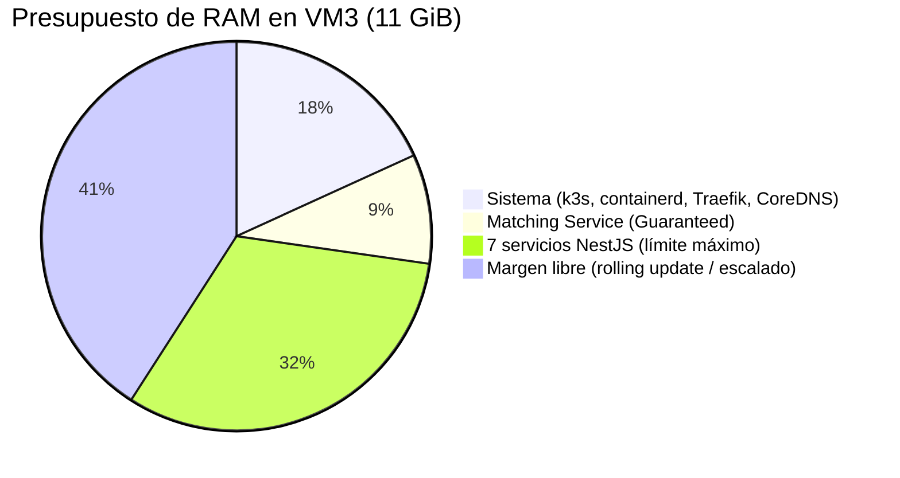
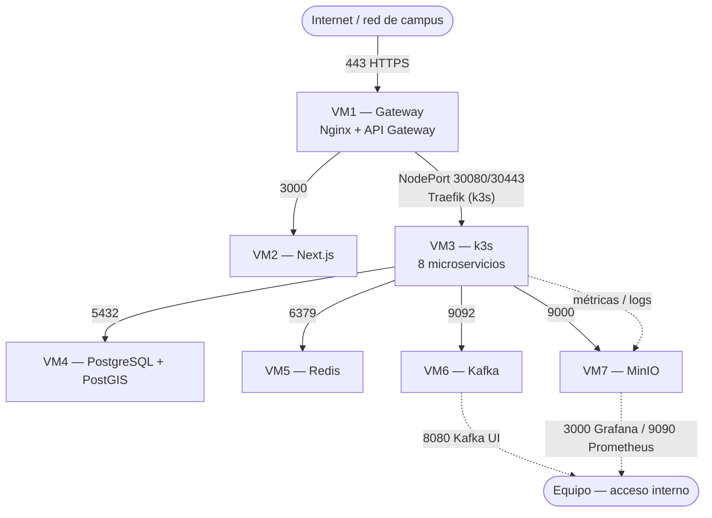
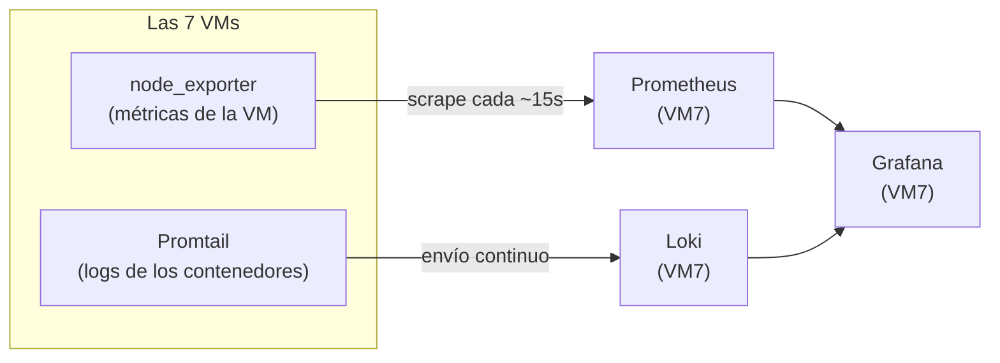

# Documento de Infraestructura V1 — QUICKPATCH

| | |
|---|---|
| **Tipo de documento** | Manual operativo de infraestructura |
| **Versión** | 1.0 |
| **Curso** | Arquitectura de Software |
| **Proyecto** | QUICKPATCH |

---

## 1. Alcance

### 1.1 Propósito

Este documento describe cómo se construye, despliega y opera la infraestructura de QUICKPATCH sobre las 7 máquinas virtuales propias del proyecto. Es el manual operativo: el "cómo" concreto de llevar a producción lo que el SAD ya decidió a nivel de arquitectura.

### 1.2 Qué cubre

- Inventario detallado de las 7 VMs.
- Requisitos del ambiente local (máquinas de desarrollo del equipo).
- Provisionamiento con Ansible.
- Orquestación y despliegue (Docker Compose + k3s).
- Pipeline de CI/CD.
- Configuración de los ambientes Local, Dev, QA/Staging y Producción.
- Seguridad de infraestructura (secretos, TLS, puertos entre VMs).
- Observabilidad.
- Backup y recuperación.

### 1.3 Qué no cubre

- Decisiones de arquitectura de software y sus trade-offs (ver SAD).
- Modelo de datos y contratos de API/eventos (ver DD).
- Políticas de equipo, GitFlow y estilo de código (ver Políticas y Herramientas).
- El diagrama de despliegue conceptual y el benchmarking de infraestructura (ver Vista Física, SDD).

---

## 2. Inventario de VMs

### 2.1 Especificación base

Las 7 VMs son asignadas por el laboratorio de virtualización de la Pontificia Universidad Javeriana para el curso, sobre hipervisor VMware. Las 7 comparten exactamente la misma especificación de recursos; solo difieren en la IP asignada y el software que cada una aloja.

| Ítem | Valor |
|---|---|
| Proveedor | Laboratorio de virtualización, Pontificia Universidad Javeriana |
| Hipervisor | VMware |
| Sistema operativo | Ubuntu 22.04.5 LTS (Jammy Jellyfish) |
| Kernel | 6.8.0-90-generic |
| vCPU | 4 (Intel Xeon Gold 5520) |
| RAM | 11 GiB |
| Disco | 68 GB (50 GB disponibles al aprovisionar) |

> Las 7 VMs tienen la misma asignación de recursos independientemente de su rol. En particular, VM3 aloja los 8 microservicios sobre k3s con la misma RAM disponible que VM5, que solo corre Redis. El presupuesto de CPU/RAM asignado a cada microservicio (sección 4.2) es una estimación de diseño, no una medición real — todavía no existen manifiestos ni datos de carga contra el hardware real. Se vigila con las métricas de Prometheus/`node_exporter` (sección 8) contra los umbrales de AC1-E4 y AC4-E3 del SAD, y se valida de forma definitiva con el benchmarking del entregable "PoC + ADR" (sección 10).

### 2.2 Detalle por VM

| VM | Rol | IP | Software instalado |
|---|---|---|---|
| VM1 | Gateway | `10.43.100.168` | Nginx + API Gateway |
| VM2 | Frontend web | `10.43.98.15` | Next.js (panel admin) |
| VM3 | Backend | `10.43.98.205` | k3s (nodo único) — 8 microservicios: Identity, Actors, Catalog, Matching, ServiceRequest, Ranking, Payments, Communication |
| VM4 | Base de datos | `10.43.98.209` | PostgreSQL + PostGIS |
| VM5 | Cache | `10.43.98.29` | Redis |
| VM6 | Mensajería | `10.43.99.12` | Apache Kafka + Kafka UI |
| VM7 | Storage y observabilidad | `10.43.99.8` | MinIO + Prometheus + Loki + Grafana |

---

## 3. Provisionamiento con Ansible

Esta sección documenta el **plan** de provisionamiento. Los playbooks no están implementados todavía; se desarrollan durante el Sprint 3, siguiendo la estructura definida aquí y en el SAD (sección 5.4).

### 3.1 Inventario

```ini
[gateway]
vm1 ansible_host=10.43.100.168

[frontend]
vm2 ansible_host=10.43.98.15

[backend]
vm3 ansible_host=10.43.98.205

[database]
vm4 ansible_host=10.43.98.209

[cache]
vm5 ansible_host=10.43.98.29

[messaging]
vm6 ansible_host=10.43.99.12

[storage_observability]
vm7 ansible_host=10.43.99.8
```

### 3.2 Playbooks planeados

| Playbook | Alcance | Qué instala/configura |
|---|---|---|
| `setup-base.yml` | Las 7 VMs | Docker Engine + plugin de Compose, dependencias comunes, usuario de despliegue y llaves SSH, **`node_exporter` y Promtail** (agentes de métricas y logs) |
| `deploy-db.yml` | VM4 | PostgreSQL + extensión PostGIS, bases y roles iniciales |
| `deploy-kafka.yml` | VM6 | Apache Kafka + Kafka UI vía Docker Compose |
| `deploy-k3s.yml` | VM3 | Instalación de k3s (nodo único), configuración de `kubeconfig`, y bootstrap inicial de los 8 microservicios (ver 3.3) |
| `deploy-cache.yml` | VM5 | Redis vía Docker Compose |
| `deploy-gateway.yml` | VM1 | Nginx + configuración del API Gateway |
| `deploy-runner.yml` | VM1 | Registro e instalación del runner self-hosted de GitHub Actions (servicio systemd), copia del `kubeconfig` de VM3 |
| `deploy-frontend.yml` | VM2 | Contenedor de Next.js vía Docker Compose |
| `deploy-storage-observability.yml` | VM7 | MinIO + Prometheus + Loki + Grafana vía Docker Compose (los componentes centrales; `node_exporter`/Promtail van en `setup-base.yml`, no aquí) |

`setup-base.yml` corre primero y en las 7 VMs por igual; los seis restantes son específicos de cada rol y solo tocan su propia VM (vía los grupos del inventario), de forma que aplicar o repetir uno no afecta a las demás.

> **Nota sobre Pino:** Pino no se instala en ningún lado — es la librería de logging que cada microservicio NestJS usa internamente para escribir sus logs en formato JSON a la salida estándar del contenedor. **Loki** (en VM7) es el componente real que los agrega y almacena; **Promtail** (instalado en las 7 VMs desde `setup-base.yml`) es el agente que los recolecta desde cada contenedor y se los envía a Loki. Grafana consulta Loki igual que consulta Prometheus, en la misma interfaz. El detalle de este flujo se documenta en la sección 8 (Observabilidad).

### 3.3 Bootstrap inicial de los microservicios

Instalar k3s deja el clúster corriendo, pero vacío — ningún microservicio arranca solo. `deploy-k3s.yml` incluye, después de instalar k3s, los pasos para dejar los 8 microservicios corriendo por primera vez:

1. Crear el namespace del proyecto (`kubectl create namespace quickpatch`).
2. Cargar los `Secret` de Kubernetes con las credenciales necesarias (contraseñas de base de datos, llaves de firma JWT, credenciales de la pasarela de pagos) — nunca en texto plano en los manifiestos.
3. Cargar los `ConfigMap` con configuración no sensible (URLs internas de Kafka, Redis, etc.).
4. Crear el `imagePullSecret` con el token de acceso a `ghcr.io` (ver sección 4.4), para que k3s pueda descargar las imágenes de los 8 servicios.
5. Aplicar los 8 `deployment.yaml` + `service.yaml` de `infrastructure/vm3-k3s/` (sección 4.1) por primera vez.

Después de este bootstrap, cualquier actualización posterior usa el flujo normal de la sección 4.4 (`kubectl set image`), que no repite estos pasos.

### 3.4 Ejecución planeada

```bash
ansible-playbook -i inventory.ini setup-base.yml
ansible-playbook -i inventory.ini deploy-db.yml
ansible-playbook -i inventory.ini deploy-cache.yml
ansible-playbook -i inventory.ini deploy-kafka.yml
ansible-playbook -i inventory.ini deploy-k3s.yml
ansible-playbook -i inventory.ini deploy-gateway.yml
ansible-playbook -i inventory.ini deploy-runner.yml
ansible-playbook -i inventory.ini deploy-frontend.yml
ansible-playbook -i inventory.ini deploy-storage-observability.yml
```

El orden respeta las dependencias de arranque ya definidas en el SAD (sección 5.3): base de datos y cache antes que mensajería, mensajería antes que el backend, backend antes que frontend/gateway. `deploy-runner.yml` corre después de `deploy-k3s.yml` porque necesita copiar el `kubeconfig` que ese playbook genera. Storage y observabilidad (VM7) es independiente y puede correr en cualquier momento.

---

## 4. Orquestación y despliegue

Al igual que la sección 3, esta sección documenta el **plan** de despliegue: los manifiestos todavía no están escritos. Los límites de recursos definidos aquí surgieron de una revisión crítica de la capacidad real de VM3 (ver `Hallazgos - Capacidad de Infraestructura.md`) y quedan pendientes de confirmación por parte de Backend antes de implementarse en código.

### 4.1 Estructura de archivos

```
infrastructure/
├── vm1-gateway/docker-compose.yml
├── vm2-web/docker-compose.yml
├── vm3-k3s/
│   ├── identity/deployment.yaml + service.yaml
│   ├── actors/deployment.yaml + service.yaml
│   ├── catalog/deployment.yaml + service.yaml
│   ├── matching/deployment.yaml + service.yaml
│   ├── service-request/deployment.yaml + service.yaml
│   ├── ranking/deployment.yaml + service.yaml
│   ├── payments/deployment.yaml + service.yaml
│   └── communication/deployment.yaml + service.yaml
├── vm4-database/docker-compose.yml
├── vm5-redis/docker-compose.yml
├── vm6-kafka/docker-compose.yml
└── vm7-storage-observability/docker-compose.yml
```

Solo VM3 usa Kubernetes (k3s); el resto de VMs usa Docker Compose, consistente con ADR-011.

### 4.2 Presupuesto de recursos en VM3

VM3 tiene 4 vCPU y 11 GiB de RAM fijos (sección 2.1), compartidos entre el control plane de k3s y los 8 microservicios. Sin límites explícitos, Node/V8 y el JVM asumen que tienen toda la máquina disponible, lo que puede llevar a que el sistema operativo mate procesos por falta de memoria durante un pico de carga — y que la primera víctima sea, por cómo Kubernetes decide a quién desalojar, el propio Matching Service. Para evitarlo, cada microservicio declara `resources.requests` y `resources.limits` explícitos:

| Componente | CPU (request/limit) | RAM (request/limit) | Clase de QoS |
|---|---|---|---|
| k3s + containerd + Traefik + CoreDNS (sistema) | — | — | reservado, ~0.5 vCPU / ~2 GiB de margen |
| Matching Service (Spring Boot) | 1 / 1 vCPU | 1 / 1 GiB | Guaranteed |
| Identity, Actors, Catalog, ServiceRequest, Ranking, Payments, Communication (NestJS, c/u) | 0.1 / 0.35 vCPU | 256Mi / 512Mi | Burstable |

Con los 7 servicios NestJS en su límite máximo (2.45 vCPU / 3.5 GiB) más el Matching (1 vCPU / 1 GiB) más el overhead de sistema (0.5 vCPU / 2 GiB), el uso máximo teórico es de **3.95 vCPU / 6.5 GiB de 4 vCPU / 11 GiB disponibles** — deja margen para el pod adicional que se crea durante un rolling update y para escalar el Matching a una segunda réplica (AC4-E3) sin agotar la máquina.



**Por qué el Matching queda en "Guaranteed":** cuando VM3 entra en presión de memoria, Kubernetes desaloja primero los pods en QoS "BestEffort" (sin límites) y luego los "Burstable" que más exceden su *request*; un pod "Guaranteed" (request = limit) es el último candidato a desalojo. AC1-E4 exige que el Matching siga respondiendo bajo pico de carga — dejarlo en la clase de QoS más protegida es lo que hace esa exigencia verificable, no solo declarada.

### 4.3 Límite de conexiones a PostgreSQL

VM4 corre PostgreSQL con `max_connections` por defecto (100). Sin restricción, cada instancia de un servicio NestJS con Prisma abre por defecto varias conexiones simultáneas, y sumadas a las del Matching (HikariCP) pueden acercarse al límite incluso sin haber escalado ningún servicio. Se fija explícitamente, vía variable de entorno en cada `deployment.yaml` (sin tocar el código de los servicios):

| Servicio | Variable | Valor |
|---|---|---|
| Los 7 servicios NestJS | `DATABASE_URL=...?connection_limit=5` | 5 conexiones c/u → 35 en total |
| Matching (Spring Boot) | `SPRING_DATASOURCE_HIKARI_MAXIMUM_POOL_SIZE` | 10 |
| Matching (Spring Boot) | `SERVER_TOMCAT_THREADS_MAX` | 50 |

Con esto, el uso base de conexiones queda en ~45 de 100, dejando margen real para escalar el Matching (AC4-E3) sin llegar al error `too many clients`. El límite de hilos de Tomcat (50, en vez del valor por defecto de 200) evita que el servicio abra más hilos de los que su pool de conexiones puede atender, que era la causa del *thrashing* bajo carga identificado en la revisión de capacidad.

### 4.4 Cómo se despliega o actualiza un microservicio

1. Se construye la imagen Docker del servicio modificado y se sube a **GitHub Container Registry (`ghcr.io`)** — gratuito e integrado con el repositorio del proyecto, sin credenciales adicionales que gestionar.
2. Se actualiza el `deployment.yaml` correspondiente (o se ejecuta `kubectl set image deployment/<servicio> <contenedor>=<nueva-imagen>`).
3. Kubernetes aplica un *rolling update*: crea el pod nuevo, espera a que pase el `readinessProbe`, y solo entonces retira el pod anterior — sin downtime para ese servicio ni para los demás 7.
4. El margen de RAM definido en la sección 4.2 es lo que permite que el pod adicional del rolling update quepa sin desalojar a otros servicios.

**Pendiente de definir con datos reales:** los parámetros de `readinessProbe`/`livenessProbe` (tiempos de espera, número de reintentos) y si se necesita un `startupProbe` separado para el arranque. No se fijan valores en esta versión del documento porque dependen del comportamiento real de cada servicio bajo carga, algo que todavía no se ha medido — fijar un número ahora sería una estimación sin sustento, el mismo problema señalado en la sección 2.1.

---

## 5. CI/CD

### 5.1 Estructura del pipeline

Pipeline en GitHub Actions, separado por aplicación (`web/`, `mobile/`) y por microservicio dentro del backend (`services/identity/`, `services/matching/`, etc.). Un cambio en un solo servicio dispara solo su propio pipeline, no el de los 8 — esto es lo que hace posible cumplir AC5-E1 (build + pruebas en menos de 10 minutos) incluso con pruebas de integración pesadas en el gate de `develop`.

### 5.2 Gates por rama

| Rama | Dónde corre | Qué corre | Gate |
|---|---|---|---|
| `feature/*` → PR a `develop` | Runner de GitHub Actions | Lint + unitarias (Jest, `flutter_test`) del servicio afectado | CI verde + 1 revisor, sin autoaprobación |
| `develop` | Runner de GitHub Actions | Integración con Testcontainers (PostgreSQL/PostGIS y Kafka reales en Docker) + contrato (Pact) | CI verde |
| `release/x.y.z` | Runner de GitHub Actions, levantando `docker-compose.staging.yml` | E2E (Playwright, Patrol), UAT contra criterios de aceptación, seguridad (OWASP ZAP) | Checklist de aceptación aprobado — bloquea el merge a `main` si falla (RNF-08) |
| `main` (despliegue) | Runner self-hosted (VM1) → k3s en VM3 | Rolling update del servicio modificado | Tag SemVer |
| `main` (post-despliegue) | VM3 real, ventana de mantenimiento programada, inmediatamente después del despliegue | Smoke tests + k6 — 150 matchings concurrentes (AC1-E4) | Si no cumple el umbral, reversión inmediata (`kubectl rollout undo`) antes de habilitar tráfico real |

```mermaid
flowchart LR
    F["feature/*"] --> G1{{"Lint + unitarias<br/>runner GH Actions"}}
    G1 --> D["develop"]
    D --> G2{{"Testcontainers + Pact<br/>runner GH Actions"}}
    G2 --> R["release/x.y.z"]
    R --> G3{{"E2E + UAT + OWASP ZAP<br/>docker-compose.staging.yml<br/>runner GH Actions — automático"}}
    G3 -->|"checklist aprobado"| M["main"]
    M --> SH{{"Runner self-hosted en VM1<br/>(dentro de la red privada)"}}
    SH --> P["k3s en VM3<br/>rolling update por servicio"]
    P --> G4{{"Smoke tests + k6<br/>150 concurrentes<br/>ventana de mantenimiento — MANUAL"}}
    G4 -->|"cumple umbral"| OK(["Tráfico real habilitado"])
    G4 -->|"no cumple"| RB{{"kubectl rollout undo"}}
    RB --> P
```



El gate de `release/x.y.z` funcional (E2E/UAT/seguridad) corre automáticamente dentro del runner de GitHub Actions: `docker compose -f docker-compose.staging.yml up -d`, se ejecutan las pruebas contra esa copia efímera, y el runner la apaga al terminar. No depende de que un miembro del equipo la tenga levantada en su laptop — eso queda como opción para depurar manualmente, no como el mecanismo del gate. Este es el único gate que bloquea el merge a `main` (RNF-08, parte funcional/seguridad).

La prueba de carga (k6) **no puede correr antes del despliegue** porque no existe una segunda instancia de VM3 donde probar la versión nueva sin desplegarla primero (K5). Por eso corre justo después del rolling update, dentro de la misma ventana de mantenimiento sin usuarios activos (RNF-07): si el reporte no cumple el umbral de AC1-E4, se revierte con `kubectl rollout undo` antes de que haya tráfico real — la reversión es casi instantánea porque Kubernetes ya conoce la versión anterior, no hay que reconstruir nada.

### 5.3 Despliegue a producción

Los runners de GitHub Actions corren en la nube de GitHub y no tienen ruta de red hacia `10.43.x.x` (red privada del laboratorio): ninguna dirección de ese rango es alcanzable desde fuera de la red de la Javeriana, sin importar el protocolo. Por eso el paso de despliegue no puede ejecutarse en un runner normal — se ejecuta en un **runner self-hosted instalado en VM1**, que sí está dentro de esa red y puede llegar a VM3 directamente.

Al mergear a `main` (tras pasar el gate funcional de `release/*`): build de la imagen Docker del servicio modificado, push al registro, y — ya dentro del runner self-hosted — `kubectl set image deployment/<servicio> ...` (o `kubectl apply -f`). Kubernetes hace el rolling update descrito en la sección 4.4 — reinicia únicamente el Deployment del servicio afectado, sin downtime para los demás 7. Inmediatamente después corre la validación de la sección 5.2 (smoke tests + k6); un fallo dispara `kubectl rollout undo` sobre ese mismo Deployment antes de habilitar tráfico real.

**Por qué en VM1 y no en VM3 ni en una laptop:** VM3 ya opera con el presupuesto de recursos ajustado de la sección 4.2, y sumarle el proceso del runner competiría por esa misma RAM/CPU justo durante el despliegue. VM1 solo corre Nginx y tiene margen de sobra; al estar en la misma red privada que VM3, no necesita ningún túnel ni VPN adicional para alcanzarla. Una laptop del equipo no sirve para esto porque el runner tiene que estar disponible siempre que se necesite desplegar, no solo cuando esa persona esté conectada.

**Restricción de seguridad obligatoria:** el repositorio es público. GitHub advierte explícitamente que un runner self-hosted en un repositorio público es un riesgo — cualquier persona puede abrir un Pull Request desde un fork, y si ese PR dispara un workflow que corre en el runner self-hosted, ese código ajeno se ejecuta dentro de la red de la Javeriana. El job que usa `runs-on: self-hosted` debe restringirse a eventos de `push` directo sobre `main`/`release/*` — nunca a `pull_request` proveniente de un fork externo.

---

## 6. Configuración de ambientes

### 6.1 Resumen

| Ambiente | Dónde vive | Persistencia | Qué corre ahí |
|---|---|---|---|
| Local | Laptop de cada integrante del equipo | Persistente mientras se desarrolla, no compartido | Desarrollo día a día, lint, pruebas unitarias |
| Dev | Runner de GitHub Actions (Testcontainers) | Efímero — se crea y se destruye en cada ejecución de CI | Pruebas de integración y de contrato (Pact) sobre `develop` |
| QA / Staging | Runner de GitHub Actions (`docker-compose.staging.yml`) + VM3 real para la prueba de carga | Efímero (funcional) / real y programado (carga) | E2E, UAT, seguridad (automático) — carga con k6 (manual, ventana programada) |
| Producción | Las 7 VMs | Persistente, siempre activo | El sistema completo, tráfico real |

Ningún ambiente además de Producción ocupa hardware dedicado y permanente — es la consecuencia directa de K5 (sin presupuesto para VMs adicionales): Dev y la parte funcional de Staging existen solo durante la ejecución del pipeline, no como servidores que alguien tiene que mantener corriendo.

### 6.2 Requisitos del ambiente local

_Pendiente de confirmar con Backend y Frontend: versión de Node.js, versión del SDK de Flutter, gestor de paquetes y forma de fijar la versión en el repo (`.nvmrc` u otro). Se completa cuando el equipo lo confirme._

---

## 7. Seguridad de infraestructura

### 7.1 Gestión de secretos

Ningún secreto (contraseñas, tokens de la pasarela de pagos, credenciales de MinIO, llaves de firma JWT) se guarda en el repositorio ni en las imágenes Docker — consistente con la política del equipo de no compartir credenciales reales, ni siquiera con la IA (Políticas y Herramientas, sección de uso de IA).

- **VM1, VM2, VM4, VM5, VM6, VM7** (Docker Compose): secretos gestionados con Ansible Vault — archivos cifrados dentro del propio repositorio de Ansible, que se desencriptan solo al momento de ejecutar el playbook.
- **VM3** (k3s): secretos como objetos `Secret` de Kubernetes, referenciados desde cada `deployment.yaml` como variable de entorno — nunca escritos en texto plano en el manifiesto.
- **CI/CD:** credenciales del registro de imágenes y del `kubeconfig` de despliegue, como GitHub Actions Secrets del repositorio.

### 7.2 TLS / HTTPS

RNF-02 exige que toda comunicación cliente-servidor use HTTPS/TLS. El certificado se gestiona en VM1 (Nginx) con **Let's Encrypt** — gratuito y con renovación automática, consistente con la mentalidad cost-conscious del equipo (ver CLAUDE.md, sección 9).

El tráfico interno entre VMs, dentro de la red privada de la Javeriana (`10.43.x.x`), no usa TLS: es tráfico que nunca sale a Internet, y cifrarlo agregaría gestión de certificados internos sin un beneficio real dado que la red ya es privada.

### 7.3 Puertos y comunicación entre VMs



| Origen | Destino | Puerto | Servicio |
|---|---|---|---|
| Internet / red de campus | VM1 | 443 | Nginx / API Gateway (TLS) |
| VM1 | VM2 | 3000 | Next.js |
| VM1 | VM3 | 30080 / 30443 | Ingreso a microservicios (Traefik, NodePort de k3s) |
| VM3 | VM4 | 5432 | PostgreSQL |
| VM3 | VM5 | 6379 | Redis |
| VM3 | VM6 | 9092 | Kafka (productores/consumidores) |
| VM3 | VM7 | 9000 | MinIO (subir evidencias) |
| Equipo (interno) | VM6 | 8080 | Kafka UI |
| Equipo (interno) | VM7 | 3000 / 9090 | Grafana / Prometheus |
| Equipo (SSH) | Las 7 VMs | 22 | Administración |

Regla general: firewall por defecto en denegar todo el tráfico entrante (`ufw default deny incoming`), habilitando explícitamente solo los pares origen-destino-puerto de esta tabla. Ninguna VM acepta conexiones directas del exterior salvo VM1 (443) y el acceso SSH del equipo.

### 7.4 Acceso administrativo (SSH)

Autenticación únicamente por llave pública — login por contraseña deshabilitado en las 7 VMs desde `setup-base.yml`.

---

## 8. Observabilidad

Dos tipos de información, cada uno con su propia cadena de recolección y almacenamiento, unificados en un solo panel:

- **Métricas** (números que cambian en el tiempo: CPU, RAM, peticiones por segundo, errores por minuto) — recolectadas por `node_exporter` en cada VM, almacenadas por Prometheus en VM7.
- **Logs** (mensajes de texto que describen eventos: "pago rechazado", "acceso denegado") — recolectados por Promtail en cada VM, almacenados por Loki en VM7.

Ninguno de los dos sustituye al otro: las métricas dicen *qué tan rápido u ocupado* está el sistema; los logs dicen *qué pasó exactamente*. Grafana consulta ambas fuentes desde el mismo panel, lo que permite cruzarlos — por ejemplo, ver qué decían los logs justo cuando una métrica de CPU se disparó.



### 8.1 Qué se instala y dónde

| Componente | Dónde | Rol |
|---|---|---|
| `node_exporter` | Las 7 VMs (`setup-base.yml`) | Expone las métricas de esa VM para que Prometheus las recolecte |
| Promtail | Las 7 VMs (`setup-base.yml`) | Recolecta los logs de los contenedores de esa VM y los envía a Loki |
| Prometheus | VM7 (`deploy-storage-observability.yml`) | Almacena el historial de métricas de las 7 VMs |
| Loki | VM7 (`deploy-storage-observability.yml`) | Almacena el historial de logs de las 7 VMs |
| Grafana | VM7 (`deploy-storage-observability.yml`) | Panel único para consultar Prometheus y Loki |

### 8.2 Qué cubre esto en el SRS y el SAD

- **RNF-04** (todo 403 queda en log): el 403 se escribe con Pino/el logger del servicio, Promtail lo recolecta, Loki lo guarda permanentemente — sin esta cadena, el log existiría solo mientras el contenedor no se reinicie, lo cual pasa en cada despliegue.
- **AC6-E1/E2** (reconstruir una disputa, trazabilidad de pagos): requieren historial persistente de eventos — Loki es lo que hace posible que ese historial sobreviva más allá de la vida de un contenedor.
- **AC3-E1/E3** (disponibilidad, "límite de capacidad a vigilar" de la sección 2.1): Prometheus + `node_exporter` son el instrumento real para vigilar esa capacidad — sin ellos, "vigilar" no tenía con qué hacerse.

---

## 9. Backup y recuperación

### 9.1 Qué se respalda y qué no

| Dato | ¿Se respalda? | Por qué |
|---|---|---|
| PostgreSQL (VM4) | **Sí** | Es la fuente de verdad del negocio — tenants, usuarios, solicitudes, pagos, calificaciones, evidencias registradas. Perderla es perder la plataforma. |
| Evidencias en MinIO (VM7) | Pendiente de decisión — ver 9.4 | Son archivos, no filas de base de datos; respaldarlas requiere otro lugar donde guardarlas. |
| Kafka (VM6) | No | Es un bus de mensajes en tránsito, no un sistema de registro. El patrón Outbox (ADR-007) ya garantiza que un evento no se pierde entre que se genera y se publica — no hace falta guardar el historial completo de Kafka aparte. |
| Redis (VM5) | No | Cache y colas cortas — se reconstruye solo con el uso normal del sistema, no guarda información que no exista también en otro lado. |
| Configuración de infraestructura (Ansible, manifiestos k3s) | No hace falta un respaldo aparte | Ya vive versionada en el repositorio de Git — el repositorio es su respaldo. |

### 9.2 Respaldo de PostgreSQL

- **Mecanismo:** `pg_dump` programado por cron en VM4, una vez al día.
- **Destino:** un bucket de MinIO en VM7 — VM distinta a VM4, así un problema en VM4 no se lleva también su propio respaldo.
- **Retención:** 7 días. Suficiente para el alcance de un proyecto académico de 3 meses (K3); no se justifica una política de retención de nivel empresarial para este contexto.

### 9.3 Recuperación

Restaurar desde el dump más reciente con `pg_restore`. Dado K7 (sin operación 24/7), esta recuperación es **manual**, dentro de la misma ventana de 12–24h ya aceptada para el resto de fallos de infraestructura (ver SAD, sección 5.2) — no hay un mecanismo de restauración automática.

### 9.4 Evidencias en MinIO — sin respaldo, limitación aceptada

MinIO en VM7 es tanto el almacenamiento principal de las evidencias fotográficas como, si algo le pasa a esa VM, el único lugar donde existían — no hay una octava VM para duplicar el storage (K5), y un respaldo manual dependiente de una sola persona no es un mecanismo confiable ni reproducible por el resto del equipo.

**Se documenta como limitación aceptada**, con el mismo tratamiento que el SPOF de VM3 (SAD, sección 5.2): si VM7 falla por completo, las evidencias no respaldadas se pierden. El riesgo residual es la pérdida de evidencia fotográfica de servicios ya completados, no la caída de la plataforma — el ciclo de negocio (RF-15, pagos, calificaciones) no depende de que la evidencia siga disponible después de completado el servicio.

---

## 10. Limitaciones reconocidas

Índice de las limitaciones ya aceptadas a lo largo de este documento y del SAD — no se repiten aquí las justificaciones completas, solo dónde encontrarlas.

| Limitación | Origen | Detalle en |
|---|---|---|
| VM3 es punto único de falla (SPOF) | K5 | SAD, sección 5.2; este documento, sección 4.2 |
| Las 7 VMs tienen la misma especificación sin importar el rol | Laboratorio de la Javeriana | Sección 2.1 |
| Sin VM dedicada a staging — funcional en CI, carga contra producción | K5 | Sección 5.2; SRS, RNF-07 |
| La prueba de carga valida después del despliegue, no antes, con reversión si falla | K5 | Sección 5.2/5.3; SRS, RNF-08 |
| Evidencias en MinIO sin respaldo | K5 | Sección 9.4 |
| Recuperación manual entre 12 y 24 horas ante cualquier falla | K7 | SAD, sección 5.2 |
| QoS "Guaranteed" del Matching protege contra desalojo, pero le quita capacidad de ráfaga | Trade-off de diseño | Sección 4.2 |
| Parámetros de `readinessProbe`/`livenessProbe` sin definir | Falta de datos reales medidos | Sección 4.4 |
| La sección 2.1 describe un presupuesto de recursos asignado, no uno medido — la validación real llega con el benchmarking del entregable "PoC + ADR" | K3 (alcance académico) | Sección 2.1 |

Ninguna de estas limitaciones se considera un defecto a corregir dentro del alcance de este documento — son restricciones aceptadas conscientemente, consistentes con K3, K5 y K7 del SAD.

---
