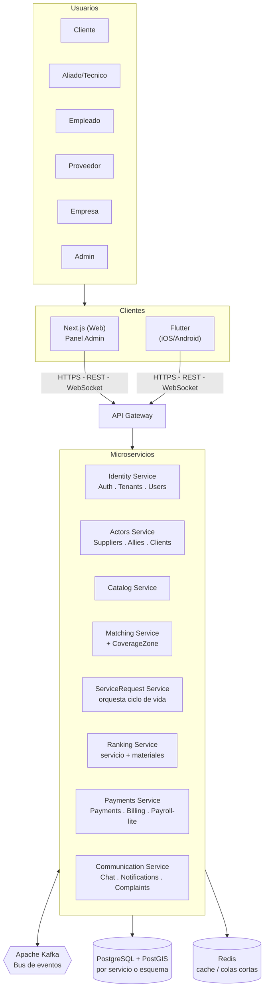
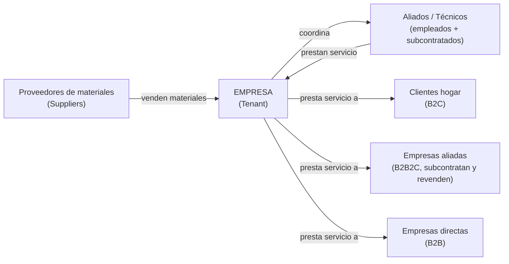
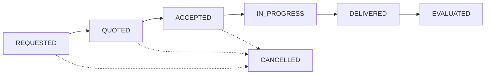
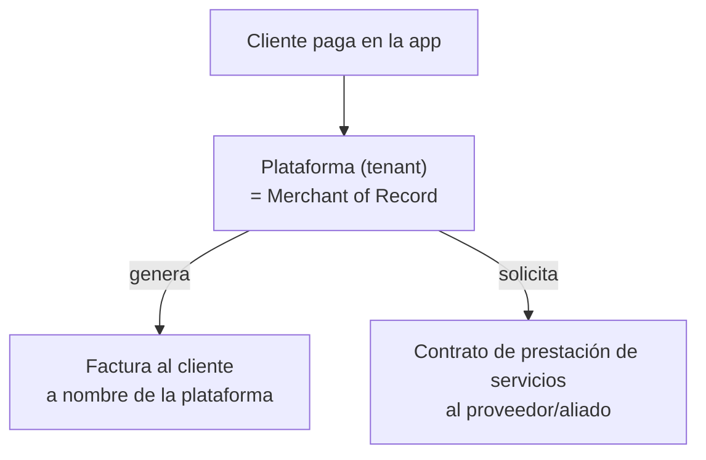

# Documento de Arquitectura de Software (SAD) V1 — TécnicoCerca

---

## 1. Drivers y Killers

Esta sección identifica las fuerzas que determinan las decisiones de arquitectura del sistema. Los _drivers_ son las necesidades de negocio y técnicas que impulsan la arquitectura hacia cierta forma. Los _killers_ son las restricciones que limitan o invalidan alternativas de diseño.

### 1.1 Drivers

|ID|Driver|Origen|Implicación arquitectónica|
|---|---|---|---|
|D1|Matching por ubicación y ventana horaria en tiempo real|Incumplimiento recurrente de ventanas de horario reportado por el cliente|Requiere mecanismo geoespacial y consulta de disponibilidad horaria|
|D2|Doble ranking (materiales y servicio prestado)|El cliente no puede validar la calidad de lo que le venden ni la calidad del servicio prestado|Dos módulos/tablas de ranking separados: uno para Suppliers (materiales) y otro para Allies/Technicians (servicio)|
|D3|Modelo de facturación "merchant of record" (tipo Uber)|El cliente exige que la plataforma facture a nombre propio, no cada técnico individualmente|La plataforma actúa como responsable fiscal frente al cliente final|
|D4|Pagos con cumplimiento PCI-DSS|Requisito explícito y no negociable del cliente|Tokenización de datos de pago vía pasarela certificada|
|D5|Multi-tenancy y soporte a múltiples empresas oferentes|Modelo de negocio actual (empresas aliadas con técnicos propios, B2B2E) y visión explícita de tenants independientes a futuro|Aislamiento de datos por tenant desde el diseño inicial|
|D8|Trazabilidad ante reclamaciones|Necesidad de resolver disputas cliente-técnico con evidencia|Registro histórico de eventos del ciclo de vida del servicio|

### 1.2 Killers

|ID|Killer|Origen|Qué prohíbe|
|---|---|---|---|
|K1|No es un ERP|Restricción explícita del cliente|Contabilidad general, nómina legal completa, inventarios complejos|
|K2|Nunca almacenar PAN/CVV|Requisito PCI-DSS|Cualquier diseño que toque directamente datos de tarjeta|
|K3|Timeline académico de aproximadamente 3 meses|Restricción del curso|Limita la profundidad de cada módulo; prioriza el alcance mínimo viable|
|K4|No se implementa manejo de conectividad intermitente / modo offline|Fuera de alcance por restricción de tiempo del proyecto académico|La aplicación móvil asume conexión a internet disponible; sin sincronización diferida|
|K5|Sin presupuesto para servicios cloud administrados|Restricción de recursos del proyecto|Bases de datos, colas de mensajes o cómputo administrado en la nube; toda la infraestructura corre en servidores propios|
|K6|Operación limitada a Colombia|Alcance actual del proyecto; la expansión es visión futura, no alcance presente|Internacionalización de moneda/idioma, soporte multi-región, cumplimiento normativo de otros países|
|K7|Equipo de estudiantes sin operación 24/7|Naturaleza del proyecto; sin turnos, guardias ni rol de operación dedicado|Mecanismos de alta disponibilidad con recuperación automática compleja (failover, multi-zona)|
|K8|No se construye sitio público con SEO / presencia digital|Solicitud explícita del cliente, fuera de alcance por restricción de tiempo (K3)|Páginas públicas indexables, contenido SSR orientado a SEO, integración con redes sociales/Google Business — el frontend web se limita al panel administrativo|

## 2. Atributos de Calidad

Los atributos de calidad expresan, en términos medibles, las propiedades que el sistema debe cumplir. Cada atributo seleccionado está sustentado por uno o más de los drivers o killers definidos en la sección anterior.

|ID|Atributo|Sustentado por|
|---|---|---|
|AC1|Rendimiento|D1|
|AC2|Seguridad|D4, K2, D5|
|AC3|Disponibilidad|K5, K7|
|AC4|Escalabilidad|D5|
|AC5|Mantenibilidad|K3|
|AC6|Trazabilidad / Auditabilidad|D8|

---

## 3. Escenarios de Calidad

Cada escenario sigue la estructura de seis partes: fuente del estímulo, estímulo, ambiente, artefacto, respuesta y medida de la respuesta.

Cada escenario se clasifica en uno de tres tipos:

- **Uso**: operación normal del sistema, lo que ocurre en el día a día.
- **Cambio**: crecimiento o modificación esperada del sistema con el tiempo (nuevos tenants, nuevo código, nuevos servicios).
- **Fallo**: algo se rompe o deja de responder — cómo reacciona el sistema ante condiciones adversas o inesperadas.

### 3.1 AC1 — Rendimiento

**Escenario 1 — Búsqueda de técnicos cercanos** · _Tipo: Uso_

|Parte|Contenido|
|---|---|
|Fuente|Cliente|
|Estímulo|Solicita técnicos cercanos disponibles|
|Ambiente|Horario de alta demanda|
|Artefacto|Mecanismo de búsqueda por ubicación y disponibilidad|
|Respuesta|Devuelve lista ordenada por distancia y ranking|
|Medida|Menos de 3 segundos para el 95% de las solicitudes|

**Escenario 2 — Consulta de historial** · _Tipo: Uso_

|Parte|Contenido|
|---|---|
|Fuente|Cliente o técnico|
|Estímulo|Consulta su historial de servicios|
|Ambiente|Operación normal, historial con múltiples solicitudes acumuladas|
|Artefacto|Módulo de gestión de solicitudes|
|Respuesta|Devuelve el historial paginado|
|Medida|Menos de 1.5 segundos para cargar una página de resultados|

**Escenario 3 — Procesamiento en segundo plano** · _Tipo: Uso_

|Parte|Contenido|
|---|---|
|Fuente|Sistema (tras la creación de una solicitud)|
|Estímulo|Se dispara la búsqueda de técnicos candidatos|
|Ambiente|Operación normal|
|Artefacto|Mecanismo de procesamiento asíncrono|
|Respuesta|Identifica y notifica a los técnicos candidatos|
|Medida|Menos de 7 segundos desde la creación de la solicitud hasta la notificación|

**Escenario 4 — Pico de carga inesperado** · _Tipo: Fallo_

|Parte|Contenido|
|---|---|
|Fuente|Carga de usuarios|
|Estímulo|Un pico de solicitudes supera la capacidad prevista (ej. campaña o promoción viral)|
|Ambiente|Evento de demanda no anticipado|
|Artefacto|Matching Service|
|Respuesta|El sistema degrada de forma controlada (cola de espera) en vez de caerse por completo|
|Medida|El sistema soporta hasta **150 solicitudes de matching concurrentes** (estimado como 3 veces una carga esperada de ~50 solicitudes concurrentes en hora pico) sin devolver errores ni caerse por completo; el tiempo de respuesta puede degradarse más allá de los 3 segundos definidos en el Escenario 1, pero el servicio sigue respondiendo|

### 3.2 AC2 — Seguridad

**Escenario 1 — Protección de datos de pago** · _Tipo: Uso_

|Parte|Contenido|
|---|---|
|Fuente|Cliente|
|Estímulo|Ingresa datos de tarjeta en el checkout|
|Ambiente|Cualquier transacción de pago|
|Artefacto|Mecanismo de procesamiento de pagos|
|Respuesta|Tokeniza la información sin que el backend la almacene ni la registre en logs|
|Medida|0 ocurrencias de número de tarjeta o CVV en base de datos o logs|

**Escenario 2 — Aislamiento multi-tenant** · _Tipo: Uso_

|Parte|Contenido|
|---|---|
|Fuente|Usuario autenticado de un tenant|
|Estímulo|Realiza una consulta a la API|
|Ambiente|Operación normal|
|Artefacto|Backend — control de acceso a datos|
|Respuesta|Solo devuelve datos correspondientes a su propio tenant|
|Medida|0 casos de fuga de datos entre tenants en pruebas de aislamiento|

**Escenario 3 — Control de acceso por rol** · _Tipo: Uso_

|Parte|Contenido|
|---|---|
|Fuente|Usuario autenticado con un rol específico|
|Estímulo|Intenta acceder a una acción reservada a otro rol|
|Ambiente|Operación normal|
|Artefacto|Backend — control de acceso basado en roles|
|Respuesta|Rechaza la acción con un error de autorización|
|Medida|100% de los endpoints sensibles validan el rol en el backend, no solo en el cliente|

**Escenario 4 — Token comprometido o expirado** · _Tipo: Fallo_

|Parte|Contenido|
|---|---|
|Fuente|Atacante externo o cliente con sesión vencida|
|Estímulo|Intenta usar un token JWT robado, manipulado o expirado|
|Ambiente|Cualquier momento|
|Artefacto|Identity Service|
|Respuesta|Rechaza la petición antes de que llegue a cualquier microservicio downstream y fuerza reautenticación|
|Medida|100% de los tokens inválidos o expirados son rechazados en el Identity Service / API Gateway|

### 3.3 AC3 — Disponibilidad

**Escenario 1 — Caída de un componente no crítico** · _Tipo: Fallo_

|Parte|Contenido|
|---|---|
|Fuente|Falla de infraestructura|
|Estímulo|Un componente no crítico deja de responder|
|Ambiente|Operación normal|
|Artefacto|Sistema en general|
|Respuesta|Las funciones core (autenticación, solicitud de servicio) siguen operando desde los componentes restantes|
|Medida|Recuperación manual en un plazo de **12 a 24 horas**, dado que no hay operación 24/7|

**Escenario 2 — Mantenimiento planeado** · _Tipo: Uso_

|Parte|Contenido|
|---|---|
|Fuente|Equipo de DevOps|
|Estímulo|Se requiere aplicar una actualización o mantenimiento programado|
|Ambiente|Ventana anunciada al equipo|
|Artefacto|Sistema en general|
|Respuesta|El mantenimiento se realiza sin pérdida de datos, con downtime acotado y comunicado|
|Medida|Downtime planeado menor a **2 horas**|

**Escenario 3 — Caída de un microservicio individual** · _Tipo: Fallo_

|Parte|Contenido|
|---|---|
|Fuente|Falla de infraestructura o bug de despliegue|
|Estímulo|Un microservicio (ej. Ranking Service) deja de responder|
|Ambiente|Operación normal|
|Artefacto|Sistema de microservicios (VM3)|
|Respuesta|Los demás 7 servicios siguen operando; los eventos dirigidos al servicio caído se acumulan en Kafka sin perderse|
|Medida|0% de eventos perdidos durante la caída; el servicio recupera y procesa el backlog pendiente al reiniciar|

**Escenario 4 — Kafka no disponible temporalmente** · _Tipo: Fallo_

|Parte|Contenido|
|---|---|
|Fuente|Falla de infraestructura|
|Estímulo|El bus de eventos deja de responder|
|Ambiente|Operación normal|
|Artefacto|Todos los microservicios|
|Respuesta|Las operaciones síncronas críticas (vía API Gateway) siguen funcionando; los eventos se reintentan vía Transactional Outbox (ADR-007) hasta que Kafka se recupere|
|Medida|0 eventos perdidos; reintento automático sin intervención manual dentro de la ventana de recuperación del Escenario 1|

### 3.4 AC4 — Escalabilidad

**Escenario 1 — Alta de nuevo tenant** · _Tipo: Cambio_

|Parte|Contenido|
|---|---|
|Fuente|Equipo administrador de la plataforma|
|Estímulo|Se registra una nueva empresa (tenant) en el sistema|
|Ambiente|Operación normal, sin interrumpir a los tenants existentes|
|Artefacto|Módulo de gestión de tenants y esquema de base de datos|
|Respuesta|El nuevo tenant queda operativo con sus datos aislados, sin requerir cambios estructurales en el esquema|
|Medida|Tenant funcional en menos de **1 hora**, sin downtime para tenants existentes|

**Escenario 2 — Crecimiento del catálogo de técnicos** · _Tipo: Cambio_

|Parte|Contenido|
|---|---|
|Fuente|Tenant (empresa)|
|Estímulo|Registra un número creciente de aliados/técnicos y catálogo de servicios|
|Ambiente|Operación normal, crecimiento progresivo del volumen de datos|
|Artefacto|Módulo de gestión de aliados/empleados y mecanismo de búsqueda|
|Respuesta|El sistema sigue respondiendo consultas de matching sin degradación notable|
|Medida|El tiempo de respuesta del matching se mantiene dentro de la medida definida en AC1 (menos de 2 segundos)|

**Escenario 3 — Escalado independiente de un microservicio** · _Tipo: Cambio_

|Parte|Contenido|
|---|---|
|Fuente|Equipo de DevOps|
|Estímulo|El Matching Service requiere más capacidad por aumento sostenido de demanda|
|Ambiente|Crecimiento sostenido de solicitudes|
|Artefacto|Matching Service (contenedor en VM3)|
|Respuesta|Se despliegan instancias adicionales del contenedor de ese servicio, sin tocar los demás 7|
|Medida|El escalado no requiere cambios de código ni downtime en los demás microservicios|

### 3.5 AC5 — Mantenibilidad

**Escenario 1 — Pipeline de integración continua** · _Tipo: Cambio_

|Parte|Contenido|
|---|---|
|Fuente|Desarrollador del equipo|
|Estímulo|Hace push de un cambio de código a un módulo|
|Ambiente|Desarrollo activo|
|Artefacto|Pipeline de integración continua (build y pruebas automáticas)|
|Respuesta|El pipeline corre y reporta si el cambio rompió algo|
|Medida|Completa build y pruebas en menos de **10 minutos**|

**Escenario 2 — Acoplamiento entre módulos** · _Tipo: Cambio_

|Parte|Contenido|
|---|---|
|Fuente|Desarrollador del equipo|
|Estímulo|Implementa una funcionalidad nueva o corrige un error|
|Ambiente|Desarrollo activo|
|Artefacto|Estructura de microservicios|
|Respuesta|El cambio requiere modificaciones solo en el o los servicios directamente relacionados|
|Medida|La mayoría de los cambios (80% o más) afectan un solo servicio; cambios que afectan tres o más son la excepción|

**Escenario 3 — Incorporación de un nuevo microservicio** · _Tipo: Cambio_

|Parte|Contenido|
|---|---|
|Fuente|Equipo de desarrollo|
|Estímulo|Se requiere agregar una nueva capacidad de negocio no cubierta por los 8 servicios actuales|
|Ambiente|Evolución del sistema más allá del alcance académico actual|
|Artefacto|Arquitectura de microservicios|
|Respuesta|El nuevo servicio se agrega y se conecta a Kafka con sus propios eventos, sin modificar el código de los servicios existentes|
|Medida|0 cambios de código requeridos en los microservicios existentes para incorporar uno nuevo|

### 3.6 AC6 — Trazabilidad / Auditabilidad

**Escenario 1 — Reconstrucción de una disputa** · _Tipo: Uso_

|Parte|Contenido|
|---|---|
|Fuente|Administrador del tenant|
|Estímulo|Recibe un reclamo de un cliente sobre un servicio específico|
|Ambiente|Operación normal|
|Artefacto|Registro de eventos del ciclo de vida del servicio|
|Respuesta|Puede reconstruir la línea de tiempo completa del servicio (cotización, aceptación, entrega, evaluación)|
|Medida|100% de las transiciones de estado del servicio quedan registradas, sin pasos faltantes en la secuencia|

**Escenario 2 — Registro de cambios en pagos** · _Tipo: Uso_

|Parte|Contenido|
|---|---|
|Fuente|Sistema|
|Estímulo|Se realiza un cambio de estado en un pago (creado, aprobado, rechazado, reembolsado)|
|Ambiente|Operación normal|
|Artefacto|Módulo de auditoría|
|Respuesta|Registra el origen del cambio, el momento, y el estado anterior y nuevo|
|Medida|100% de los cambios de estado en pagos quedan registrados con marca de tiempo|

**Escenario 3 — Evento duplicado por reintento** · _Tipo: Fallo_

|Parte|Contenido|
|---|---|
|Fuente|Sistema (reintento tras falla temporal de red o de Kafka)|
|Estímulo|Un mismo evento se publica o se consume más de una vez|
|Ambiente|Tras recuperación de una falla temporal (ver Escenario 4 de AC3)|
|Artefacto|Consumidores de eventos (idempotencia, ADR-007)|
|Respuesta|El efecto del evento se aplica una sola vez, pese a llegar duplicado|
|Medida|0 efectos duplicados (ej. doble notificación, doble cálculo de ranking), verificable por `eventId`|

### 3.7 Priorización de escenarios

Siguiendo el método ATAM, cada escenario se prioriza en dos ejes votados por separado, cada uno desde una perspectiva distinta:

- **Importancia de negocio** (vota el cliente / stakeholders de negocio): qué tanto le duele al éxito del proyecto si este escenario no se cumple.
- **Dificultad arquitectónica** (vota el equipo de arquitectura): qué tanto esfuerzo, riesgo técnico o incertidumbre implica lograrlo.

Solo los escenarios que califican Alta en ambos ejes se consideran **prioritarios** — son los que efectivamente deben sustentar una decisión de arquitectura (ADR) con su trade-off explícito; el resto queda documentado pero no mueve decisiones de fondo.

|Escenario|Atributo|Importancia de negocio|Dificultad arquitectónica|Prioridad|
|---|---|---|---|---|
|AC1-E1 Búsqueda de técnicos cercanos|Rendimiento|Alta|Alta|**Alta**|
|AC1-E2 Consulta de historial|Rendimiento|Media|Baja|Baja|
|AC1-E3 Procesamiento en segundo plano|Rendimiento|Alta|Media|**Alta**|
|AC1-E4 Pico de carga inesperado|Rendimiento|Media|Alta|Media|
|AC2-E1 Protección de datos de pago|Seguridad|Alta|Media|**Alta**|
|AC2-E2 Aislamiento multi-tenant|Seguridad|Alta|Alta|**Alta**|
|AC2-E3 Control de acceso por rol|Seguridad|Media|Baja|Baja|
|AC2-E4 Token comprometido o expirado|Seguridad|Alta|Media|**Alta**|
|AC3-E1 Caída de componente no crítico|Disponibilidad|Alta|Media|**Alta**|
|AC3-E2 Mantenimiento planeado|Disponibilidad|Media|Baja|Baja|
|AC3-E3 Caída de un microservicio|Disponibilidad|Alta|Alta|**Alta**|
|AC3-E4 Kafka no disponible|Disponibilidad|Alta|Alta|**Alta**|
|AC4-E1 Alta de nuevo tenant|Escalabilidad|Media|Media|Media|
|AC4-E2 Crecimiento del catálogo|Escalabilidad|Media|Baja|Baja|
|AC4-E3 Escalado independiente de servicio|Escalabilidad|Media|Media|Media|
|AC5-E1 Pipeline de integración continua|Mantenibilidad|Media|Baja|Baja|
|AC5-E2 Acoplamiento entre módulos|Mantenibilidad|Media|Media|Media|
|AC5-E3 Incorporación de nuevo microservicio|Mantenibilidad|Baja|Media|Baja|
|AC6-E1 Reconstrucción de una disputa|Trazabilidad|Alta|Media|**Alta**|
|AC6-E2 Registro de cambios en pagos|Trazabilidad|Alta|Baja|Media|
|AC6-E3 Evento duplicado por reintento|Trazabilidad|Alta|Alta|**Alta**|

---

## 4. Arquitectura de Alto Nivel (HLD)

Esta sección presenta la vista general de componentes del sistema y cómo se conectan entre sí, sin entrar aún al detalle interno de cada uno. La arquitectura se plantea como un conjunto de **microservicios independientes**, organizados según los dominios de negocio, que se comunican principalmente mediante **eventos publicados en Apache Kafka** (Event-Driven Architecture) en lugar de llamadas síncronas directas entre servicios.

### 4.1 Diagrama general



### 4.2 Componentes

#### 4.2.1 Clientes (frontend)

- **Next.js (Web)**: panel administrativo del tenant — gestión de empleados, aliados, proveedores y reportes. Exclusivamente backoffice, sin sitio público indexable (ver K8).
- **Flutter (iOS/Android)**: aplicación para clientes y para técnicos/aliados en campo.

Ambos clientes se comunican con el sistema a través de un **API Gateway** único, que enruta cada solicitud al microservicio correspondiente y resuelve autenticación y rate limiting de forma centralizada.

#### 4.2.2 Microservicios

Cada servicio es responsable de un dominio de negocio, con su propio ciclo de despliegue:

|Servicio|Módulos que agrupa|
|---|---|
|Identity Service|Auth, Tenants, Users|
|Actors Service|Suppliers, Allies, Clients|
|Catalog Service|Catalog (especialidades, servicios publicados)|
|Matching Service|Matching, CoverageZone|
|ServiceRequest Service|ServiceRequest (orquesta cotización → prestación → evaluación)|
|Ranking Service|Ranking (servicio prestado y materiales, ver D2)|
|Payments Service|Payments, Billing, Payroll-lite|
|Communication Service|Chat, Notifications, Complaints|

#### 4.2.3 Persistencia

- **PostgreSQL + PostGIS**: cada servicio gestiona su propia base o esquema, evitando acoplamiento a nivel de datos entre servicios. PostGIS resuelve las consultas geoespaciales del Matching Service.
- **Redis**: cache y colas de corta duración, compartido como infraestructura de soporte.

#### 4.2.4 Comunicación entre servicios (Event-Driven)

**Apache Kafka** deja de ser solo un mecanismo de procesamiento en segundo plano y pasa a ser el **canal principal de comunicación entre microservicios**: cada servicio publica eventos de su dominio (por ejemplo, `SERVICE_REQUESTED`, `QUOTE_ACCEPTED`, `PAYMENT_APPROVED`) y los demás servicios interesados los consumen de forma asíncrona, sin acoplarse directamente entre sí vía llamadas REST síncronas.

Ejemplos de flujo de eventos:

- `ServiceRequest Service` publica `SERVICE_REQUESTED` → lo consume `Matching Service` (busca candidatos) y `Communication Service` (notifica)
- `ServiceRequest Service` publica `SERVICE_EVALUATED` → lo consume `Ranking Service` (recalcula reputación)
- `Payments Service` publica `PAYMENT_APPROVED` → lo consume `ServiceRequest Service` (libera el servicio) y `Communication Service` (notifica al cliente)

### 4.3 Principio rector: comunicación por eventos, no por llamadas directas

Los servicios no se llaman entre sí de forma síncrona salvo cuando el usuario necesita una respuesta inmediata (a través del API Gateway). Toda coordinación entre dominios de negocio ocurre mediante eventos publicados y consumidos vía Kafka. Esto reduce el acoplamiento entre servicios, pero introduce complejidad adicional: consistencia eventual (los datos entre servicios no se actualizan de forma instantánea) y necesidad de manejar fallos de entrega de eventos (ver ADR-007, Transactional Outbox + idempotencia, ahora crítico para _todo_ el sistema y no solo para tareas en segundo plano).

---

## 5. Arquitectura de Infraestructura

Esta sección describe cómo se distribuye el sistema sobre las 7 VMs propias (K5: sin presupuesto para servicios cloud administrados), y cómo se automatiza su configuración y despliegue dado que una sola persona (DevOps) administra las 7 máquinas.

### 5.1 Distribución de VMs

|VM|IP|Rol|Qué corre|
|---|---|---|---|
|VM1|10.43.100.168|Gateway / Entry point|Nginx + API Gateway — enruta tráfico a Next.js y a los 8 microservicios en VM3|
|VM2|10.43.98.15|Frontend Web|Next.js (panel administrativo del tenant — sin sitio público, ver K8)|
|VM3|10.43.98.205|Backend — microservicios|8 microservicios (Identity, Actors, Catalog, Matching, ServiceRequest, Ranking, Payments, Communication) como Deployments de Kubernetes (k3s)|
|VM4|10.43.98.209|Base de datos|PostgreSQL + PostGIS (fuente de verdad, incluye datos geoespaciales)|
|VM5|10.43.98.29|Cache / colas cortas|Redis (BullMQ para trabajos programados)|
|VM6|10.43.99.12|Mensajería asíncrona|Apache Kafka + Kafka UI (matching, ranking, notificaciones, pagos)|
|VM7|10.43.99.8|Storage + Observabilidad|MinIO (evidencias fotográficas) + logs estructurados / métricas|

Dado K5 (sin presupuesto para VMs adicionales), los 8 microservicios no reciben una VM cada uno. Los 8 corren dentro de VM3, orquestados con Kubernetes (k3s, clúster de un solo nodo), lo que permite escalado independiente por servicio, auto-healing y rolling updates sin downtime — ver ADR-011 (sección 5.7) y ADR-003 (sección 6).

### 5.2 Principio de distribución

- **Separación por criticidad**: lo síncrono (VM1-VM4) queda aislado de lo asíncrono (VM6), así si Kafka se satura no tumba la API.
- **Base de datos sola en su VM** (VM4): es el recurso más sensible — nunca comparte máquina con procesos que puedan consumir su CPU/RAM.
- **Redis separado de Kafka** (VM5 vs. VM6): aunque ambos son infraestructura de soporte, tienen patrones de carga distintos (Redis = baja latencia constante, Kafka = throughput por ráfagas).

> **Limitación reconocida — punto único de falla en VM3:** k3s aísla los 8 microservicios entre sí a nivel de pod, con auto-healing (si un pod falla, Kubernetes lo reinicia automáticamente sin afectar a los demás, ver escenario AC3-E3), pero **siguen compartiendo la misma máquina física** al ser un clúster de un solo nodo. Si VM3 completa falla (hardware, memoria agotada, etc.), los 8 servicios caen simultáneamente porque no hay un segundo nodo al cual Kubernetes pueda reprogramar los pods. Esto limita el beneficio de "resiliencia ante fallos aislados" atribuido a los microservicios en el ADR-003 al nivel de proceso/pod, no al nivel de máquina — un clúster multi-nodo eliminaría esta limitación, pero requeriría VMs adicionales que violan K5 (sin presupuesto para VMs adicionales).

### 5.3 Orden de arranque

Existen dependencias de arranque entre componentes: PostgreSQL y Kafka deben estar disponibles antes que los microservicios. Este orden se garantiza con healthchecks en Docker Compose, probes de Kubernetes (`readinessProbe`/`livenessProbe`) en k3s, y/o con un script de orquestación:

1. VM4 (PostgreSQL/PostGIS) y VM5 (Redis)
2. VM6 (Kafka) — los microservicios dependen del bus de eventos para operar correctamente
3. VM3 (los 8 microservicios, vía Kubernetes/k3s)
4. VM2 (Next.js) y VM1 (Nginx Gateway / API Gateway)
5. VM7 (MinIO + Observabilidad) — independiente, puede iniciar en paralelo

### 5.4 Automatización con Ansible

Dado que una sola persona administra las 7 VMs, la automatización no es opcional. Estructura del proyecto:

```
ansible/
├── inventory.ini          → lista de las 7 VMs con IPs y roles
├── setup-base.yml         → Docker y dependencias comunes (corre en las 7)
├── deploy-db.yml          → especifico para VM4 (PostgreSQL + PostGIS)
├── deploy-kafka.yml       → especifico para VM6
├── deploy-k3s.yml         → instala k3s (Kubernetes) en VM3
└── group_vars/
```

Ejemplo de inventario:

```
[gateway]
vm1 ansible_host=10.43.100.168

[frontend]
vm2 ansible_host=10.43.98.15

[backend]
vm3 ansible_host=10.43.98.205

[database]
vm4 ansible_host=10.43.98.209

[cache]
vm5 ansible_host=10.43.98.29

[messaging]
vm6 ansible_host=10.43.99.12

[storage_observability]
vm7 ansible_host=10.43.99.8
```

Ejecución sobre las 7 VMs en una sola pasada:

```
ansible-playbook -i inventory.ini setup-base.yml
```

### 5.5 Contenedores y despliegue

VM3 corre **k3s**, una distribución ligera de Kubernetes con la misma API que un clúster completo, operando como **clúster de un solo nodo** (sin necesidad de VMs adicionales, consistente con K5). Cada uno de los 8 microservicios se despliega como un `Deployment` + `Service` de Kubernetes independiente, lo que permite reiniciar, actualizar, o escalar el número de réplicas de un servicio específico sin afectar a los demás:

```
infrastructure/
├── vm1-gateway/docker-compose.yml
├── vm2-web/docker-compose.yml
├── vm3-k3s/
│   ├── identity/deployment.yaml + service.yaml
│   ├── actors/deployment.yaml + service.yaml
│   ├── catalog/deployment.yaml + service.yaml
│   ├── matching/deployment.yaml + service.yaml
│   ├── service-request/deployment.yaml + service.yaml
│   ├── ranking/deployment.yaml + service.yaml
│   ├── payments/deployment.yaml + service.yaml
│   └── communication/deployment.yaml + service.yaml
├── vm4-database/docker-compose.yml
├── vm5-redis/docker-compose.yml
├── vm6-kafka/docker-compose.yml
└── vm7-storage-observability/docker-compose.yml
```

Solo VM3 usa Kubernetes; el resto de VMs sigue con Docker Compose, ya que no alojan múltiples servicios independientes que se beneficien de esa orquestación.

### 5.6 CI/CD

Pipeline en GitHub Actions, separado por aplicación (`web/`, `mobile/`) y **por microservicio** dentro del backend (`services/identity/`, `services/matching/`, etc.), con gates de test antes de build:

- **Al abrir PR**: lint + tests unitarios — solo se ejecuta el pipeline del microservicio afectado, no de los 8.
- **Al mergear a `develop`**: build + tests de integración del servicio modificado.
- **Al mergear a `main` / crear `release/*`**: build de imagen Docker, push al registro, y despliegue automático a k3s (`kubectl set image deployment/<servicio> ...` o `kubectl apply -f`), reiniciando únicamente el Deployment del servicio afectado, sin downtime para los demás gracias al rolling update nativo de Kubernetes.

### 5.7 ADR de infraestructura

|ID|Decisión|Atributo priorizado|Atributo sacrificado|Justificación|
|---|---|---|---|---|
|ADR-011|Kubernetes (k3s, clúster de un solo nodo en VM3) para orquestar los 8 microservicios; Docker Compose para el resto de VMs|AC3 Disponibilidad (rolling updates sin downtime, auto-healing de contenedores)|Costo/simplicidad operativa (curva de aprendizaje y administración de un clúster, aunque sea de un solo nodo)|Kubernetes real (vía k3s) sin salirse del presupuesto de 7 VMs (K5); el equipo asume conscientemente la mayor complejidad operativa pese a K7 (sin operación 24/7), confiando en la capacidad propia para administrarlo|

> **Nota:** se descartó un clúster de Kubernetes multi-nodo (vía `kubeadm` completo) por requerir VMs adicionales dedicadas al control plane, lo cual viola K5. k3s resuelve esto al ser una distribución de Kubernetes completa pero liviana, capaz de correr en un solo nodo (VM3) sin sacrificar la API estándar de Kubernetes ni los manifiestos de Deployment/Service. El resto de las VMs (base de datos, cache, mensajería, storage) se mantiene en Docker Compose simple, ya que no alojan múltiples servicios independientes que se beneficien de orquestación.

---

## 6. Trade-offs y ADRs

Cada ADR (Architecture Decision Record) documenta una decisión de arquitectura ya tomada. Un trade-off arquitectónico siempre ocurre **entre atributos de calidad**: se prioriza uno a costa de otro. La columna "Justificación" conecta cada decisión con el driver/killer y el escenario prioritario (sección 3.7) que la motivaron.

|ID|Decisión|Atributo priorizado|Atributo sacrificado|Justificación|
|---|---|---|---|---|
|ADR-002|Flutter como cliente único móvil|AC5 Mantenibilidad|AC1 Rendimiento (nativo por plataforma)|K3: una sola base de código a cambio de perder rendimiento/APIs nativas óptimas por plataforma|
|ADR-003|Microservicios + Event-Driven Architecture|AC4 Escalabilidad, AC3 Disponibilidad|AC5 Mantenibilidad|Fallos aislados y escalado independiente por servicio (AC3-E3, AC3-E4, AC4-E3), a costa de mayor complejidad de desarrollo y riesgo frente a K3, K7|
|ADR-004|PostgreSQL + PostGIS|AC1 Rendimiento|AC5 Mantenibilidad (flexibilidad de esquema de un motor NoSQL)|D1: consultas geoespaciales nativas para el matching (AC1-E1)|
|ADR-005|Shared-schema con `tenant_id` + RLS|AC5 Mantenibilidad (costo/velocidad de implementación)|AC2 Seguridad (aislamiento físico total)|D5, K5: aislamiento lógico vía RLS en vez de esquema físico separado por tenant (AC2-E2)|
|ADR-006|Kafka como bus de eventos central|AC3 Disponibilidad, AC4 Escalabilidad|AC5 Mantenibilidad, AC1 Rendimiento|D1, D8: bajo acoplamiento entre servicios a costa de consistencia eventual (AC1-E3, AC3-E4)|
|ADR-007|Transactional Outbox + idempotencia|AC3 Disponibilidad, AC6 Trazabilidad|AC5 Mantenibilidad|D8, K5: confiabilidad ante fallos de Kafka y eventos duplicados (AC3-E4, AC6-E3), a costa de más lógica en cada escritura|
|ADR-009|Tokenización de pagos|AC2 Seguridad|AC5 Mantenibilidad (dependencia de la pasarela externa)|D4, K2: reduce el alcance de cumplimiento PCI-DSS (AC2-E1), a costa de menor control directo sobre el flujo de pago|

**Síntesis:** ni AC1 (Rendimiento) ni AC5 (Mantenibilidad) aparecen priorizados en ningún ADR — siempre son los que se sacrifican. Es consistente con la decisión consciente de anteponer Escalabilidad y Disponibilidad a costa de la complejidad de desarrollo (ver nota de tensión, sección 1.2).

---

## 7. Arquitectura de Negocio

Esta sección describe el modelo de negocio en términos conceptuales — actores, relaciones y flujos — independiente de cómo se implementa técnicamente.

### 7.1 Modelo de tenants

TécnicoCerca se concibe como una plataforma SaaS multi-tenant. La empresa dueña original de la plataforma es el primer tenant, pero el diseño contempla que otras empresas se sumen como tenants independientes a futuro, cada una con sus propios datos, usuarios, técnicos y catálogo de servicios aislados entre sí (ver D5, sustento de AC2 y AC4).

### 7.2 Actores y roles

|Rol|Descripción|Relación|
|---|---|---|
|`PLATFORM_ADMIN`|Administra la plataforma completa y los tenants (visión SaaS)|—|
|`TENANT_ADMIN`|Dueño/administrador de la empresa (el tenant)|—|
|`EMPLOYEE`|Colaborador directo de la plantilla del tenant, presta servicios|B2E|
|`ALLY`|Profesional o empresa subcontratada, no nómina directa, presta servicios|B2E / B2B2E|
|`SUPPLIER`|Proveedor de repuestos y materiales|B2B|
|`BUSINESS_CLIENT`|Empresa que contrata directo, o que subcontrata y revende|B2B / B2B2C|
|`CLIENT`|Persona natural — servicios para el hogar|B2C|

### 7.3 Relaciones entre actores



Las tres relaciones de negocio coexisten en el mismo sistema:

- **B2B**: el tenant le compra materiales a Suppliers, y presta servicios directos a empresas (`BUSINESS_CLIENT`).
- **B2E / B2B2E**: el tenant coordina técnicos propios (`EMPLOYEE`) y subcontratados (`ALLY`) para prestar los servicios.
- **B2C / B2B2C**: el tenant presta servicios a clientes hogar (`CLIENT`) directamente, o a través de empresas aliadas que subcontratan y revenden a sus propios clientes.

### 7.4 Ciclo de vida del servicio

Todo servicio contratado pasa por tres etapas, sin excepción (requisito explícito del negocio):



|Etapa|Qué ocurre|
|---|---|
|Cotización (`QUOTED`)|El cliente describe la necesidad; se sugieren aliados/empleados vía matching; se cotiza mano de obra + materiales|
|Prestación del servicio (`IN_PROGRESS` → `DELIVERED`)|Seguimiento en tiempo real, evidencias fotográficas, chat, checklist de trabajo|
|Evaluación de la entrega (`EVALUATED`)|El cliente valida lo entregado, califica (ranking), se libera el pago/factura|

`CANCELLED` es posible desde cualquier estado previo a `IN_PROGRESS`.

### 7.5 Modelo de facturación

La plataforma opera como **merchant of record** (modelo tipo Uber, ver D3 y ADR-008): factura ella misma al cliente final a nombre propio, y a su vez exige a proveedores/aliados un contrato de prestación de servicios (no una factura tradicional) como soporte del pago que se les hace. Este modelo se eligió explícitamente en contraste con el modelo tipo Mercado Libre/Mercado Pago, donde cada vendedor factura por su cuenta.



---

## 8. Arquitectura de Datos

Esta sección describe las entidades principales del sistema agrupadas por dominio de negocio, y la estrategia de aislamiento multi-tenant. El modelo de datos completo (diagrama entidad-relación, atributos, tipos de dato y contratos de API) se desarrolla en el Documento de Datos (DD) V1, no en esta sección.

### 8.1 Dominios de entidades

|Dominio|Entidades|
|---|---|
|Identidad y Tenancy|`Tenant`, `User`, `Role`|
|Actores de negocio|`Supplier`, `Ally`, `Employee`, `Client`, `BusinessClient`|
|Catálogo|`Specialty`, `ServiceCatalogItem`, `CoverageZone`|
|Ciclo de vida del servicio|`ServiceRequest`, `Quote`, `MatchingAttempt`, `Evidence`, `Evaluation`|
|Reputación|`Ranking` (servicio), `SupplierRanking` (materiales)|
|Pagos y facturación|`Payment`, `Invoice`, `PayoutRecord`|
|Comunicación y soporte|`Conversation`, `Message`, `Notification`, `Complaint`|
|Auditoría|`AuditLog`|

### 8.2 Aislamiento multi-tenant a nivel de datos

Consistente con D5 y ADR-005 (shared-schema con `tenant_id` + Row-Level Security), toda tabla de negocio debe incluir la columna `tenant_id`, no solo las tablas raíz (`Tenant`, `User`). Esto sustenta directamente el escenario de calidad de aislamiento multi-tenant definido en AC2 — sin `tenant_id` en cada tabla, la política RLS no puede aplicarse de forma simple y consistente en todo el esquema.