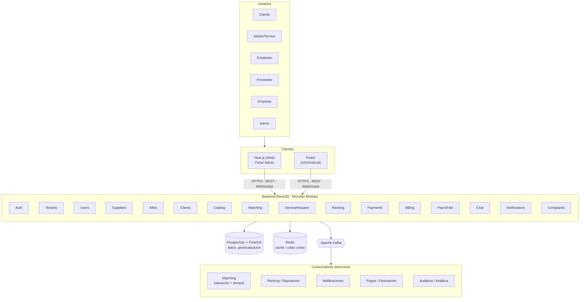

# Documento de Arquitectura de Software (SAD) V1 — TécnicoCerca

**Autor:** Sebastian Sánchez — DevOps Engineer
**Fecha:** 1 de septiembre de 2026

---

## 1. Drivers y Killers

Esta sección identifica las fuerzas que determinan las decisiones de arquitectura del sistema. Los *drivers* son las necesidades de negocio y técnicas que impulsan la arquitectura hacia cierta forma. Los *killers* son las restricciones que limitan o invalidan alternativas de diseño.

### 1.1 Drivers

| ID | Driver | Origen | Implicación arquitectónica |
|---|---|---|---|
| D1 | Matching por ubicación y ventana horaria en tiempo real | Incumplimiento recurrente de ventanas de horario reportado por el cliente | Requiere mecanismo geoespacial y consulta de disponibilidad horaria |
| D2 | `[PENDIENTE — definir con el equipo]` Doble ranking (materiales vs. servicio prestado) | El cliente no puede validar la calidad de lo que le venden ni la calidad del servicio prestado | Por definir: módulos de ranking separados o tabla única con campo de tipo |
| D3 | Modelo de facturación "merchant of record" (tipo Uber) | El cliente exige que la plataforma facture a nombre propio, no cada técnico individualmente | La plataforma actúa como responsable fiscal frente al cliente final |
| D4 | Pagos con cumplimiento PCI-DSS | Requisito explícito y no negociable del cliente | Tokenización de datos de pago vía pasarela certificada |
| D5 | Multi-tenancy y soporte a múltiples empresas oferentes | Modelo de negocio actual (empresas aliadas con técnicos propios, B2B2E) y visión explícita de tenants independientes a futuro | Aislamiento de datos por tenant desde el diseño inicial |
| D7 | `[PENDIENTE — confirmar alcance]` Presencia digital / SEO | Solicitud explícita del cliente de visibilidad en buscadores y redes | Por confirmar: si el frontend web incluye sitio público indexable o solo panel administrativo |
| D8 | Trazabilidad ante reclamaciones | Necesidad de resolver disputas cliente-técnico con evidencia | Registro histórico de eventos del ciclo de vida del servicio |

### 1.2 Killers

| ID | Killer | Origen | Qué prohíbe |
|---|---|---|---|
| K1 | No es un ERP | Restricción explícita del cliente | Contabilidad general, nómina legal completa, inventarios complejos |
| K2 | Nunca almacenar PAN/CVV | Requisito PCI-DSS | Cualquier diseño que toque directamente datos de tarjeta |
| K3 | Timeline académico de aproximadamente 3 meses | Restricción del curso | Limita la profundidad de cada módulo; prioriza el alcance mínimo viable |
| K4 | No se implementa manejo de conectividad intermitente / modo offline | Fuera de alcance por restricción de tiempo del proyecto académico | La aplicación móvil asume conexión a internet disponible; sin sincronización diferida |
| K5 | Sin presupuesto para servicios cloud administrados | Restricción de recursos del proyecto | Bases de datos, colas de mensajes o cómputo administrado en la nube; toda la infraestructura corre en servidores propios |
| K6 | Operación limitada a Colombia | Alcance actual del proyecto; la expansión es visión futura, no alcance presente | Internacionalización de moneda/idioma, soporte multi-región, cumplimiento normativo de otros países |
| K7 | Equipo de estudiantes sin operación 24/7 | Naturaleza del proyecto; sin turnos, guardias ni rol de operación dedicado | Mecanismos de alta disponibilidad con recuperación automática compleja (failover, multi-zona) |

> **Nota:** D2 y D7 permanecen abiertos hasta ser resueltos con el equipo. Su resolución puede derivar en nuevos atributos de calidad o ajustes a los ya definidos en la sección siguiente.

---

## 2. Atributos de Calidad

Los atributos de calidad expresan, en términos medibles, las propiedades que el sistema debe cumplir. Cada atributo seleccionado está sustentado por uno o más de los drivers o killers definidos en la sección anterior.

| ID | Atributo | Sustentado por |
|---|---|---|
| AC1 | Rendimiento | D1 |
| AC2 | Seguridad | D4, K2, D5 |
| AC3 | Disponibilidad | K5, K7 |
| AC4 | Escalabilidad | D5 |
| AC5 | Mantenibilidad | K3 |
| AC6 | Trazabilidad / Auditabilidad | D8 |

---

## 3. Escenarios de Calidad

Cada escenario sigue la estructura de seis partes: fuente del estímulo, estímulo, ambiente, artefacto, respuesta y medida de la respuesta. Los escenarios se redactan de forma agnóstica a la tecnología concreta; la tecnología específica se define en la sección de Arquitectura de Alto Nivel.

### 3.1 AC1 — Rendimiento

**Escenario 1 — Búsqueda de técnicos cercanos**

| Parte | Contenido |
|---|---|
| Fuente | Cliente |
| Estímulo | Solicita técnicos cercanos disponibles |
| Ambiente | Horario de alta demanda |
| Artefacto | Mecanismo de búsqueda por ubicación y disponibilidad |
| Respuesta | Devuelve lista ordenada por distancia y ranking |
| Medida | Menos de 2 segundos para el 95% de las solicitudes |

**Escenario 2 — Consulta de historial**

| Parte | Contenido |
|---|---|
| Fuente | Cliente o técnico |
| Estímulo | Consulta su historial de servicios |
| Ambiente | Operación normal, historial con múltiples solicitudes acumuladas |
| Artefacto | Módulo de gestión de solicitudes |
| Respuesta | Devuelve el historial paginado |
| Medida | Menos de 1 segundo para cargar una página de resultados |

**Escenario 3 — Procesamiento en segundo plano**

| Parte | Contenido |
|---|---|
| Fuente | Sistema (tras la creación de una solicitud) |
| Estímulo | Se dispara la búsqueda de técnicos candidatos |
| Ambiente | Operación normal |
| Artefacto | Mecanismo de procesamiento asíncrono |
| Respuesta | Identifica y notifica a los técnicos candidatos |
| Medida | Menos de 5 segundos desde la creación de la solicitud hasta la notificación |

### 3.2 AC2 — Seguridad

**Escenario 1 — Protección de datos de pago**

| Parte | Contenido |
|---|---|
| Fuente | Cliente |
| Estímulo | Ingresa datos de tarjeta en el checkout |
| Ambiente | Cualquier transacción de pago |
| Artefacto | Mecanismo de procesamiento de pagos |
| Respuesta | Tokeniza la información sin que el backend la almacene ni la registre en logs |
| Medida | 0 ocurrencias de número de tarjeta o CVV en base de datos o logs |

**Escenario 2 — Aislamiento multi-tenant**

| Parte | Contenido |
|---|---|
| Fuente | Usuario autenticado de un tenant |
| Estímulo | Realiza una consulta a la API |
| Ambiente | Operación normal |
| Artefacto | Backend — control de acceso a datos |
| Respuesta | Solo devuelve datos correspondientes a su propio tenant |
| Medida | 0 casos de fuga de datos entre tenants en pruebas de aislamiento |

**Escenario 3 — Control de acceso por rol**

| Parte | Contenido |
|---|---|
| Fuente | Usuario autenticado con un rol específico |
| Estímulo | Intenta acceder a una acción reservada a otro rol |
| Ambiente | Operación normal |
| Artefacto | Backend — control de acceso basado en roles |
| Respuesta | Rechaza la acción con un error de autorización |
| Medida | 100% de los endpoints sensibles validan el rol en el backend, no solo en el cliente |

### 3.3 AC3 — Disponibilidad

**Escenario 1 — Caída de un componente no crítico**

| Parte | Contenido |
|---|---|
| Fuente | Falla de infraestructura |
| Estímulo | Un componente no crítico deja de responder |
| Ambiente | Operación normal |
| Artefacto | Sistema en general |
| Respuesta | Las funciones core (autenticación, solicitud de servicio) siguen operando desde los componentes restantes |
| Medida | Recuperación manual en un plazo de **12 a 24 horas** `[PROPUESTA — validar en reunión]`, dado que no hay operación 24/7 |

**Escenario 2 — Mantenimiento planeado**

| Parte | Contenido |
|---|---|
| Fuente | Equipo de DevOps |
| Estímulo | Se requiere aplicar una actualización o mantenimiento programado |
| Ambiente | Ventana anunciada al equipo |
| Artefacto | Sistema en general |
| Respuesta | El mantenimiento se realiza sin pérdida de datos, con downtime acotado y comunicado |
| Medida | Downtime planeado menor a **2 horas** `[PROPUESTA — validar en reunión]` |

### 3.4 AC4 — Escalabilidad

**Escenario 1 — Alta de nuevo tenant**

| Parte | Contenido |
|---|---|
| Fuente | Equipo administrador de la plataforma |
| Estímulo | Se registra una nueva empresa (tenant) en el sistema |
| Ambiente | Operación normal, sin interrumpir a los tenants existentes |
| Artefacto | Módulo de gestión de tenants y esquema de base de datos |
| Respuesta | El nuevo tenant queda operativo con sus datos aislados, sin requerir cambios estructurales en el esquema |
| Medida | Tenant funcional en menos de **1 hora** `[PROPUESTA — validar en reunión]`, sin downtime para tenants existentes |

**Escenario 2 — Crecimiento del catálogo de técnicos**

| Parte | Contenido |
|---|---|
| Fuente | Tenant (empresa) |
| Estímulo | Registra un número creciente de aliados/técnicos y catálogo de servicios |
| Ambiente | Operación normal, crecimiento progresivo del volumen de datos |
| Artefacto | Módulo de gestión de aliados/empleados y mecanismo de búsqueda |
| Respuesta | El sistema sigue respondiendo consultas de matching sin degradación notable |
| Medida | El tiempo de respuesta del matching se mantiene dentro de la medida definida en AC1 (menos de 2 segundos) |

### 3.5 AC5 — Mantenibilidad

**Escenario 1 — Pipeline de integración continua**

| Parte | Contenido |
|---|---|
| Fuente | Desarrollador del equipo |
| Estímulo | Hace push de un cambio de código a un módulo |
| Ambiente | Desarrollo activo |
| Artefacto | Pipeline de integración continua (build y pruebas automáticas) |
| Respuesta | El pipeline corre y reporta si el cambio rompió algo |
| Medida | Completa build y pruebas en menos de **10 minutos** `[PROPUESTA — validar en reunión]` |

**Escenario 2 — Acoplamiento entre módulos**

| Parte | Contenido |
|---|---|
| Fuente | Desarrollador del equipo |
| Estímulo | Implementa una funcionalidad nueva o corrige un error |
| Ambiente | Desarrollo activo |
| Artefacto | Estructura modular del backend |
| Respuesta | El cambio requiere modificaciones solo en el o los módulos directamente relacionados |
| Medida | La mayoría de los cambios (80% o más) afectan un solo módulo; cambios que afectan tres o más módulos son la excepción |

### 3.6 AC6 — Trazabilidad / Auditabilidad

**Escenario 1 — Reconstrucción de una disputa**

| Parte | Contenido |
|---|---|
| Fuente | Administrador del tenant |
| Estímulo | Recibe un reclamo de un cliente sobre un servicio específico |
| Ambiente | Operación normal |
| Artefacto | Registro de eventos del ciclo de vida del servicio |
| Respuesta | Puede reconstruir la línea de tiempo completa del servicio (cotización, aceptación, entrega, evaluación) |
| Medida | 100% de las transiciones de estado del servicio quedan registradas, sin pasos faltantes en la secuencia |

**Escenario 2 — Registro de cambios en pagos**

| Parte | Contenido |
|---|---|
| Fuente | Sistema |
| Estímulo | Se realiza un cambio de estado en un pago (creado, aprobado, rechazado, reembolsado) |
| Ambiente | Operación normal |
| Artefacto | Módulo de auditoría |
| Respuesta | Registra el origen del cambio, el momento, y el estado anterior y nuevo |
| Medida | 100% de los cambios de estado en pagos quedan registrados con marca de tiempo |

> **Nota general:** las medidas marcadas como propuesta corresponden a valores sugeridos por el área de infraestructura, pendientes de validación con el equipo completo.

---

## 4. Arquitectura de Alto Nivel (HLD)

Esta sección presenta la vista general de componentes del sistema y cómo se conectan entre sí, sin entrar aún al detalle interno de cada uno. La arquitectura se plantea sobre un backend único organizado como monolito modular, que atiende a los tres clientes (web, aplicación móvil) a través de una API síncrona y un mecanismo de procesamiento asíncrono para las tareas que no requieren respuesta inmediata al usuario.

### 4.1 Diagrama general

### 4.2 Componentes

#### 4.2.1 Clientes (frontend)

- **Next.js (Web)**: panel administrativo del tenant — gestión de empleados, aliados, proveedores y reportes. *`[PENDIENTE — confirmar con el equipo si además incluye un sitio público indexable orientado a SEO, según la definición de D7]`*
- **Flutter (iOS/Android)**: aplicación para clientes y para técnicos/aliados en campo.

Ambos clientes se comunican con el backend mediante HTTPS, usando REST para operaciones estándar y WebSocket para comunicación en tiempo real (por ejemplo, chat).

#### 4.2.2 Backend (NestJS — monolito modular)

Un único backend atiende a los tres clientes. Se organiza internamente en módulos con responsabilidad única, sin estar separados físicamente en servicios independientes:

`Auth · Tenants · Users · Suppliers · Allies · Clients · Catalog · Matching · ServiceRequest · Ranking · Payments · Billing · Payroll-lite · Chat · Notifications · Complaints`

#### 4.2.3 Persistencia

- **PostgreSQL + PostGIS**: fuente de verdad transaccional del sistema. La extensión PostGIS resuelve las consultas geoespaciales requeridas por el matching de técnicos según ubicación y disponibilidad horaria.
- **Redis**: cache y colas de corta duración (por ejemplo, recordatorios de horario).

#### 4.2.4 Procesamiento asíncrono

**Apache Kafka** desacopla del flujo síncrono todo lo que no necesita una respuesta inmediata al usuario. Los consumidores identificados son:

- **Matching** — búsqueda de técnicos candidatos según ubicación y ventana horaria
- **Ranking / Reputación** — recálculo de reputación tras cada evaluación
- **Notificaciones** — envío de alertas a los usuarios involucrados
- **Pagos / Facturación** — generación de factura tras la confirmación de un pago
- **Auditoría / Analítica** — registro de trazabilidad y alimentación de métricas de negocio

### 4.3 Principio rector: separación por criticidad

Todo lo que el usuario necesita ver de inmediato (crear una solicitud, confirmar un pago, enviar un mensaje de chat) se resuelve mediante la API síncrona. Todo lo que puede resolverse en segundo plano (buscar al técnico más cercano, recalcular ranking, enviar una notificación, actualizar analítica) se resuelve mediante el mecanismo de procesamiento asíncrono. Este principio mantiene la aplicación con buen tiempo de respuesta incluso si el volumen de operaciones de fondo crece.

> **Nota:** el nivel de monolito modular corresponde al alcance definido por K3 (timeline académico) — pendiente de confirmar si se requiere plantear adicionalmente una proyección hacia una arquitectura de mayor escala, sin que esto implique un cambio en lo que efectivamente se construye.