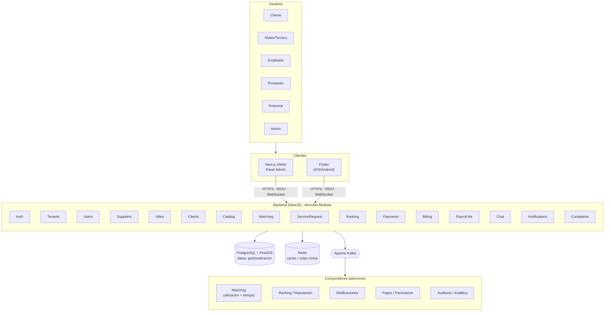
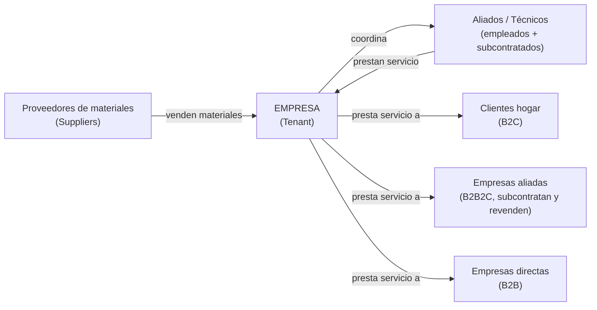
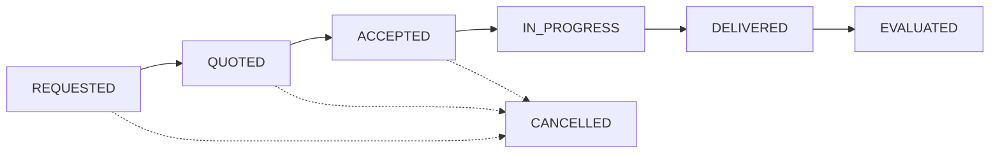
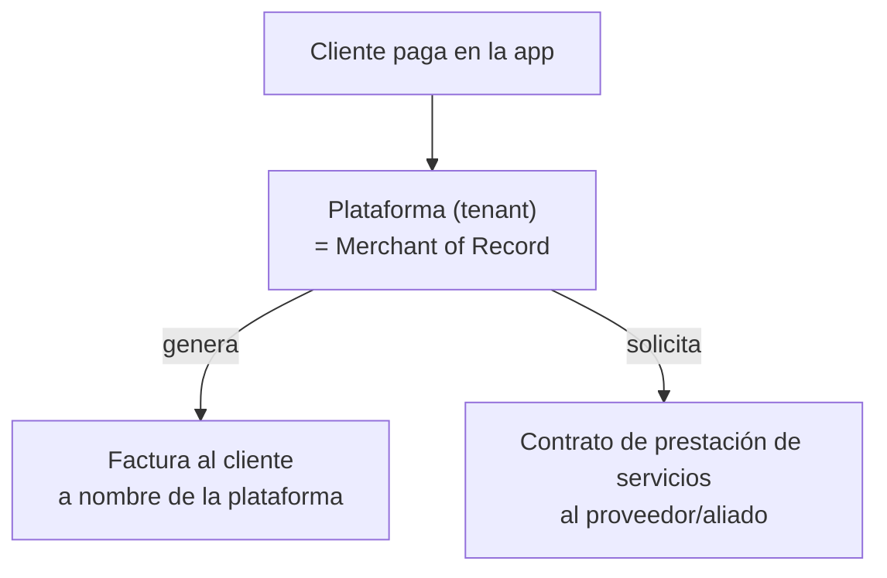

# Documento de Arquitectura de Software (SAD) V1 — TécnicoCerca


---

## 1. Drivers y Killers

Esta sección identifica las fuerzas que determinan las decisiones de arquitectura del sistema. Los _drivers_ son las necesidades de negocio y técnicas que impulsan la arquitectura hacia cierta forma. Los _killers_ son las restricciones que limitan o invalidan alternativas de diseño.

### 1.1 Drivers

|ID|Driver|Origen|Implicación arquitectónica|
|---|---|---|---|
|D1|Matching por ubicación y ventana horaria en tiempo real|Incumplimiento recurrente de ventanas de horario reportado por el cliente|Requiere mecanismo geoespacial y consulta de disponibilidad horaria|
|D2|Doble ranking (materiales y servicio prestado)|El cliente no puede validar la calidad de lo que le venden ni la calidad del servicio prestado|Dos módulos/tablas de ranking separados: uno para Suppliers (materiales) y otro para Allies/Technicians (servicio)|
|D3|Modelo de facturación "merchant of record" (tipo Uber)|El cliente exige que la plataforma facture a nombre propio, no cada técnico individualmente|La plataforma actúa como responsable fiscal frente al cliente final|
|D4|Pagos con cumplimiento PCI-DSS|Requisito explícito y no negociable del cliente|Tokenización de datos de pago vía pasarela certificada|
|D5|Multi-tenancy y soporte a múltiples empresas oferentes|Modelo de negocio actual (empresas aliadas con técnicos propios, B2B2E) y visión explícita de tenants independientes a futuro|Aislamiento de datos por tenant desde el diseño inicial|
|D8|Trazabilidad ante reclamaciones|Necesidad de resolver disputas cliente-técnico con evidencia|Registro histórico de eventos del ciclo de vida del servicio|

### 1.2 Killers

|ID|Killer|Origen|Qué prohíbe|
|---|---|---|---|
|K1|No es un ERP|Restricción explícita del cliente|Contabilidad general, nómina legal completa, inventarios complejos|
|K2|Nunca almacenar PAN/CVV|Requisito PCI-DSS|Cualquier diseño que toque directamente datos de tarjeta|
|K3|Timeline académico de aproximadamente 3 meses|Restricción del curso|Limita la profundidad de cada módulo; prioriza el alcance mínimo viable|
|K4|No se implementa manejo de conectividad intermitente / modo offline|Fuera de alcance por restricción de tiempo del proyecto académico|La aplicación móvil asume conexión a internet disponible; sin sincronización diferida|
|K5|Sin presupuesto para servicios cloud administrados|Restricción de recursos del proyecto|Bases de datos, colas de mensajes o cómputo administrado en la nube; toda la infraestructura corre en servidores propios|
|K6|Operación limitada a Colombia|Alcance actual del proyecto; la expansión es visión futura, no alcance presente|Internacionalización de moneda/idioma, soporte multi-región, cumplimiento normativo de otros países|
|K7|Equipo de estudiantes sin operación 24/7|Naturaleza del proyecto; sin turnos, guardias ni rol de operación dedicado|Mecanismos de alta disponibilidad con recuperación automática compleja (failover, multi-zona)|
|K8|No se construye sitio público con SEO / presencia digital|Solicitud explícita del cliente, fuera de alcance por restricción de tiempo (K3)|Páginas públicas indexables, contenido SSR orientado a SEO, integración con redes sociales/Google Business — el frontend web se limita al panel administrativo|

> **Nota:** D2 y D7 fueron resueltos. D2: doble ranking confirmado (ver implicación arquitectónica). D7 fue reclasificado como K8 (ver Killers): el frontend web es exclusivamente el panel administrativo del tenant, sin sitio público indexable.

---

## 2. Atributos de Calidad

Los atributos de calidad expresan, en términos medibles, las propiedades que el sistema debe cumplir. Cada atributo seleccionado está sustentado por uno o más de los drivers o killers definidos en la sección anterior.

|ID|Atributo|Sustentado por|
|---|---|---|
|AC1|Rendimiento|D1|
|AC2|Seguridad|D4, K2, D5|
|AC3|Disponibilidad|K5, K7|
|AC4|Escalabilidad|D5|
|AC5|Mantenibilidad|K3|
|AC6|Trazabilidad / Auditabilidad|D8|

---

## 3. Escenarios de Calidad

Cada escenario sigue la estructura de seis partes: fuente del estímulo, estímulo, ambiente, artefacto, respuesta y medida de la respuesta. Los escenarios se redactan de forma agnóstica a la tecnología concreta; la tecnología específica se define en la sección de Arquitectura de Alto Nivel.

### 3.1 AC1 — Rendimiento

**Escenario 1 — Búsqueda de técnicos cercanos**

|Parte|Contenido|
|---|---|
|Fuente|Cliente|
|Estímulo|Solicita técnicos cercanos disponibles|
|Ambiente|Horario de alta demanda|
|Artefacto|Mecanismo de búsqueda por ubicación y disponibilidad|
|Respuesta|Devuelve lista ordenada por distancia y ranking|
|Medida|Menos de 2 segundos para el 95% de las solicitudes|

**Escenario 2 — Consulta de historial**

|Parte|Contenido|
|---|---|
|Fuente|Cliente o técnico|
|Estímulo|Consulta su historial de servicios|
|Ambiente|Operación normal, historial con múltiples solicitudes acumuladas|
|Artefacto|Módulo de gestión de solicitudes|
|Respuesta|Devuelve el historial paginado|
|Medida|Menos de 1 segundo para cargar una página de resultados|

**Escenario 3 — Procesamiento en segundo plano**

|Parte|Contenido|
|---|---|
|Fuente|Sistema (tras la creación de una solicitud)|
|Estímulo|Se dispara la búsqueda de técnicos candidatos|
|Ambiente|Operación normal|
|Artefacto|Mecanismo de procesamiento asíncrono|
|Respuesta|Identifica y notifica a los técnicos candidatos|
|Medida|Menos de 5 segundos desde la creación de la solicitud hasta la notificación|

### 3.2 AC2 — Seguridad

**Escenario 1 — Protección de datos de pago**

|Parte|Contenido|
|---|---|
|Fuente|Cliente|
|Estímulo|Ingresa datos de tarjeta en el checkout|
|Ambiente|Cualquier transacción de pago|
|Artefacto|Mecanismo de procesamiento de pagos|
|Respuesta|Tokeniza la información sin que el backend la almacene ni la registre en logs|
|Medida|0 ocurrencias de número de tarjeta o CVV en base de datos o logs|

**Escenario 2 — Aislamiento multi-tenant**

|Parte|Contenido|
|---|---|
|Fuente|Usuario autenticado de un tenant|
|Estímulo|Realiza una consulta a la API|
|Ambiente|Operación normal|
|Artefacto|Backend — control de acceso a datos|
|Respuesta|Solo devuelve datos correspondientes a su propio tenant|
|Medida|0 casos de fuga de datos entre tenants en pruebas de aislamiento|

**Escenario 3 — Control de acceso por rol**

|Parte|Contenido|
|---|---|
|Fuente|Usuario autenticado con un rol específico|
|Estímulo|Intenta acceder a una acción reservada a otro rol|
|Ambiente|Operación normal|
|Artefacto|Backend — control de acceso basado en roles|
|Respuesta|Rechaza la acción con un error de autorización|
|Medida|100% de los endpoints sensibles validan el rol en el backend, no solo en el cliente|

### 3.3 AC3 — Disponibilidad

**Escenario 1 — Caída de un componente no crítico**

|Parte|Contenido|
|---|---|
|Fuente|Falla de infraestructura|
|Estímulo|Un componente no crítico deja de responder|
|Ambiente|Operación normal|
|Artefacto|Sistema en general|
|Respuesta|Las funciones core (autenticación, solicitud de servicio) siguen operando desde los componentes restantes|
|Medida|Recuperación manual en un plazo de **12 a 24 horas** `[PROPUESTA — validar en reunión]`, dado que no hay operación 24/7|

**Escenario 2 — Mantenimiento planeado**

|Parte|Contenido|
|---|---|
|Fuente|Equipo de DevOps|
|Estímulo|Se requiere aplicar una actualización o mantenimiento programado|
|Ambiente|Ventana anunciada al equipo|
|Artefacto|Sistema en general|
|Respuesta|El mantenimiento se realiza sin pérdida de datos, con downtime acotado y comunicado|
|Medida|Downtime planeado menor a **2 horas** `[PROPUESTA — validar en reunión]`|

### 3.4 AC4 — Escalabilidad

**Escenario 1 — Alta de nuevo tenant**

|Parte|Contenido|
|---|---|
|Fuente|Equipo administrador de la plataforma|
|Estímulo|Se registra una nueva empresa (tenant) en el sistema|
|Ambiente|Operación normal, sin interrumpir a los tenants existentes|
|Artefacto|Módulo de gestión de tenants y esquema de base de datos|
|Respuesta|El nuevo tenant queda operativo con sus datos aislados, sin requerir cambios estructurales en el esquema|
|Medida|Tenant funcional en menos de **1 hora** `[PROPUESTA — validar en reunión]`, sin downtime para tenants existentes|

**Escenario 2 — Crecimiento del catálogo de técnicos**

|Parte|Contenido|
|---|---|
|Fuente|Tenant (empresa)|
|Estímulo|Registra un número creciente de aliados/técnicos y catálogo de servicios|
|Ambiente|Operación normal, crecimiento progresivo del volumen de datos|
|Artefacto|Módulo de gestión de aliados/empleados y mecanismo de búsqueda|
|Respuesta|El sistema sigue respondiendo consultas de matching sin degradación notable|
|Medida|El tiempo de respuesta del matching se mantiene dentro de la medida definida en AC1 (menos de 2 segundos)|

### 3.5 AC5 — Mantenibilidad

**Escenario 1 — Pipeline de integración continua**

|Parte|Contenido|
|---|---|
|Fuente|Desarrollador del equipo|
|Estímulo|Hace push de un cambio de código a un módulo|
|Ambiente|Desarrollo activo|
|Artefacto|Pipeline de integración continua (build y pruebas automáticas)|
|Respuesta|El pipeline corre y reporta si el cambio rompió algo|
|Medida|Completa build y pruebas en menos de **10 minutos** `[PROPUESTA — validar en reunión]`|

**Escenario 2 — Acoplamiento entre módulos**

|Parte|Contenido|
|---|---|
|Fuente|Desarrollador del equipo|
|Estímulo|Implementa una funcionalidad nueva o corrige un error|
|Ambiente|Desarrollo activo|
|Artefacto|Estructura modular del backend|
|Respuesta|El cambio requiere modificaciones solo en el o los módulos directamente relacionados|
|Medida|La mayoría de los cambios (80% o más) afectan un solo módulo; cambios que afectan tres o más módulos son la excepción|

### 3.6 AC6 — Trazabilidad / Auditabilidad

**Escenario 1 — Reconstrucción de una disputa**

|Parte|Contenido|
|---|---|
|Fuente|Administrador del tenant|
|Estímulo|Recibe un reclamo de un cliente sobre un servicio específico|
|Ambiente|Operación normal|
|Artefacto|Registro de eventos del ciclo de vida del servicio|
|Respuesta|Puede reconstruir la línea de tiempo completa del servicio (cotización, aceptación, entrega, evaluación)|
|Medida|100% de las transiciones de estado del servicio quedan registradas, sin pasos faltantes en la secuencia|

**Escenario 2 — Registro de cambios en pagos**

|Parte|Contenido|
|---|---|
|Fuente|Sistema|
|Estímulo|Se realiza un cambio de estado en un pago (creado, aprobado, rechazado, reembolsado)|
|Ambiente|Operación normal|
|Artefacto|Módulo de auditoría|
|Respuesta|Registra el origen del cambio, el momento, y el estado anterior y nuevo|
|Medida|100% de los cambios de estado en pagos quedan registrados con marca de tiempo|

> **Nota general:** las medidas marcadas como propuesta corresponden a valores sugeridos por el área de infraestructura, pendientes de validación con el equipo completo.

---

## 4. Arquitectura de Alto Nivel (HLD)

Esta sección presenta la vista general de componentes del sistema y cómo se conectan entre sí, sin entrar aún al detalle interno de cada uno. La arquitectura se plantea sobre un backend único organizado como monolito modular, que atiende a los tres clientes (web, aplicación móvil) a través de una API síncrona y un mecanismo de procesamiento asíncrono para las tareas que no requieren respuesta inmediata al usuario.

### 4.1 Diagrama general



### 4.2 Componentes

#### 4.2.1 Clientes (frontend)

- **Next.js (Web)**: panel administrativo del tenant — gestión de empleados, aliados, proveedores y reportes. Exclusivamente backoffice, sin sitio público indexable (ver K8).
- **Flutter (iOS/Android)**: aplicación para clientes y para técnicos/aliados en campo.

Ambos clientes se comunican con el backend mediante HTTPS, usando REST para operaciones estándar y WebSocket para comunicación en tiempo real (por ejemplo, chat).

#### 4.2.2 Backend (NestJS — monolito modular)

Un único backend atiende a los tres clientes. Se organiza internamente en módulos con responsabilidad única, sin estar separados físicamente en servicios independientes:

`Auth · Tenants · Users · Suppliers · Allies · Clients · Catalog · Matching · ServiceRequest · Ranking · Payments · Billing · Payroll-lite · Chat · Notifications · Complaints`

#### 4.2.3 Persistencia

- **PostgreSQL + PostGIS**: fuente de verdad transaccional del sistema. La extensión PostGIS resuelve las consultas geoespaciales requeridas por el matching de técnicos según ubicación y disponibilidad horaria.
- **Redis**: cache y colas de corta duración (por ejemplo, recordatorios de horario).

#### 4.2.4 Procesamiento asíncrono

**Apache Kafka** desacopla del flujo síncrono todo lo que no necesita una respuesta inmediata al usuario. Los consumidores identificados son:

- **Matching** — búsqueda de técnicos candidatos según ubicación y ventana horaria
- **Ranking / Reputación** — recálculo de reputación tras cada evaluación
- **Notificaciones** — envío de alertas a los usuarios involucrados
- **Pagos / Facturación** — generación de factura tras la confirmación de un pago
- **Auditoría / Analítica** — registro de trazabilidad y alimentación de métricas de negocio

### 4.3 Principio rector: separación por criticidad

Todo lo que el usuario necesita ver de inmediato (crear una solicitud, confirmar un pago, enviar un mensaje de chat) se resuelve mediante la API síncrona. Todo lo que puede resolverse en segundo plano (buscar al técnico más cercano, recalcular ranking, enviar una notificación, actualizar analítica) se resuelve mediante el mecanismo de procesamiento asíncrono. Este principio mantiene la aplicación con buen tiempo de respuesta incluso si el volumen de operaciones de fondo crece.

> **Nota:** el nivel de monolito modular corresponde al alcance definido por K3 (timeline académico) — pendiente de confirmar si se requiere plantear adicionalmente una proyección hacia una arquitectura de mayor escala, sin que esto implique un cambio en lo que efectivamente se construye.

---

## 5. Arquitectura de Infraestructura

Esta sección describe cómo se distribuye el sistema sobre las 7 VMs propias (K5: sin presupuesto para servicios cloud administrados), y cómo se automatiza su configuración y despliegue dado que una sola persona (DevOps) administra las 7 máquinas.

### 5.1 Distribución de VMs

|VM|IP|Rol|Qué corre|
|---|---|---|---|
|VM1|10.43.100.168|Gateway / Entry point|Nginx (reverse proxy + balanceo) — enruta tráfico a Next.js y NestJS|
|VM2|10.43.98.15|Frontend Web|Next.js (panel administrativo del tenant — sin sitio público, ver K8)|
|VM3|10.43.98.205|Backend principal|NestJS (API REST + WebSocket) — el monolito modular|
|VM4|10.43.98.209|Base de datos|PostgreSQL + PostGIS (fuente de verdad, incluye datos geoespaciales)|
|VM5|10.43.98.29|Cache / colas cortas|Redis (BullMQ para trabajos programados)|
|VM6|10.43.99.12|Mensajería asíncrona|Apache Kafka + Kafka UI (matching, ranking, notificaciones, pagos)|
|VM7|10.43.99.8|Storage + Observabilidad|MinIO (evidencias fotográficas) + logs estructurados / métricas|

**Nota sobre Flutter (móvil):** no necesita VM propia — se compila en CI (GitHub Actions) y consume la API desde VM1/VM3.

> **Discrepancia detectada:** el documento previo de infraestructura describe VM2 como servidor tanto del "sitio público" como del panel administrativo. Con K8 ya confirmado (sin sitio público / SEO fuera de alcance), ese documento debe actualizarse para que VM2 quede descrita únicamente como panel administrativo, consistente con esta sección del SAD.

### 5.2 Principio de distribución

- **Separación por criticidad**: lo síncrono (VM1-VM4) queda aislado de lo asíncrono (VM6), así si Kafka se satura no tumba la API.
- **Base de datos sola en su VM** (VM4): es el recurso más sensible — nunca comparte máquina con procesos que puedan consumir su CPU/RAM.
- **Redis separado de Kafka** (VM5 vs. VM6): aunque ambos son infraestructura de soporte, tienen patrones de carga distintos (Redis = baja latencia constante, Kafka = throughput por ráfagas).

### 5.3 Orden de arranque

Existen dependencias de arranque entre componentes: PostgreSQL y Kafka deben estar disponibles antes que NestJS. Este orden se garantiza con healthchecks en Docker Compose y/o con un script de orquestación:

1. VM4 (PostgreSQL/PostGIS) y VM5 (Redis)
2. VM6 (Kafka)
3. VM3 (NestJS backend)
4. VM2 (Next.js) y VM1 (Nginx Gateway)
5. VM7 (MinIO + Observabilidad) — independiente, puede iniciar en paralelo

### 5.4 Automatización con Ansible

Dado que una sola persona administra las 7 VMs, la automatización no es opcional. Estructura del proyecto:

```
ansible/
├── inventory.ini          → lista de las 7 VMs con IPs y roles
├── setup-base.yml         → Docker y dependencias comunes (corre en las 7)
├── deploy-db.yml          → especifico para VM4 (PostgreSQL + PostGIS)
├── deploy-kafka.yml       → especifico para VM6
├── deploy-backend.yml     → especifico para VM3
└── group_vars/
```

Ejemplo de inventario:

```
[gateway]
vm1 ansible_host=10.43.100.168

[frontend]
vm2 ansible_host=10.43.98.15

[backend]
vm3 ansible_host=10.43.98.205

[database]
vm4 ansible_host=10.43.98.209

[cache]
vm5 ansible_host=10.43.98.29

[messaging]
vm6 ansible_host=10.43.99.12

[storage_observability]
vm7 ansible_host=10.43.99.8
```

Ejecución sobre las 7 VMs en una sola pasada:

```
ansible-playbook -i inventory.ini setup-base.yml
```

### 5.5 Contenedores y despliegue

Cada VM tiene su propio `docker-compose.yml`, versionado en el mismo repositorio dentro de una carpeta `infrastructure/`:

```
infrastructure/
├── vm1-gateway/docker-compose.yml
├── vm2-web/docker-compose.yml
├── vm3-backend/docker-compose.yml
├── vm4-database/docker-compose.yml
├── vm5-redis/docker-compose.yml
├── vm6-kafka/docker-compose.yml
└── vm7-storage-observability/docker-compose.yml
```

### 5.6 CI/CD

Pipeline en GitHub Actions, separado por aplicación (`backend/`, `web/`, `mobile/`), con gates de test antes de build:

- **Al abrir PR**: lint + tests unitarios.
- **Al mergear a `develop`**: build + tests de integración.
- **Al mergear a `main` / crear `release/*`**: build de imagen Docker y despliegue automático vía SSH a la VM correspondiente (`docker compose pull && docker compose up -d`).

### 5.7 ADR de infraestructura

|ID|Decisión|Sustentado por|Trade-off|
|---|---|---|---|
|ADR-011|Docker Compose por VM (sin Kubernetes ni cloud administrado)|K5, K7|Gana simplicidad operativa manejable por una sola persona, sin costo de infraestructura; pierde orquestación automática (auto-healing, auto-scaling) que sí ofrecería Kubernetes — aceptable dado K7 (sin operación 24/7)|

> **Nota:** se descartó Kubernetes explícitamente por ser sobre-ingeniería para 7 VMs administradas por una sola persona en un proyecto académico — Docker Swarm quedó como alternativa intermedia no elegida, ya que Compose por VM resulta suficientemente simple sin agregar la complejidad de gestión de un clúster.

---

## 6. Trade-offs y ADRs

Cada ADR (Architecture Decision Record) documenta una decisión de arquitectura ya tomada: qué se decidió, en qué driver o killer se sustenta, y qué trade-off implica (qué se gana y qué se sacrifica).

|ID|Decisión|Sustentado por|Trade-off|
|---|---|---|---|
|ADR-001|Next.js exclusivamente para panel administrativo|K3, K8|Gana enfoque en el core del negocio dentro del tiempo disponible; pierde la presencia digital que el cliente pidió — queda como trabajo futuro|
|ADR-002|Flutter para iOS/Android como cliente único móvil|K3|Gana una sola base de código para ambas tiendas; pierde rendimiento nativo puro y acceso a APIs muy específicas de cada plataforma|
|ADR-003|NestJS como backend modular único (monolito modular)|K3|Gana velocidad de desarrollo y simplicidad de despliegue; pierde escalabilidad independiente por módulo (todo escala junto)|
|ADR-004|PostgreSQL + PostGIS|D1|Gana consultas geoespaciales nativas y consistencia transaccional; pierde la flexibilidad de un motor NoSQL para datos muy variables|
|ADR-005|Shared-schema con `tenant_id` + RLS|D5, K5|Gana costo bajo y velocidad de implementación; pierde aislamiento físico total entre tenants|
|ADR-006|Apache Kafka para desacoplar procesos|D1, D8|Gana resiliencia y capacidad de auditar eventos; pierde simplicidad operativa (más piezas que mantener con 7 VMs)|
|ADR-007|Transactional Outbox + idempotencia|D8, K5|Gana confiabilidad si Kafka falla temporalmente; pierde simplicidad de código (más lógica en cada escritura)|
|ADR-008|Modelo de facturación "merchant of record"|D3|Gana experiencia de cliente unificada (como Uber); la plataforma asume responsabilidad fiscal/legal directa|
|ADR-009|Tokenización de pagos (reduce alcance PCI-DSS)|D4, K2|Gana reducir el alcance de cumplimiento a SAQ-A/A-EP; pierde control total sobre el flujo de pago (dependencia de la pasarela externa)|
|ADR-010|Payroll-lite acotado (no ERP)|K1|Gana enfoque en el problema real del negocio; pierde funcionalidad de nómina/contabilidad completa|

> **Nota:** el ADR-011, propio de infraestructura (Docker Compose sobre VMs propias vs. Kubernetes/cloud administrado), se documenta en la sección 5.7 junto con el resto de la Arquitectura de Infraestructura.

---

## 7. Arquitectura de Negocio

Esta sección describe el modelo de negocio en términos conceptuales — actores, relaciones y flujos — independiente de cómo se implementa técnicamente.

### 7.1 Modelo de tenants

TécnicoCerca se concibe como una plataforma SaaS multi-tenant. La empresa dueña original de la plataforma es el primer tenant, pero el diseño contempla que otras empresas se sumen como tenants independientes a futuro, cada una con sus propios datos, usuarios, técnicos y catálogo de servicios aislados entre sí (ver D5, sustento de AC2 y AC4).

### 7.2 Actores y roles

|Rol|Descripción|Relación|
|---|---|---|
|`PLATFORM_ADMIN`|Administra la plataforma completa y los tenants (visión SaaS)|—|
|`TENANT_ADMIN`|Dueño/administrador de la empresa (el tenant)|—|
|`EMPLOYEE`|Colaborador directo de la plantilla del tenant, presta servicios|B2E|
|`ALLY`|Profesional o empresa subcontratada, no nómina directa, presta servicios|B2E / B2B2E|
|`SUPPLIER`|Proveedor de repuestos y materiales|B2B|
|`BUSINESS_CLIENT`|Empresa que contrata directo, o que subcontrata y revende|B2B / B2B2C|
|`CLIENT`|Persona natural — servicios para el hogar|B2C|

### 7.3 Relaciones entre actores



Las tres relaciones de negocio coexisten en el mismo sistema:

- **B2B**: el tenant le compra materiales a Suppliers, y presta servicios directos a empresas (`BUSINESS_CLIENT`).
- **B2E / B2B2E**: el tenant coordina técnicos propios (`EMPLOYEE`) y subcontratados (`ALLY`) para prestar los servicios.
- **B2C / B2B2C**: el tenant presta servicios a clientes hogar (`CLIENT`) directamente, o a través de empresas aliadas que subcontratan y revenden a sus propios clientes.

### 7.4 Ciclo de vida del servicio

Todo servicio contratado pasa por tres etapas, sin excepción (requisito explícito del negocio):



|Etapa|Qué ocurre|
|---|---|
|Cotización (`QUOTED`)|El cliente describe la necesidad; se sugieren aliados/empleados vía matching; se cotiza mano de obra + materiales|
|Prestación del servicio (`IN_PROGRESS` → `DELIVERED`)|Seguimiento en tiempo real, evidencias fotográficas, chat, checklist de trabajo|
|Evaluación de la entrega (`EVALUATED`)|El cliente valida lo entregado, califica (ranking), se libera el pago/factura|

`CANCELLED` es posible desde cualquier estado previo a `IN_PROGRESS`.

### 7.5 Modelo de facturación

La plataforma opera como **merchant of record** (modelo tipo Uber, ver D3 y ADR-008): factura ella misma al cliente final a nombre propio, y a su vez exige a proveedores/aliados un contrato de prestación de servicios (no una factura tradicional) como soporte del pago que se les hace. Este modelo se eligió explícitamente en contraste con el modelo tipo Mercado Libre/Mercado Pago, donde cada vendedor factura por su cuenta.



---

## 8. Arquitectura de Datos

Esta sección describe las entidades principales del sistema agrupadas por dominio de negocio, y la estrategia de aislamiento multi-tenant. El modelo de datos completo (diagrama entidad-relación, atributos, tipos de dato y contratos de API) se desarrolla en el Documento de Datos (DD) V1, no en esta sección.

### 8.1 Dominios de entidades

|Dominio|Entidades|
|---|---|
|Identidad y Tenancy|`Tenant`, `User`, `Role`|
|Actores de negocio|`Supplier`, `Ally`, `Employee`, `Client`, `BusinessClient`|
|Catálogo|`Specialty`, `ServiceCatalogItem`, `CoverageZone`|
|Ciclo de vida del servicio|`ServiceRequest`, `Quote`, `MatchingAttempt`, `Evidence`, `Evaluation`|
|Reputación|`Ranking` (servicio), `SupplierRanking` (materiales)|
|Pagos y facturación|`Payment`, `Invoice`, `PayoutRecord`|
|Comunicación y soporte|`Conversation`, `Message`, `Notification`, `Complaint`|
|Auditoría|`AuditLog`|

### 8.2 Aislamiento multi-tenant a nivel de datos

Consistente con D5 y ADR-005 (shared-schema con `tenant_id` + Row-Level Security), toda tabla de negocio debe incluir la columna `tenant_id`, no solo las tablas raíz (`Tenant`, `User`). Esto sustenta directamente el escenario de calidad de aislamiento multi-tenant definido en AC2 — sin `tenant_id` en cada tabla, la política RLS no puede aplicarse de forma simple y consistente en todo el esquema.

> **Nota:** el diagrama entidad-relación completo, con atributos, tipos de dato, claves foráneas y la revisión/corrección del modelo inicial propuesto por el equipo, se desarrolla en el Documento de Datos (DD) V1.