# SDD - Software Design Description - QUICKPATCH

**Proyecto:** QUICKPATCH - Plataforma multi-tenant de servicios técnicos  
**Documento:** Descripción de Diseño de Software (SDD)  
**Estado:** Borrador integrable - Vista Lógica y Vista Física desarrolladas  
**Fecha:** Septiembre de 2026

---

# 1. Introducción

Este documento consolida el diseño de software de QUICKPATCH a partir de la arquitectura, requisitos, modelo de datos y lineamientos de desarrollo vigentes. La organización del SDD se mantiene por vistas complementarias del sistema, integrando una **Vista Lógica** ya desarrollada y dejando preparadas las secciones que deberán ser completadas por los responsables de las demás vistas.

La estructura toma como referencia el enfoque 4+1 para separar la descripción lógica, los procesos en ejecución, la organización del desarrollo, el despliegue físico y los escenarios que conectan las demás vistas.

---

# 2. Fuentes de diseño y actualización de diagramas

Los diagramas y descripciones del SDD deben mantenerse alineados con las fuentes vigentes del proyecto. Ningún diagrama debe actualizarse de forma aislada si el cambio contradice requisitos, decisiones arquitectónicas, contratos o la implementación real.

| Artefacto / vista | Fuentes primarias de diseño | Elementos que deben mantenerse sincronizados |
|---|---|---|
| **Vista Lógica** | `SAD.md`, `SRS.md`, `DD.md` | Microservicios, módulos, dominios, entidades, relaciones lógicas, responsabilidades, contratos y eventos. |
| **Vista de Procesos** | `SRS.md`, `DD.md`, `SAD.md`, escenarios de calidad | Flujos síncronos/asíncronos, secuencias, productores/consumidores, concurrencia, reintentos, fallos. |
| **Vista de Desarrollo** | Repositorio de código, `Documento Politicas y Herramientas.md`, `SAD.md` | Carpetas, paquetes, proyectos, dependencias, convenciones, librerías, pruebas y CI/CD. |
| **Vista Física** | `SAD.md`, manifiestos de despliegue, archivos de infraestructura y políticas | VMs, contenedores, redes, puertos, servicios, ambientes, observabilidad y seguridad de infraestructura. |
| **Vista de Escenarios (+1)** | `SRS.md`, flujos de negocio, historias de usuario, escenarios de calidad | Casos representativos que atraviesan y validan las otras cuatro vistas. |
| **Diagramas de datos** | `DD.md`, contratos vigentes, migraciones/esquemas implementados | Entidades, campos, relaciones físicas, referencias lógicas y propiedad de datos por servicio. |
| **Diagramas de componentes** | `SAD.md`, `SDD.md`, código implementado | Límites de servicio, interfaces, dependencias permitidas y canales de comunicación. |

## 2.1 Regla de actualización

Para cualquier diagrama nuevo o modificado se debe verificar, según corresponda:

- requisito funcional o no funcional relacionado;
- microservicio o módulo propietario;
- contrato REST o evento involucrado;
- datos que consume o produce;
- relación con ADRs vigentes;
- correspondencia con el código, repositorio y despliegue real.

---

# 3. Arquitectura

## 3.1 Vista Lógica del Sistema

La arquitectura lógica del backend se organiza por dominios y servicios. Los clientes acceden a través del API Gateway; los microservicios contienen capacidades de negocio separadas; Kafka gestiona la integración asíncrona; y PostgreSQL/PostGIS, Redis y MinIO soportan persistencia, cache y evidencias.

### 3.1.1 Vista lógica general por capas

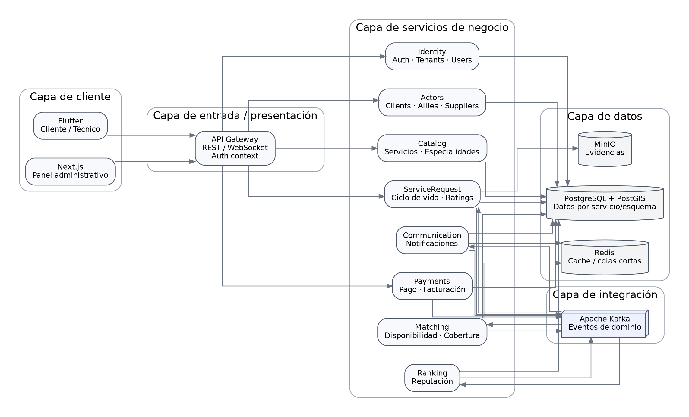

**Figura 1. Vista lógica general por capas de QUICKPATCH.**

La representación organiza el sistema en capa de cliente, entrada/presentación, servicios de negocio, integración y datos. Los ocho microservicios definidos en la arquitectura de alto nivel aparecen dentro de la capa de negocio y se conectan con los recursos de integración y persistencia correspondientes.

### 3.1.2 Componentes lógicos principales del backend

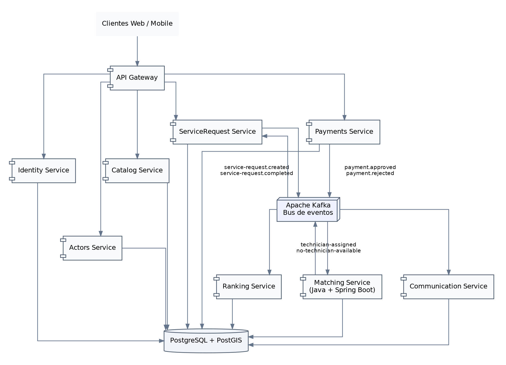

**Figura 2. Componentes lógicos principales del backend.**

El API Gateway concentra la entrada de solicitudes síncronas. ServiceRequest, Matching, Payments, Ranking y Communication participan en los flujos de eventos por Kafka. Cada servicio conserva su límite funcional y su propiedad de datos.

### 3.1.3 Principios de organización lógica

#### Separación por dominio

Cada microservicio representa una capacidad de negocio diferenciada y mantiene sus reglas dentro de su propio límite lógico.

#### Propiedad de datos

Cada servicio es propietario de los datos asociados a su dominio. Las relaciones internas al mismo servicio pueden implementarse con claves foráneas físicas; las relaciones entre dominios se representan mediante identificadores lógicos, contratos o eventos.

Ejemplo:

```text
ServiceRequest.client_id -> UUID del usuario en Identity
```

#### Comunicación por contratos

- REST se utiliza para operaciones en las que el cliente necesita una respuesta inmediata.
- Kafka se utiliza para coordinación asíncrona entre dominios.

#### Consistencia entre servicios

La comunicación asíncrona implica consistencia eventual entre dominios. Los eventos se gestionan con mecanismos de idempotencia, reintentos y Transactional Outbox.

#### Multi-tenancy

Los datos de negocio asociados a empresas conservan `tenant_id`. El contexto de tenant se deriva de la identidad autenticada y se aplica en las operaciones de lectura y escritura correspondientes.

---

## 3.2 Descomposición lógica por microservicio

### 3.2.1 API Gateway

**Responsabilidades:**

- enrutamiento hacia el servicio correspondiente;
- validación inicial del contexto de autenticación;
- propagación de identidad, rol y tenant;
- aplicación de políticas transversales de API;
- rechazo de tokens inválidos o expirados.

El Gateway no contiene reglas propias de matching, solicitudes, pagos, ranking ni facturación.

### 3.2.2 Identity Service

**Dominio:** identidad, autenticación, usuarios y tenancy.

**Módulos lógicos:**

- Auth
- Tenants
- Users
- Authorization / Roles

| Concepto | Tipo | Responsabilidad |
|---|---|---|
| `Tenant` | Entidad persistente | Empresa o espacio lógico independiente dentro de QUICKPATCH. |
| `User` | Entidad persistente | Identidad autenticable de una persona. |
| `TechnicianProfile` | Entidad persistente | Información específica del perfil técnico vinculada a un usuario. |
| `Role` | Concepto de autorización | Conjunto de permisos para cada tipo de usuario. |
| `AuthenticatedContext` | Objeto lógico | Propaga `userId`, `tenantId` y rol. |

**Datos documentados:** `tenants`, `users`, `technician_profiles`.

### 3.2.3 Actors Service

**Dominio:** actores de negocio distintos de la identidad técnica.

**Módulos lógicos:**

- Suppliers
- Allies
- Clients

| Concepto | Estado | Responsabilidad |
|---|---|---|
| `Supplier` | Conceptual / evolutivo | Proveedor de materiales o repuestos. |
| `Ally` | Conceptual / evolutivo | Técnico, profesional o empresa aliada que presta servicios. |
| `Client` | Conceptual / evolutivo | Cliente hogar o empresarial que contrata servicios. |

La persistencia detallada de estos conceptos se incorpora al DD cuando el Sprint correspondiente defina sus atributos y reglas.

### 3.2.4 Catalog Service

**Dominio:** catálogo de servicios y especialidades.

**Responsabilidades:**

- mantener categorías y especialidades;
- exponer opciones válidas para la creación de solicitudes;
- suministrar información de catálogo a clientes y procesos internos.

| Concepto | Persistencia | Descripción |
|---|---|---|
| `ServiceCategory` | `service_categories` | Categoría o tipo de servicio solicitado. |

### 3.2.5 ServiceRequest Service

**Dominio:** ciclo de vida de la solicitud de servicio.

**Módulos lógicos:**

- Request Management
- Service Lifecycle
- Ratings
- State Validation

| Concepto | Tipo | Responsabilidad |
|---|---|---|
| `ServiceRequest` | Entidad / agregado central | Representa la solicitud y controla sus transiciones válidas. |
| `ServiceCategory` | Entidad relacionada | Clasifica el servicio requerido. |
| `Rating` | Entidad | Registra la evaluación posterior al servicio. |
| `ServiceRequestStatus` | Value Object / Enum conceptual | Estado válido de la solicitud. |

**Estados actuales:**

```text
buscando_tecnico
    -> en_espera
    -> asignado
    -> en_progreso
    -> completado
    -> pagado
```

**Datos documentados:** `service_categories`, `service_requests`, `ratings`.

**Referencias lógicas externas:** `client_id`, `technician_id`, `tenant_id`.

**Eventos:**

- produce `service-request.created`;
- produce `service-request.completed`;
- consume `matching.technician-assigned`;
- consume `matching.no-technician-available`;
- consume `payment.approved`;
- consume `payment.rejected` cuando corresponda al flujo.

### 3.2.6 Matching Service

**Tecnología asignada:** Java + Spring Boot.

**Dominio:** selección y asignación de técnicos según disponibilidad, cobertura y criterios de proximidad.

**Módulos lógicos:**

- Availability
- Coverage
- Candidate Search
- Matching Attempts
- Assignment

| Concepto | Persistencia | Responsabilidad |
|---|---|---|
| `TechnicianAvailability` | `technician_availability` | Disponibilidad temporal de un técnico. |
| `CoverageZone` | `coverage_zones` | Área geográfica cubierta por un técnico. |
| `MatchingAttempt` | `matching_attempts` | Intento de asignación y resultado. |
| `Candidate` | Objeto lógico | Técnico evaluado durante el matching. |
| `MatchResult` | Objeto lógico | Resultado del proceso de matching. |

**Flujo lógico principal:**

El siguiente diagrama representa el flujo lógico principal del proceso de matching.


*Figura 3. Flujo lógico principal del Matching Service.*

### 3.2.7 Ranking Service

**Dominio:** reputación y evaluación agregada.

**Responsabilidades:**

- recalcular reputación de técnicos/aliados;
- mantener ranking de servicio y, cuando aplique, ranking de materiales/proveedores;
- consumir resultados y evaluaciones del ciclo de servicio.

Los modelos persistentes definitivos de ranking permanecen sujetos a evolución del DD.

### 3.2.8 Payments Service

**Dominio:** pagos y facturación.

**Módulos lógicos:**

- Payment Processing
- PSP Adapter
- Billing
- Invoice Management

| Concepto | Persistencia | Responsabilidad |
|---|---|---|
| `Payment` | `payments` | Estado de una operación de pago sin almacenar PAN/CVV. |
| `Invoice` | `invoices` | Factura asociada al pago o servicio. |
| `PaymentTokenReference` | Value Object | Referencia al token suministrado por el PSP. |
| `PaymentStatus` | Value Object / Enum conceptual | Estado controlado de la transacción. |

**Eventos:** `payment.approved`, `payment.rejected`.

### 3.2.9 Communication Service

**Dominio:** notificaciones y comunicación desacoplada.

**Responsabilidades:**

- reaccionar a eventos del ciclo de servicio;
- generar notificaciones para clientes y técnicos;
- ejecutar comunicaciones que no deben bloquear operaciones síncronas.

Chat y reclamaciones permanecen como funcionalidades futuras hasta que sean incorporadas por un Sprint y requisito explícito.

---

## 3.3 Modelo lógico de dominio y relaciones

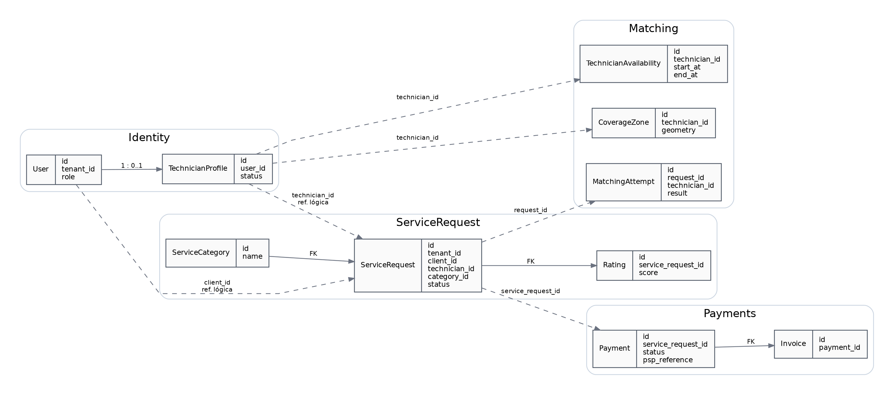

**Figura 3. Modelo lógico de dominio y referencias entre servicios.**

Las relaciones continuas representan relaciones internas al mismo dominio que pueden implementarse como claves foráneas. Las relaciones punteadas representan referencias lógicas entre servicios independientes.

### 3.3.1 Relaciones internas

```text
service_requests.category_id -> service_categories.id
ratings.service_request_id   -> service_requests.id
invoices.payment_id          -> payments.id
```

### 3.3.2 Referencias lógicas entre servicios

```text
service_requests.client_id      -> Identity / User
service_requests.technician_id  -> Identity / Technician
matching_attempts.request_id    -> ServiceRequest / ServiceRequest
payments.service_request_id     -> ServiceRequest / ServiceRequest
```

Un servicio no ejecuta escrituras directas sobre tablas propietarias de otro dominio ni define Foreign Keys físicas entre límites de servicio diferentes.

---

## 3.4 Contratos lógicos principales

### 3.4.1 REST

```text
POST /v1/auth/register/client
POST /v1/auth/register/technician
POST /v1/auth/register/company
POST /v1/auth/login
GET  /v1/users/me

POST /v1/service-requests
GET  /v1/service-requests/{id}
POST /v1/service-requests/{id}/start
POST /v1/service-requests/{id}/complete
POST /v1/service-requests/{id}/rating
POST /v1/service-requests/{id}/payment
GET  /v1/payments/{id}/invoice
```

### 3.4.2 Eventos de dominio

```text
service-request.created
matching.technician-assigned
matching.no-technician-available
service-request.completed
payment.approved
payment.rejected
```

**Sobre común del evento:**

```json
{
  "eventId": "uuid",
  "eventVersion": 1,
  "correlationId": "uuid",
  "tenantId": "uuid",
  "producer": "service-name",
  "occurredAt": "timestamp",
  "data": {}
}
```

---

# 4. Diseño Detallado

## 4.1 Estructura interna de los microservicios backend

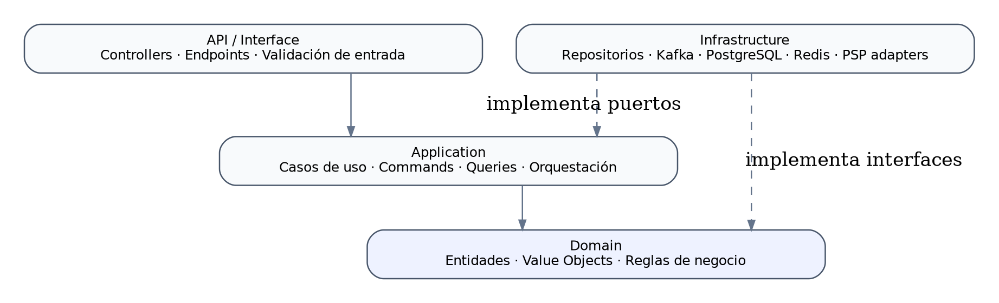

**Figura 4. Estructura lógica interna de un microservicio.**

La estructura interna se divide en cuatro capas lógicas:

| Capa | Contenido |
|---|---|
| **API / Interface** | Controllers, endpoints, validación de entrada y contratos expuestos. |
| **Application** | Casos de uso, comandos, queries y coordinación del flujo de aplicación. |
| **Domain** | Entidades, value objects y reglas de negocio. |
| **Infrastructure** | Repositorios, Kafka, PostgreSQL, Redis, PSP y adaptadores externos. |

**Dirección conceptual de dependencias:**

```text
API -> Application -> Domain
Infrastructure -> Application / Domain mediante interfaces
```

El detalle definitivo de proyectos, carpetas y paquetes debe quedar sincronizado con la Vista de Desarrollo.

## 4.2 Reglas transversales del backend

### Multi-tenancy

- los datos de negocio incluyen contexto de tenant cuando corresponde;
- las consultas aplican aislamiento de tenant;
- el tenant se deriva del contexto autenticado;
- PostgreSQL RLS puede actuar como defensa adicional.

### Seguridad de pagos

- no se persiste PAN/CVV;
- se almacena únicamente información permitida y referencias tokenizadas del PSP.

### Idempotencia

Los consumidores de eventos toleran mensajes repetidos y utilizan `eventId` para identificar efectos ya procesados.

### Transactional Outbox

Las operaciones que modifican estado de negocio y publican eventos registran localmente el cambio y el evento pendiente; el publicador reintenta ante indisponibilidad temporal de Kafka.

### Trazabilidad

Los cambios relevantes del ciclo de servicio y pago conservan información suficiente para reconstrucción y auditoría.

## 4.3 Trazabilidad con atributos de calidad

| Decisión de diseño | Atributos relacionados | Reflejo en el diseño |
|---|---|---|
| Microservicios por dominio | Escalabilidad, disponibilidad, mantenibilidad | Servicios separados y despliegue independiente. |
| Kafka como bus de eventos | Disponibilidad, escalabilidad, trazabilidad | Integración asíncrona y contratos de eventos. |
| PostgreSQL + PostGIS | Rendimiento | Consultas geoespaciales del Matching Service. |
| `tenant_id` + controles de acceso | Seguridad, escalabilidad | Aislamiento lógico de empresas. |
| Outbox + idempotencia | Disponibilidad, trazabilidad | Publicación confiable y tolerancia a duplicados. |
| Tokenización de pagos | Seguridad | Backend sin almacenamiento de PAN/CVV. |

## 4.4 Elementos de diseño todavía evolutivos

Permanecen sujetos a definición de Sprints posteriores:

1. persistencia definitiva de Actors (`Supplier`, `Ally`, `Client`);
2. persistencia detallada de Ranking;
3. modelos persistentes de Notification, Chat y Complaints;
4. modelos relacionados con payroll-lite, si entran en alcance implementable;
5. nuevos eventos o endpoints introducidos por historias de usuario futuras;
6. value objects y clases auxiliares surgidos de la implementación.

---

# 5. Vista de Procesos

**Corresponde a:** Backend Developers + QA.

La Vista de Procesos describe los aspectos dinámicos del sistema: la concurrencia, distribución, flujos de control, comunicación entre procesos y mecanismos de tolerancia a fallos. Esta vista es la base técnica para el diseño de pruebas de integración, resiliencia y rendimiento por parte del equipo de QA.

---

## 5.1 Procesos y servicios en ejecución

La arquitectura de QUICKPATCH distribuye sus procesos a lo largo de las 7 máquinas virtuales asignadas (aislamiento físico y de red según K5 y K10):

| Proceso / Servicio | Entorno de Ejecución | VM / Host | Rol operativo |
|---|---|---|---|
| **App Móvil (Flutter)** | Dispositivos móviles (Android / iOS) | Cliente externo | Interfaz de clientes y técnicos en campo (FA1: requiere conexión activa). |
| **Panel Web (Next.js)** | Node.js runtime en Docker Compose | VM2 (`10.43.98.15`) | Interfaz administrativa del tenant y operaciones (FA2). |
| **API Gateway / Reverse Proxy** | Nginx | VM1 (`10.43.100.168`) | Punto único de entrada, enrutamiento, terminación TLS e inspección JWT. |
| **Microservicios Backend (8)** | Pods independientes en clúster k3s | VM3 (`10.43.98.205`) | Ejecución de la lógica de negocio (Identity, Actors, Catalog, Matching, ServiceRequest, Ranking, Payments, Communication). |
| **Motor de Base de Datos** | PostgreSQL 15 + PostGIS | VM4 (`10.43.98.209`) | Almacenamiento relacional transaccional y consultas geoespaciales. |
| **Servicio de Cache y Colas Cortas** | Redis | VM5 (`10.43.98.29`) | Cache en memoria y colas temporales de baja latencia. |
| **Bus de Eventos (Broker)** | Apache Kafka + Kafka UI | VM6 (`10.43.99.12`) | Mensajería distribuida asíncrona entre microservicios. |
| **Storage de Evidencias Fotográficas** | MinIO (S3-compatible) | VM7 (`10.43.99.8`) | Repositorio de objetos para evidencias fotográficas de servicios (D7). |
| **Stack de Observabilidad** | Prometheus + Loki + Grafana | VM7 (`10.43.99.8`) | Agregación de métricas de sistema, recolección de logs estructurados y dashboards. |

---

## 5.2 Flujos síncronos y asíncronos

El sistema aplica una estricta separación de patrones de comunicación (ADR-003, ADR-006):

### 5.2.1 Flujos síncronos (REST over HTTPS)
Se limitan exclusivamente a las interacciones cliente-servidor a través del API Gateway donde el usuario requiere confirmación o respuesta inmediata:
- Autenticación e inicio de sesión (`POST /v1/auth/login`, renovación de tokens).
- Creación de solicitud (`POST /v1/service-requests` — devuelve confirmación con `id` en < 1.5s).
- Consultas de lectura (`GET /v1/service-requests/{id}`, consulta de perfil `GET /v1/users/me`).
- Transición de estado de servicio iniciada por técnico (`POST /v1/service-requests/{id}/start`).
- Carga de evidencia fotográfica (`POST /v1/service-requests/{id}/evidence`).
- Checkout y confirmación de pago con token del PSP (`POST /v1/service-requests/{id}/payment`).

### 5.2.2 Flujos asíncronos (Event-Driven over Kafka)
Toda coordinación, cálculo derivado y propagación de estado entre microservicios se realiza de forma asíncrona mediante tópicos de Apache Kafka (ADR-006):
- Búsqueda y evaluación de técnicos elegibles por el Matching Service tras la creación de una solicitud.
- Despacho de notificaciones push y alertas al cliente y técnico por el Communication Service.
- Liberación y actualización del estado del servicio tras la aprobación de pago por el PSP.
- Emisión de facturas/comprobantes por el Payments Service.
- Recálculo de reputación promedio de técnicos por el Ranking Service tras una calificación.

---

## 5.3 Secuencia de creación de solicitud y matching

Este flujo describe el ciclo desde la creación de la necesidad por parte del cliente hasta la asignación confirmada del técnico (RF-07, RF-09, RF-10, D1, AC1-E1, AC2-E3):

1. **Recepción:** El cliente envía `POST /v1/service-requests` al API Gateway indicando categoría (`category_id`), descripción, dirección de texto y coordenadas geográficas (`location`).
2. **Validación e Ingesta:** El Gateway valida el JWT, inyecta `tenant_id` y `user_id` en los headers y enruta a `ServiceRequest Service`.
3. **Persistencia y Outbox:** `ServiceRequest Service` persiste la solicitud en estado `buscando_tecnico` y, dentro de la misma transacción atómica en PostgreSQL, inserta el evento `service-request.created` en la tabla `outbox_events`. Devuelve respuesta `201 Created` al cliente de inmediato.
4. **Publicación:** El worker de Outbox lee el registro pendiente y lo publica en el tópico Kafka `service-request.created`.
5. **Consumo y Búsqueda Geoespacial:** `Matching Service` (Spring Boot) consume el evento. Ejecuta una consulta con PostGIS (`ST_DWithin` / polígonos de `coverage_zones`) contra `technician_availability` con `status = 'disponible'` y filtrando estrictamente por la especialidad (`specialty_id`, AC1-E1).
6. **Resolución:**
   - *Caso con candidatos:* Selecciona al técnico óptimo por distancia y ranking. Registra el intento en `matching_attempts` (con marca `expires_at`) y publica `matching.technician-assigned`.
   - *Caso sin candidatos (Fail Safe, AC9-E4):* Si no hay técnicos que cumplan todos los filtros, el sistema no relaja las reglas; publica `matching.no-technician-available` y la solicitud pasa a estado `en_espera`.
7. **Notificación y Asignación:** `ServiceRequest Service` actualiza el estado a `asignado`. Simultáneamente, `Communication Service` consume el evento y dispara la notificación push al técnico y al cliente en menos de 7 segundos (AC2-E3).
8. **Respuesta del Técnico:** El técnico dispone de un tiempo límite para aceptar (`POST /v1/matching/{id}/accept`) o rechazar (`POST /v1/matching/{id}/reject`). Si rechaza o el tiempo expira, el Matching Service inicia la reasignación automática hacia el siguiente candidato disponible (RF-10).

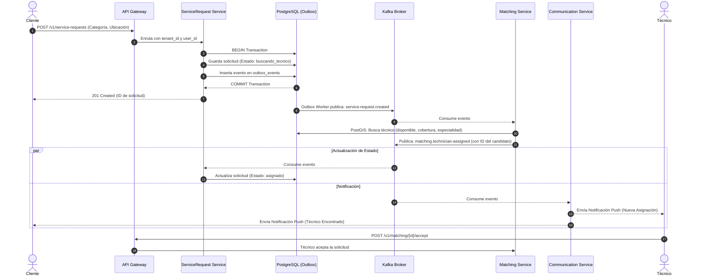

**Figura 4. Flujo asíncrono de creación de solicitud, matching con PostGIS y notificación.**

---

## 5.4 Secuencia de pago y facturación

Este flujo describe el cierre operativo del servicio y el cobro bajo el estándar PCI-DSS y el modelo Merchant of Record (RF-15, RF-22, RF-24, D4, D7, K2, ADR-009, AC3-E1, AC6-E1, AC9-E1, AC9-E5):

1. **Inicio y Evidencia:** El técnico ejecuta el servicio (`POST /v1/service-requests/{id}/start`, estado `en_progreso`). Antes de completar, sube la foto obligatoria vía `POST /v1/service-requests/{id}/evidence`; el archivo se guarda en MinIO (VM7) y la referencia URL se persiste en `service_evidence` (D7).
2. **Cierre Técnico:** El técnico solicita completar el servicio (`POST /v1/service-requests/{id}/complete`). `ServiceRequest Service` valida como precondición obligatoria que exista al menos una evidencia en `service_evidence` (AC9-E1). Si se cumple, el estado cambia a `completado` y se publica `service-request.completed`.
3. **Tokenización de Tarjeta (PCI-DSS):** El cliente ingresa los datos de su tarjeta directamente en el formulario o SDK provisto por la pasarela de pagos (PSP - Wompi). Ni el PAN ni el CVV pasan por el backend propio (K2, ADR-009, AC6-E1). El cliente recibe un token temporal (`provider_token_ref`).
4. **Solicitud de Cobro:** El cliente confirma el pago en la app enviando `POST /v1/service-requests/{id}/payment` con el token.
5. **Procesamiento de Pago:** `Payments Service` crea el registro en `payments` (estado `pendiente`) y llama a la API del PSP para procesar la transacción.
6. **Resolución del Cobro:**
   - *Aprobado:* Actualiza `payments.status = 'aprobado'`, genera el comprobante en `invoices` a nombre de la plataforma (Merchant of Record, D4) con número único de factura, y publica `payment.approved` vía Transactional Outbox.
   - *Rechazado o Fallo del PSP (AC9-E5):* Actualiza a `rechazado`, publica `payment.rejected` y la solicitud no pasa a pagada, evitando cobros dobles y permitiendo reintento seguro.
7. **Cierre de Ciclo:** `ServiceRequest Service` consume `payment.approved` y actualiza el estado a `pagado`. `Communication Service` notifica la aprobación y envía el enlace de descarga de la factura.
8. **Calificación:** El cliente califica el servicio (`POST /v1/service-requests/{id}/rating`, 1 a 5 estrellas). Se almacena en `ratings` y se emite el evento para que `Ranking Service` actualice la reputación agregada del técnico.

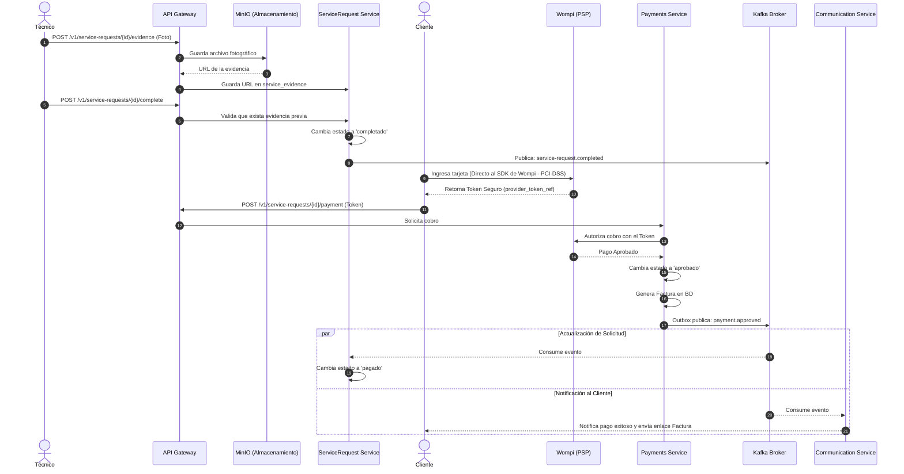

**Figura 5. Flujo de finalización de servicio, tokenización PCI-DSS y facturación.**

---

## 5.5 Productores y consumidores Kafka

La matriz de eventos asíncronos formalizada en el sistema (según DD, sección 7.2) es la siguiente:

| Tópico / Evento | Microservicio Productor | Microservicios Consumidores | Propósito del Flujo |
|---|---|---|---|
| `service-request.created` | `ServiceRequest Service` | `Matching Service`, `Communication Service` | Iniciar búsqueda de técnico disponible y notificar al cliente que su solicitud fue recibida. |
| `matching.technician-assigned` | `Matching Service` | `ServiceRequest Service`, `Communication Service` | Actualizar estado a `asignado` y notificar al técnico candidato y al cliente. |
| `matching.no-technician-available` | `Matching Service` | `ServiceRequest Service`, `Communication Service` | Colocar solicitud en `en_espera` y notificar al cliente que no hay técnicos disponibles (AC9-E4). |
| `service-request.completed` | `ServiceRequest Service` | `Payments Service`, `Communication Service` | Habilitar el proceso de pago y notificar al cliente que el servicio finalizó. |
| `payment.approved` | `Payments Service` | `ServiceRequest Service`, `Communication Service` | Cambiar estado de solicitud a `pagado` y enviar comprobante/factura al cliente. |
| `payment.rejected` | `Payments Service` | `ServiceRequest Service`, `Communication Service` | Informar rechazo de cobro y habilitar reintento de pago. |
| `service-request.evaluated` | `ServiceRequest Service` | `Ranking Service` | Disparar el recálculo asíncrono de la reputación promedio del técnico. |

---

## 5.6 Consumer Groups

Para garantizar escalabilidad horizontal y procesamiento desacoplado en Kafka (ADR-003, AC5-E3):

1. **Grupos asignados por microservicio:**
   - `servicerequest-service-group`
   - `matching-service-group`
   - `payments-service-group`
   - `communication-service-group`
   - `ranking-service-group`
2. **Aislamiento de offsets:** Cada consumer group almacena su progreso de lectura de forma independiente en Kafka. Si un servicio se detiene por mantenimiento o falla (ej. `ranking-service`, escenario AC5-E3), los eventos continúan encolándose en el tópico sin bloquear a los otros grupos; al reiniciar el pod, retoma el procesamiento desde el último offset confirmado sin pérdida de datos.
3. **Estrategia de particionado:** Los mensajes utilizan como clave (*message key*) el `aggregate_id` (o `service_request_id`). Esto asegura que todos los eventos relacionados con una misma solicitud lleguen a la misma partición y sean consumidos en estricto orden cronológico.

---

## 5.7 Concurrencia del matching

El motor de matching debe gestionar la asignación concurrente para evitar que múltiples solicitudes en la misma zona reserven o asignen simultáneamente al mismo técnico (condición de carrera):

1. **Bloqueo lógico y reserva temporal:** Al seleccionar un técnico candidato, el `Matching Service` registra el intento en `matching_attempts` con una marca temporal `expires_at` y actualiza temporalmente `technician_availability.status = 'ofrecido'`.
2. **Expiración y liberación:** Si el técnico no responde dentro de la ventana de expiración, el intento se marca como expirado, la disponibilidad se libera nuevamente y el motor evalúa al siguiente técnico más cercano.
3. **Pico de carga y degradación controlada (AC2-E4):** El motor soporta hasta 150 solicitudes de matching concurrentes (3x la carga pico esperada). Ante saturación, los eventos permanecen en el buffer de Kafka y se procesan por turnos sin emitir errores HTTP 5xx ni tumbar el servicio.

---

## 5.8 Reintentos, backoff y Dead Letter Queue (DLQ)

La estrategia de tolerancia a fallos en el consumo de eventos distingue entre errores transitorios y permanentes:

1. **Errores transitorios (red, bloqueo temporal de BD):**
   - Se aplican hasta **3 reintentos automáticos** con **backoff exponencial** (1s, 2s, 5s) con variación aleatoria (*jitter*) para evitar tormentas de reintentos.
2. **Errores permanentes o mensajes venenosos (*poison pills*):**
   - Si un evento no puede deserializarse o falla tras agotar los 3 reintentos, el consumidor desvía el mensaje al tópico de Dead Letter Queue correspondiente (ej. `service-request.created.DLQ`).
   - El consumidor registra un log estructurado de nivel `ERROR` en Loki con el `eventId`, `correlationId` y causa del error (AC7-E4), avanzando el offset para no bloquear el flujo de las demás solicitudes.

---

## 5.9 Idempotencia y Transactional Outbox

Dado que la comunicación por Kafka garantiza entrega *at-least-once* (al menos una vez), el sistema implementa defensas para asegurar consistencia e idempotencia (ADR-007, AC5-E4, AC5-E5):

### 5.9.1 Publicación confiable: Transactional Outbox
Para evitar el problema de la escritura dual (guardar en base de datos pero fallar al publicar en Kafka):
1. La escritura del cambio de estado y el registro del evento en la tabla `outbox_events` ocurren dentro de la **misma transacción local ACID** en PostgreSQL:
   ```sql
   BEGIN;
   INSERT INTO service_requests (...) VALUES (...);
   INSERT INTO outbox_events (aggregate_id, event_type, payload, attempts) VALUES (...);
   COMMIT;
   ```
2. Un proceso en segundo plano (*Outbox Worker*) consulta registros con `published_at IS NULL`, los publica en Kafka y marca `published_at = NOW()`.
3. Si Kafka no está disponible, la operación de negocio no se cae; el worker reintenta periódicamente hasta que Kafka se restablece (0 eventos perdidos, AC5-E4).

### 5.9.2 Consumo idempotente (Deduplicación)
Para evitar efectos secundarios duplicados (ej. doble cobro o doble notificación, escenario AC5-E5):
1. Cada evento transporta un identificador único global `eventId`.
2. El consumidor registra los `eventId` procesados en almacenamiento local o verifica si el estado actual de la entidad ya superó la transición del evento.
3. Si el `eventId` ya fue aplicado, el consumidor descarta el procesamiento repetido y confirma el offset inmediatamente.

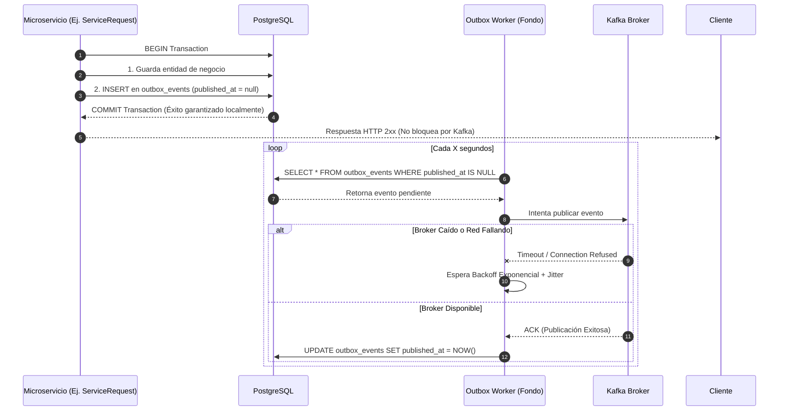

**Figura 6. Tolerancia a fallos con Transactional Outbox ante indisponibilidad del broker.**

---

## 5.10 Manejo de fallos de consumidores y Kafka

El sistema define protocolos de contingencia ante fallos en los componentes de ejecución (AC5-E1, AC5-E3, AC5-E4):

| Escenario de Falla | Comportamiento del Sistema | Recuperación |
|---|---|---|
| **Caída del broker Kafka (VM6)** | Las operaciones síncronas (REST en VM1) siguen funcionando. Los eventos salientes se almacenan en `outbox_events` en PostgreSQL (VM4). | Al volver Kafka, el Outbox Worker drena el backlog pendiente automáticamente sin pérdida de información (AC5-E4). |
| **Caída de un Pod en k3s (VM3)** | Los demás 7 microservicios continúan operando normalmente. Los eventos dirigidos al servicio caído se acumulan en Kafka. | Kubernetes detecta la falla mediante `livenessProbe` y reinicia el pod automáticamente. El pod reanuda la lectura desde su último offset confirmado (AC5-E3). |
| **Fallo en Base de Datos (VM4)** | Los pods detectan pérdida de conexión en su `readinessProbe` y se marcan como no disponibles. | Nginx en VM1 devuelve error controlado `503 Service Unavailable` sin corromper transacciones a medias. |

---

## 5.11 Escenarios de carga y puntos de sincronización

Esta sección establece los umbrales de sincronización y rendimiento operativo que deben verificarse en las pruebas de carga y QA:

### 5.11.1 Puntos de sincronización críticos
- **Latencia REST (Ingesta):** Respuesta de creación de solicitud (`POST /v1/service-requests`) en menos de 1.5 segundos.
- **Ventana de Matching Asíncrono:** Desde la creación de la solicitud hasta la notificación al técnico candidato en **menos de 7 segundos** en operación normal (AC2-E3).
- **Reflejo de Estado en Cliente:** Notificación y actualización de estado en la app móvil en **menos de 60 segundos** (RNF-06).
- **Procesamiento de Pago:** Confirmación del cobro y emisión de comprobante en menos de 3 segundos con la pasarela externa (AC3-E1).

### 5.11.2 Presupuesto y dimensionamiento bajo carga
- **Carga Pico Soportada:** Hasta 150 solicitudes de matching concurrentes (AC2-E4) sin caídas del servicio.
- **Consumo de Recursos en VM3:** Consumo máximo de memoria de los 8 microservicios acotado a ≤ 6.5 GiB de RAM sobre los 11 GiB disponibles, con **0 reinicios por OOMKilled** bajo operación sostenida de 50 solicitudes concurrentes (AC2-E5, ver presupuesto en Documento de Infraestructura, sección 5.6).

---

# 6. Vista de Desarrollo - pendiente de integración

**Corresponde a:** Backend + Frontend (Miguel).

## Recomendación de contenido

- estructura real del repositorio;
- organización por aplicación y microservicio;
- proyectos/capas del backend .NET;
- paquetes del Matching Service en Java/Spring Boot;
- organización Flutter;
- organización Next.js;
- librerías compartidas permitidas;
- contratos y DTOs;
- ubicación de pruebas;
- dependencias entre proyectos;
- convenciones de nombres;
- reglas de acoplamiento entre servicios;
- integración con CI/CD por servicio.

## Diagramas recomendados

- diagrama de paquetes del repositorio;
- diagrama de componentes por aplicación;
- diagrama de dependencias entre proyectos/módulos;
- mapa de carpetas y artefactos de build.

---

# 7. Vista Física

**Corresponde a:** DevOps (Sebastian).

Esta sección presenta cómo se despliega físicamente el sistema descrito en la Vista Lógica: las 7 VMs propias del proyecto, los ambientes de prueba y producción, y el modelo de seguridad de red y gestión de secretos. El detalle operativo completo (inventario de VMs, Ansible, CI/CD paso a paso, healthchecks, orden de arranque, presupuesto de recursos por microservicio y la limitación del clúster k3s de un solo nodo) vive en `Documento de Infraestructura.md` — esta sección consolida la vista física para el SDD sin duplicar ese contenido, siguiendo la misma regla de actualización de la sección 2.

## 7.1 Diagrama de despliegue

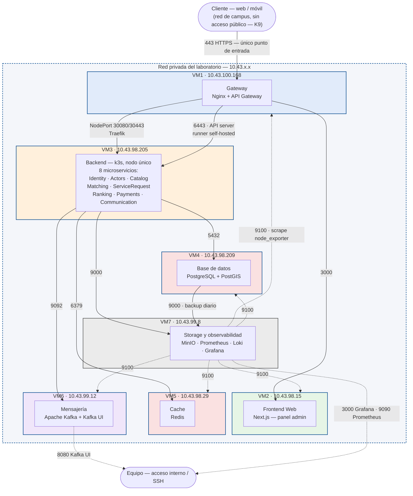

**Figura 5. Diagrama de despliegue de QUICKPATCH sobre las 7 VMs.**

Las 7 VMs son idénticas en hardware (4 vCPU · 11 GiB RAM · 68 GB disco) y solo difieren en el software que alojan (Documento de Infraestructura, sección 3). VM3 es un clúster k3s de un solo nodo: es el punto único de falla reconocido del sistema (SAD, limitación de la sección 5.2). El firewall aplica `default deny incoming`; ninguna VM acepta conexiones directas del exterior salvo VM1 (443) y el acceso SSH del equipo (Documento de Infraestructura, sección 10.2).

## 7.2 Ambientes Dev / QA / Prod

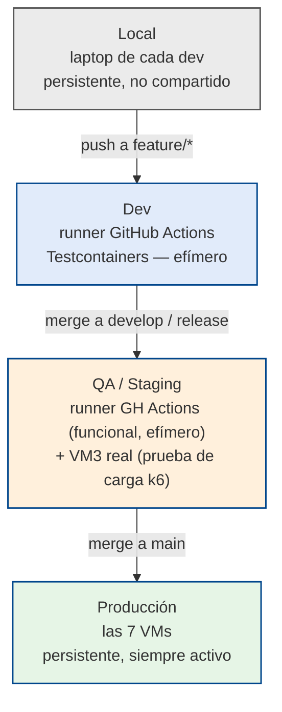

**Figura 6. Ambientes de desarrollo, pruebas y producción.**

Ningún ambiente además de Producción ocupa hardware dedicado (K10: 7 VMs fijas, sin VM adicional para staging) — Dev y la parte funcional de QA existen solo mientras corre el pipeline. La prueba de carga es la única validación que corre contra hardware real (VM3), en ventana de mantenimiento, después del despliegue (Documento de Infraestructura, sección 4 y 6).

## 7.3 Seguridad de red y gestión de secretos

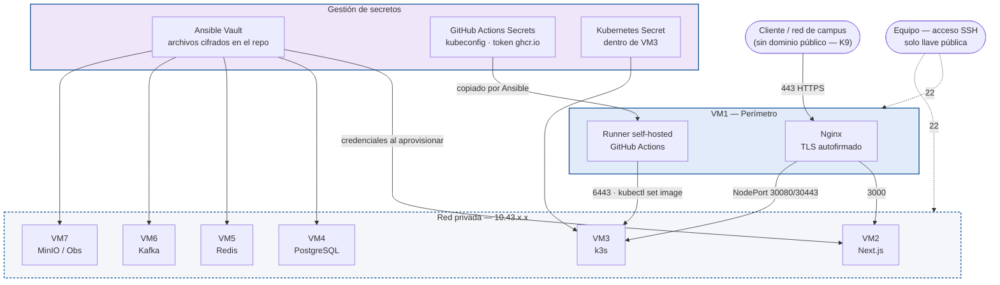

**Figura 7. Seguridad de red y gestión de secretos.**

TLS se termina en VM1 con certificado autofirmado — no hay dominio público (K9), por lo que Let's Encrypt no es viable (Documento de Infraestructura, sección 10.1). Los secretos se gestionan por dos mecanismos distintos según el tipo de despliegue: Ansible Vault para las VMs con Docker Compose (VM1, VM2, VM4–VM7) y `Secret` de Kubernetes dentro de VM3; el `kubeconfig` y el token de `ghcr.io` viajan como GitHub Actions Secrets hasta el runner self-hosted en VM1 (Documento de Infraestructura, sección 8).

---

# 8. Vista de Escenarios (+1)

---

## 8.1 Diagrama de casos de uso

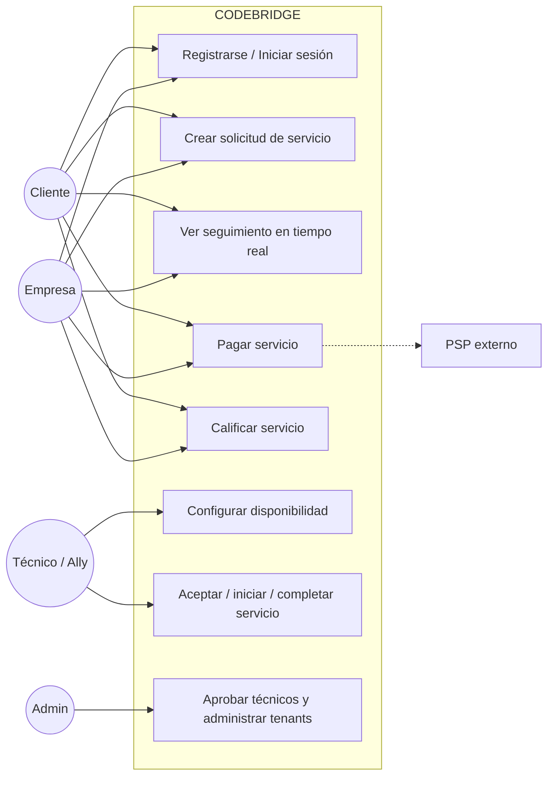

---

## 8.2 Escenarios principales

Para cada escenario se documenta: actor, precondiciones, flujo principal, flujos alternos, servicios participantes, datos involucrados, eventos/endpoints, relación con las demás vistas y requisitos asociados (SRS v3.0, CODEBRIDGE).

### Escenario 1 — Cliente registra una cuenta y crea una solicitud

| | |
|---|---|
| **Actor** | Cliente (variante: Empresa) |
| **Precondiciones** | El usuario no tiene cuenta. El Catalog Service tiene categorías vigentes. |
| **Flujo principal** | 1. `POST /v1/auth/register/client` (Identity Service) crea `User` y, si aplica, `Tenant`. 2. `POST /v1/auth/login`, se obtiene `AuthenticatedContext` (userId, tenantId, rol). 3. El cliente consulta `ServiceCategory` disponibles (Catalog Service). 4. `POST /v1/service-requests` (ServiceRequest Service): se crea el agregado en estado `buscando_tecnico`. 5. Se produce el evento `service-request.created`. |
| **Flujos alternos** | Correo ya registrado → rechazo (RF-01). Token expirado en login → reintento de autenticación. |
| **Servicios participantes** | API Gateway, Identity Service, Catalog Service, ServiceRequest Service, Kafka. |
| **Datos involucrados** | `users`, `tenants`, `service_categories`, `service_requests`. |
| **Eventos / Endpoints** | `POST /v1/auth/register/client`, `POST /v1/auth/login`, `POST /v1/service-requests` · produce `service-request.created`. |
| **Relación con Vista Lógica** | Identity Service + Catalog Service + ServiceRequest Service (Sección 3.2). |
| **Relación con Vista de Procesos** | **Resuelto:** Ver **Sección 5.2** (flujos síncronos frente al cliente) y **Sección 5.3** (ingesta síncrona y publicación asíncrona por Outbox). |
| **Relación con Vista de Desarrollo** | *Pendiente Backend+Frontend* — formulario de registro/solicitud (Next.js / Flutter) contra los contratos REST anteriores. |
| **Relación con Vista Física** | *Pendiente DevOps* — ruta API Gateway → Identity/Catalog/ServiceRequest dentro del clúster k3s. |
| **Requisitos (SRS)** | RF-01, RF-03, RF-04, RF-06, RF-07, RF-08 |

### Escenario 2 — El sistema encuentra y asigna un técnico

| | |
|---|---|
| **Actor** | Sistema (Matching Service), Técnico/Ally |
| **Precondiciones** | Evento `service-request.created` publicado. Existen `TechnicianAvailability` y `CoverageZone` compatibles con la solicitud. |
| **Flujo principal** | 1. Matching Service consume `service-request.created`. 2. Valida el contexto de la solicitud. 3. Busca técnicos disponibles (`TechnicianAvailability`). 4. Filtra por cobertura geográfica (`CoverageZone`, PostGIS). 5. Ordena candidatos por criterios de matching. 6. Registra el intento de asignación (`MatchingAttempt`). 7. Si se encontró un técnico elegible, produce `matching.technician-assigned`. 8. ServiceRequest Service consume el evento y transiciona a `asignado`. 9. Communication Service notifica al técnico. |
| **Flujos alternos** | Ningún candidato elegible tras el filtrado/ordenamiento → Escenario 3. |
| **Servicios participantes** | Matching Service, ServiceRequest Service, Communication Service, Kafka. |
| **Datos involucrados** | `technician_availability`, `coverage_zones`, `matching_attempts`, `service_requests`. |
| **Eventos / Endpoints** | Consume `service-request.created` · produce `matching.technician-assigned`. |
| **Relación con Vista Lógica** | Matching Service (Sección 3.2.6), Figura 3 (flujo lógico del matching). |
| **Relación con Vista de Procesos** | **Resuelto:** Ver **Sección 5.6** (Consumer Groups asignados) y **Sección 5.7** (Concurrencia y bloqueo temporal `expires_at`). |
| **Relación con Vista de Desarrollo** | *Pendiente* — módulo Java/Spring Boot del Matching Service. |
| **Relación con Vista Física** | *Pendiente DevOps* — nodo/contenedor del Matching Service y latencia hacia PostgreSQL+PostGIS. |
| **Requisitos (SRS)** | RF-09, RF-10 · RNF-05 (asignación en menos de 60s) |

### Escenario 3 — No existe técnico disponible y la solicitud queda en espera

| | |
|---|---|
| **Actor** | Sistema (Matching Service) |
| **Precondiciones** | Candidate Search no retorna candidatos válidos. |
| **Flujo principal** | 1. Matching Service no encuentra técnico compatible. 2. Produce `matching.no-technician-available`. 3. ServiceRequest Service consume el evento y transiciona a `en_espera`. |
| **Flujos alternos** | Reintento posterior cuando cambia la disponibilidad de algún técnico (fuera de alcance del MVP si no está implementado como *retry* automático). |
| **Servicios participantes** | Matching Service, ServiceRequest Service. |
| **Datos involucrados** | `matching_attempts`, `service_requests`. |
| **Eventos / Endpoints** | Produce `matching.no-technician-available`. |
| **Relación con Vista Lógica** | Matching Service, estado `en_espera` de `ServiceRequestStatus`. |
| **Relación con las demás vistas** | *Pendiente* de integración por los responsables respectivos. |
| **Requisitos (SRS)** | RF-09 (manejo explícito de "En espera" cuando no hay técnico disponible) |

### Escenario 4 — El técnico inicia y completa el servicio

| | |
|---|---|
| **Actor** | Técnico/Ally, Cliente / Empresa (observador del estado) |
| **Precondiciones** | Solicitud en estado `asignado`. |
| **Flujo principal** | 1. El técnico consulta `GET /v1/service-requests/{id}`. 2. `POST /v1/service-requests/{id}/start` → transición a `en_progreso`. 3. El cliente o la empresa que originó la solicitud observa el cambio de estado en tiempo real (vía Communication Service / canal de notificaciones). 4. `POST /v1/service-requests/{id}/complete` → transición a `completado`. 5. Se produce `service-request.completed`. |
| **Flujos alternos** | Intento de completar sin haber iniciado → rechazo por `State Validation`. |
| **Servicios participantes** | ServiceRequest Service, Communication Service. |
| **Datos involucrados** | `service_requests`. |
| **Eventos / Endpoints** | `POST /v1/service-requests/{id}/start`, `POST /v1/service-requests/{id}/complete` · produce `service-request.completed`. |
| **Relación con Vista Lógica** | ServiceRequest Service — módulo *Service Lifecycle* y *State Validation* (Sección 3.2.5). |
| **Relación con Vista de Procesos** | **Resuelto:** Ver **Sección 5.3** (Notificación push asíncrona) y **Sección 5.11.1** (SLA de actualización de estado < 60s). |
| **Requisitos (SRS)** | RF-11, RF-13, RF-14, RF-15 · RNF-06 (reflejo de estado en menos de 1 minuto) |

### Escenario 5 — El cliente realiza el pago

| | |
|---|---|
| **Actor** | Cliente / Empresa |
| **Precondiciones** | Solicitud en estado `completado`. |
| **Flujo principal** | 1. `POST /v1/service-requests/{id}/payment` (Payments Service). 2. *PSP Adapter* tokeniza la operación con el proveedor de pagos externo (PSP). 3. Se crea `Payment` con `PaymentTokenReference`, sin almacenar PAN/CVV. |
| **Flujos alternos** | Ver Escenario 6 (aprobación/rechazo del PSP). |
| **Servicios participantes** | Payments Service (PSP Adapter), ServiceRequest Service. |
| **Datos involucrados** | `payments`. |
| **Eventos / Endpoints** | `POST /v1/service-requests/{id}/payment`. |
| **Relación con Vista Lógica** | Payments Service — módulos *Payment Processing* y *PSP Adapter* (Sección 3.2.8). |
| **Relación con Vista Física** | *Pendiente DevOps* — salida de red autorizada hacia el PSP externo, reglas de seguridad. |
| **Requisitos (SRS)** | RF-22, RF-23 · RNF-01 (PCI-DSS, no se persiste PAN/CVV) · RIE-01 |

### Escenario 6 — El PSP aprueba o rechaza el pago

| | |
|---|---|
| **Actor** | Sistema (Payments Service), PSP externo |
| **Precondiciones** | Pago iniciado (Escenario 5). |
| **Flujo principal** | 1. El PSP responde de forma asíncrona. 2. Payments Service produce `payment.approved` o `payment.rejected`. 3. ServiceRequest Service consume el evento: si es `approved`, transiciona a `pagado`; si es `rejected`, permanece en `completado` y permite reintento. 4. Si fue aprobado, Billing genera `Invoice`. |
| **Flujos alternos** | Pago rechazado → el cliente puede reintentar (vuelve al Escenario 5). |
| **Servicios participantes** | Payments Service, ServiceRequest Service. |
| **Datos involucrados** | `payments`, `invoices`. |
| **Eventos / Endpoints** | Produce `payment.approved` / `payment.rejected` · `GET /v1/payments/{id}/invoice`. |
| **Relación con Vista Lógica** | Payments Service — módulo *Billing / Invoice Management*. |
| **Relación con Vista de Procesos** | **Resuelto:** Ver **Sección 5.4** (Separación entre interacción PCI-DSS de Wompi y el procesamiento asíncrono) y **Sección 5.9** (Idempotencia). |
| **Requisitos (SRS)** | RF-24 |

### Escenario 7 — El cliente califica el servicio

| | |
|---|---|
| **Actor** | Cliente / Empresa |
| **Precondiciones** | Solicitud en estado `pagado`. |
| **Flujo principal** | 1. `POST /v1/service-requests/{id}/rating` (ServiceRequest Service) crea `Rating`, asociado al usuario o cuenta corporativa que originó la solicitud. 2. Ranking Service consume el resultado y recalcula la reputación del técnico. |
| **Flujos alternos** | Intento de calificar sin pago confirmado → rechazo. |
| **Servicios participantes** | ServiceRequest Service, Ranking Service. |
| **Datos involucrados** | `ratings`. |
| **Eventos / Endpoints** | `POST /v1/service-requests/{id}/rating`. |
| **Relación con Vista Lógica** | ServiceRequest Service (módulo *Ratings*) + Ranking Service (Sección 3.2.7). |
| **Requisitos (SRS)** | RF-12 |

### Escenario 8 — Una empresa/tenant consulta información sin acceder a datos de otro tenant

| | |
|---|---|
| **Actor** | Empresa, Admin |
| **Precondiciones** | Usuario autenticado con `AuthenticatedContext` (incluye `tenantId`). |
| **Flujo principal** | 1. El usuario consulta sus solicitudes/dashboard. 2. Cada servicio filtra automáticamente por `tenant_id` derivado del contexto autenticado. 3. Un intento de acceder a datos de otro `tenant_id` es rechazado. |
| **Flujos alternos** | Intento de acceso no autorizado → error 403, registrado en log (RNF-04). |
| **Servicios participantes** | API Gateway (propagación de identidad/tenant), todos los microservicios (aislamiento en sus propias consultas). |
| **Datos involucrados** | Todas las tablas con columna `tenant_id`. |
| **Relación con Vista Lógica** | Regla transversal de *Multi-tenancy* (Sección 3.1.3 y 4.2). PostgreSQL RLS como defensa adicional. |
| **Requisitos (SRS)** | RF-04, RF-05, RF-18, RF-21 · RNF-04, RNF-09, RNF-10 |

### Escenario 9 — Kafka presenta una falla temporal y el evento se recupera mediante Outbox

| | |
|---|---|
| **Actor** | Sistema (cualquier servicio productor) |
| **Precondiciones** | Un servicio necesita publicar un evento (ej. `service-request.created`, `payment.approved`) y Kafka no está disponible. |
| **Flujo principal** | 1. El servicio registra localmente el cambio de estado y el evento pendiente (Transactional Outbox). 2. El publicador reintenta con backoff hasta que Kafka esté disponible. 3. El evento se publica y los consumidores lo procesan de forma idempotente usando `eventId`. |
| **Flujos alternos** | Reintentos agotados → DLQ (a definir en Vista de Procesos). |
| **Servicios participantes** | Cualquier servicio productor, Kafka. |
| **Relación con Vista Lógica** | Regla transversal *Idempotencia* y *Transactional Outbox* (Sección 4.2). |
| **Relación con Vista de Procesos** | **Resuelto:** Ver **Sección 5.8** (Reintentos, backoff exponencial con jitter y desvío a DLQ) y **Sección 5.10** (Tolerancia a fallos). |
| **Requisitos (SRS)** | RNF-07, RNF-08 (disponibilidad; un fallo no debe bloquear el flujo de negocio de forma permanente) |

---

## 8.3 Diagrama de secuencia — Escenario crítico de extremo a extremo

Cubre el flujo Escenarios 1 → 2 → 4 → 5 → 6 → 7 (registro → matching → ejecución → pago → calificación), que corresponde a la prueba end-to-end de RF-27.

> En este diagrama, el actor `Cliente` representa indistintamente a un **Cliente** o a una **Empresa**, ya que ambos siguen el mismo flujo de seguimiento, pago y calificación sobre sus propias solicitudes.

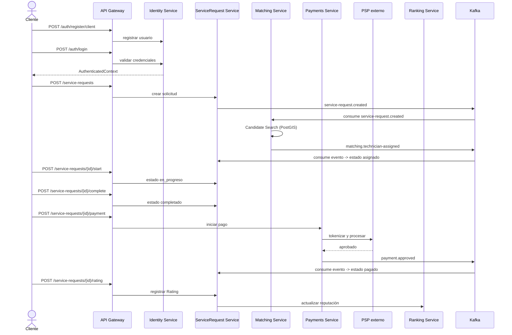

---

## 8.4 Matriz Escenario → Componentes → Vistas

| # | Escenario | Componentes principales | Vista Lógica | Vista de Procesos | Vista de Desarrollo | Vista Física |
|---|---|---|---|---|---|---|
| 1 | Registro y creación de solicitud | Identity, Catalog, ServiceRequest | ✅ Validado | ⏳ Pendiente | ⏳ Pendiente | ⏳ Pendiente |
| 2 | Matching y asignación | Matching, ServiceRequest, Communication | ✅ Validado | ⏳ Pendiente | ⏳ Pendiente | ⏳ Pendiente |
| 3 | Sin técnico disponible | Matching, ServiceRequest | ✅ Validado | ⏳ Pendiente | ⏳ Pendiente | ⏳ Pendiente |
| 4 | Ejecución del servicio | ServiceRequest, Communication | ✅ Validado | ⏳ Pendiente | ⏳ Pendiente | ⏳ Pendiente |
| 5 | Pago | Payments, ServiceRequest | ✅ Validado | ⏳ Pendiente | ⏳ Pendiente | ⏳ Pendiente |
| 6 | Aprobación/rechazo PSP | Payments, ServiceRequest | ✅ Validado | ⏳ Pendiente | ⏳ Pendiente | ⏳ Pendiente |
| 7 | Calificación | ServiceRequest, Ranking | ✅ Validado | ⏳ Pendiente | ⏳ Pendiente | ⏳ Pendiente |
| 8 | Aislamiento multi-tenant | API Gateway, todos los servicios | ✅ Validado | ⏳ Pendiente | ⏳ Pendiente | ⏳ Pendiente |
| 9 | Falla temporal de Kafka | Cualquier productor, Kafka | ✅ Validado | ⏳ Pendiente | ⏳ Pendiente | ⏳ Pendiente |

**Criterio de validación del Product Owner:** un escenario queda completamente validado cuando las cuatro vistas técnicas lo resuelven de forma coherente. Actualmente los 9 escenarios están cubiertos por la Vista Lógica; falta la confirmación de Backend+QA (Procesos), Backend+Frontend (Desarrollo) y DevOps (Física) para cerrar la integración cruzada indicada en la Sección 9 del SDD.

---

## 8.5 Requisitos no cubiertos explícitamente por ningún escenario

Como parte de la validación de completitud, reviso qué RF/RNF del SRS v3.0 **no** quedan representados en los 9 escenarios anteriores, para que el equipo decida si se documentan aparte o se consideran fuera del alcance de esta vista:

- **RF-16, RF-17** (gestión de equipo del Proveedor/Ally, historial del técnico) — no tienen escenario propio; se recomienda agregarlos si el Actors Service define su persistencia en un sprint próximo.
- **RF-19, RF-20** (aprobación/suspensión de técnicos por Admin) — mencionados tangencialmente en el Escenario 8, pero no tienen flujo propio.
- **RF-26 a RF-29** (CI/CD, pruebas, logging, cifrado) — corresponden a la Vista Física/Procesos, no a escenarios de negocio; se consideran cubiertos por esas vistas cuando DevOps las entregue.

## Para cada escenario se recomienda documentar

- actor;
- precondiciones;
- flujo principal;
- flujos alternos;
- servicios participantes;
- datos involucrados;
- eventos y endpoints;
- relación con Vista Lógica;
- relación con Vista de Procesos;
- relación con Vista de Desarrollo;
- relación con Vista Física;
- requisitos funcionales y no funcionales asociados.

## Diagramas recomendados

- casos de uso de escenarios principales;
- secuencia de extremo a extremo para los escenarios críticos;
- matriz escenario -> componentes -> vistas.

---

# 9. Integración entre vistas

Antes de consolidar una versión final del SDD se debe verificar:

- [ ] todo microservicio de la Vista Lógica existe en la Vista de Desarrollo;
- [ ] todo componente desplegable de la Vista de Desarrollo aparece en la Vista Física;
- [ ] los flujos de la Vista de Procesos utilizan componentes definidos en la Vista Lógica;
- [ ] los escenarios (+1) pueden seguirse a través de las cuatro vistas;
- [ ] los contratos REST coinciden con DD/OpenAPI;
- [ ] los eventos coinciden con DD/AsyncAPI;
- [ ] los estados de `ServiceRequest` son consistentes con SRS, DD y código;
- [ ] los nombres de servicios son uniformes en SAD, SDD, repositorio y despliegue;
- [ ] ningún servicio modifica directamente datos propiedad de otro dominio;
- [ ] las decisiones de seguridad multi-tenant aparecen de forma coherente en todas las vistas.

---

# 10. Estado actual del documento

| Sección | Corresponde a | Estado |
|---|---|---|
| Vista Lógica | Backend | **Desarrollada - lista para revisión** |
| Vista de Procesos | Backend + QA | **Desarrollada - lista para revisión** |
| Vista de Desarrollo | Backend + Frontend / Miguel | Pendiente |
| Vista Física | DevOps / Sebastian | **Desarrollada - lista para revisión** |
| Vista de Escenarios (+1) | Angy + equipo | Pendiente |
| Revisión cruzada | Todo el equipo | Pendiente al completar las vistas |

---

## Nota para asistentes de IA

Al utilizar Claude Code, Codex u otro asistente sobre este SDD:

1. tratar `SRS.md` como fuente de requisitos;
2. tratar `SAD.md` como fuente de decisiones arquitectónicas y atributos de calidad;
3. tratar `DD.md` como fuente del modelo de datos y contratos vigentes;
4. utilizar este SDD para el diseño interno y las responsabilidades lógicas;
5. no inventar módulos, entidades o eventos para completar diagramas;
6. si existe contradicción entre documentos, señalarla antes de modificar el diseño;
7. mantener separadas las responsabilidades de las vistas;
8. actualizar los diagramas junto con las fuentes de diseño correspondientes.
